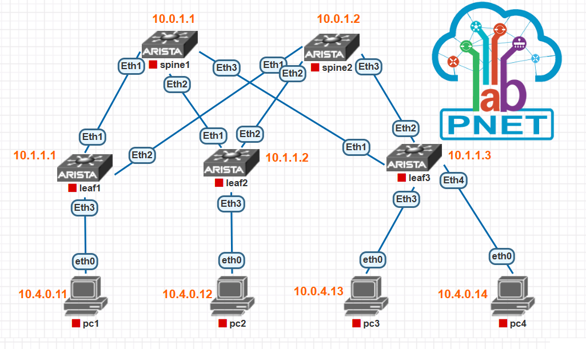

[Назад, к списку домашних заданий](../README.md)
# Домашнее задание №4. Построение Underlay сети(eBGP).
## 1. План работ.
1. Скопировать стенд с домашнего задания №1.
2. Настроить ISIS на spine и leaf коммутаторах
3. Убедиться в наличии связности между коммутаторами, с фиксацией результатов.
4. Сохранить конфигурацию сетевого оборудования.

## 2. Схема топологии CLOS.


## 3. Адресное пространство для Underlay.
### Таблица 1. Адресное пространство.
|Адресация|Назначение|
|--------|--------|
|10.0.1.**\<SN\>**/32|loopback интерфейсы для spine, где SN = 1-255|
|10.1.1.**\<LN\>**/32|loopback интерфейсы для leaf, где LN = 1-255|
|10.2.**\<SN\>**.**\<N\>**/30|p2p линки между spine и leaf, где SN = номер spine, N = 0-255|
|10.0.4.0/16|Overlay|
### Таблица 2. Сетевые адреса интерфейсов.
|Оборудование|Интерфейс|Адрес|
|--------|--------|----------|
|spine1|loopback1|10.0.1.1/32|
|spine2|loopback1|10.0.1.2/32|
|leaf1|loopback1|10.1.1.1/32|
|leaf2|loopback1|10.1.1.2/32|
|leaf3|loopback1|10.1.1.3/32|
|spine1|Eth1|10.2.1.0/31|
|leaf1|Eth1|10.2.1.1/31|
|spine1|Eth2|10.2.1.2/31|
|leaf2|Eth1|10.2.1.3/31|
|spine1|Eth3|10.2.1.4/31|
|leaf3|Eth1|10.2.1.5/31|
|spine2|Eth1|10.2.2.0/31|
|leaf1|Eth2|10.2.2.1/31|
|spine2|Eth2|10.2.2.2/31|
|leaf2|Eth2|10.2.2.3/31|
|spine2|Eth3|10.2.2.4/31|
|leaf3|Eth2|10.2.2.5/31|
|pc1|Eth1|10.4.0.11/16|
|pc2|Eth1|10.4.0.12/16|
|pc3|Eth1|10.4.0.13/16|
|pc4|Eth1|10.4.0.14/16|
### Таблица 3. Номера автономных систем (AS).
|Имя коммутатора|AS|комментарий|
|--------|--------|--------|
|spine1|65001||
|spine2|65001||
|spineM|65XXX|**\<где XXX = 000 + M\>**|
|leaf1|65101||
|leaf2|65102||
|leaf3|65103||
|leafN|65XXX|**\<где XXX = 100 + N\>**|
## 4. Настройки сетевого оборудования.
<details>
  <summary>spine1 configuration</summary>

  ```cisco
spine1#sh run
! Command: show running-config
! device: spine1 (vEOS-lab, EOS-4.27.0F)
!
! boot system flash:/vEOS-lab.swi
!
no aaa root
!
transceiver qsfp default-mode 4x10G
!
service routing protocols model ribd
!
hostname spine1
!
spanning-tree mode mstp
!
group bgp UNDERLAY
   exit
!
interface Ethernet1
   description leaf1
   no switchport
   ip address 10.2.1.0/31
!
interface Ethernet2
   description leaf2
   no switchport
   ip address 10.2.1.2/31
!
interface Ethernet3
   description leaf3
   no switchport
   ip address 10.2.1.4/31
!
interface Loopback1
   ip address 10.0.1.1/32
!
interface Management1
!
ip routing
!
peer-filter UNDERLAY
   10 match as-range 65101-65300 result accept
!
router bgp 65001
   router-id 10.0.1.1
   no bgp default ipv4-unicast
   timers bgp 1 3
   distance bgp 20 200 200
   bgp listen range 10.2.1.0/24 peer-group UNDERLAY peer-filter UNDERLAY
   neighbor UNDERLAY peer group
   neighbor UNDERLAY out-delay 0
   neighbor UNDERLAY bfd
   !
   address-family ipv4
      neighbor UNDERLAY activate
      network 10.0.1.1/32
!
end
spine1#
  ```
</details>

<details>
  <summary>spine2 configuration</summary>

  ```cisco
spine2#sh run
! Command: show running-config
! device: spine2 (vEOS-lab, EOS-4.27.0F)
!
! boot system flash:/vEOS-lab.swi
!
no aaa root
!
transceiver qsfp default-mode 4x10G
!
service routing protocols model ribd
!
hostname spine2
!
spanning-tree mode mstp
!
interface Ethernet1
   description leaf1
   no switchport
   ip address 10.2.2.0/31
!
interface Ethernet2
   description leaf2
   no switchport
   ip address 10.2.2.2/31
!
interface Ethernet3
   description leaf3
   no switchport
   ip address 10.2.2.4/31
!
interface Loopback1
   ip address 10.0.1.2/32
!
interface Management1
!
ip routing
!
peer-filter UNDERLAY
   10 match as-range 65101-65300 result accept
!
router bgp 65001
   router-id 10.0.1.2
   no bgp default ipv4-unicast
   timers bgp 1 3
   distance bgp 20 200 200
   bgp listen range 10.2.2.0/24 peer-group UNDERLAY peer-filter UNDERLAY
   neighbor UNDERLAY peer group
   neighbor UNDERLAY out-delay 0
   neighbor UNDERLAY bfd
   !
   address-family ipv4
      neighbor UNDERLAY activate
      network 10.0.1.2/32
!
end
spine2#
  ```
</details>

<details>
  <summary>leaf1 configuration</summary>

  ```cisco
leaf1#sh run
! Command: show running-config
! device: leaf1 (vEOS-lab, EOS-4.27.0F)
!
! boot system flash:/vEOS-lab.swi
!
no aaa root
!
transceiver qsfp default-mode 4x10G
!
service routing protocols model ribd
!
hostname leaf1
!
spanning-tree mode mstp
!
interface Ethernet1
   description spine1
   no switchport
   ip address 10.2.1.1/31
!
interface Ethernet2
   description spine2
   no switchport
   ip address 10.2.2.1/31
!
interface Ethernet3
!
interface Loopback1
   ip address 10.1.1.1/32
!
interface Management1
!
ip routing
!
peer-filter UNDERLAY
   10 match as-range 65001 result accept
!
router bgp 65101
   router-id 10.1.1.1
   no bgp default ipv4-unicast
   timers bgp 1 3
   distance bgp 20 200 200
   maximum-paths 2 ecmp 2
   neighbor UNDERLAY peer group
   neighbor UNDERLAY remote-as 65001
   neighbor UNDERLAY out-delay 0
   neighbor UNDERLAY bfd
   neighbor 10.2.1.0 peer group UNDERLAY
   neighbor 10.2.1.0 description spine1
   neighbor 10.2.2.0 peer group UNDERLAY
   neighbor 10.2.2.0 description spine2
   !
   address-family ipv4
      neighbor UNDERLAY activate
      network 10.1.1.1/32
!
end
leaf1#
  ```
</details>

<details>
  <summary>leaf2 configuration</summary>

  ```cisco
leaf2#sh run
! Command: show running-config
! device: leaf2 (vEOS-lab, EOS-4.27.0F)
!
! boot system flash:/vEOS-lab.swi
!
no aaa root
!
transceiver qsfp default-mode 4x10G
!
service routing protocols model ribd
!
hostname leaf2
!
spanning-tree mode mstp
!
interface Ethernet1
   description spine1
   no switchport
   ip address 10.2.1.3/31
!
interface Ethernet2
   description spine2
   no switchport
   ip address 10.2.2.3/31
!
interface Ethernet3
!
interface Loopback1
   ip address 10.1.1.2/32
!
interface Management1
!
ip routing
!
peer-filter UNDERLAY
   10 match as-range 65001 result accept
!
router bgp 65102
   router-id 10.1.1.2
   no bgp default ipv4-unicast
   timers bgp 1 3
   distance bgp 20 200 200
   maximum-paths 2 ecmp 2
   neighbor UNDERLAY peer group
   neighbor UNDERLAY remote-as 65001
   neighbor UNDERLAY out-delay 0
   neighbor UNDERLAY bfd
   neighbor 10.2.1.2 peer group UNDERLAY
   neighbor 10.2.1.2 description spine1
   neighbor 10.2.2.2 peer group UNDERLAY
   neighbor 10.2.2.2 description spine2
   !
   address-family ipv4
      neighbor UNDERLAY activate
      network 10.1.1.2/32
!
end
leaf2#
  ```
</details>

<details>
  <summary>leaf3 configuration</summary>

  ```cisco
leaf3#sh run
! Command: show running-config
! device: leaf3 (vEOS-lab, EOS-4.27.0F)
!
! boot system flash:/vEOS-lab.swi
!
no aaa root
!
transceiver qsfp default-mode 4x10G
!
service routing protocols model ribd
!
hostname leaf3
!
spanning-tree mode mstp
!
interface Ethernet1
   description spine1
   no switchport
   ip address 10.2.1.5/31
!
interface Ethernet2
   description spine2
   no switchport
   ip address 10.2.2.5/31
!
interface Ethernet3
!
interface Ethernet4
!
interface Loopback1
   ip address 10.1.1.3/32
!
interface Management1
!
ip routing
!
peer-filter UNDERLAY
   10 match as-range 65001 result accept
!
router bgp 65103
   router-id 10.1.1.3
   no bgp default ipv4-unicast
   timers bgp 1 3
   distance bgp 20 200 200
   maximum-paths 2 ecmp 2
   neighbor UNDERLAY peer group
   neighbor UNDERLAY remote-as 65001
   neighbor UNDERLAY out-delay 0
   neighbor UNDERLAY bfd
   neighbor 10.2.1.4 peer group UNDERLAY
   neighbor 10.2.1.4 description spine1
   neighbor 10.2.2.4 peer group UNDERLAY
   neighbor 10.2.2.4 description spine2
   !
   address-family ipv4
      neighbor UNDERLAY activate
      network 10.1.1.3/32
!
end
leaf3#
  ```
</details>

# Проверка сетевой связности.
<details>
  <summary>проверка соседства</summary>

  ```cisco
spine1#sh ip bgp summary
BGP summary information for VRF default
Router identifier 10.0.1.1, local AS number 65001
Neighbor Status Codes: m - Under maintenance
  Neighbor         V  AS           MsgRcvd   MsgSent  InQ OutQ  Up/Down State   PfxRcd PfxAcc
  10.2.1.1         4  65101           1087      1087    0    0 00:18:00 Estab   1      1
  10.2.1.3         4  65102           1087      1086    0    0 00:17:59 Estab   1      1
  10.2.1.5         4  65103           1088      1087    0    0 00:18:00 Estab   1      1
spine1#sh ip bgp neighbors bfd
BGP BFD Neighbor Table
Flags: U - BFD is enabled for BGP neighbor and BFD session state is UP
       I - BFD is enabled for BGP neighbor and BFD session state is INIT
       D - BFD is enabled for BGP neighbor and BFD session state is DOWN
       N - BFD is not enabled for BGP neighbor
Neighbor           Interface          Up/Down    State       Flags
10.2.1.1           Ethernet1          00:18:11   Established U
10.2.1.3           Ethernet2          00:18:10   Established U
10.2.1.5           Ethernet3          00:18:11   Established U
spine1#
  ```
  
  ```cisco
spine2#sh ip bgp summary
BGP summary information for VRF default
Router identifier 10.0.1.2, local AS number 65001
Neighbor Status Codes: m - Under maintenance
  Neighbor         V  AS           MsgRcvd   MsgSent  InQ OutQ  Up/Down State   PfxRcd PfxAcc
  10.2.2.1         4  65101           1992      1985    0    0 00:32:58 Estab   1      1
  10.2.2.3         4  65102           1896      1891    0    0 00:31:24 Estab   1      1
  10.2.2.5         4  65103           1683      1679    0    0 00:27:52 Estab   1      1
spine2#sh ip bgp neighbors bfd
BGP BFD Neighbor Table
Flags: U - BFD is enabled for BGP neighbor and BFD session state is UP
       I - BFD is enabled for BGP neighbor and BFD session state is INIT
       D - BFD is enabled for BGP neighbor and BFD session state is DOWN
       N - BFD is not enabled for BGP neighbor
Neighbor           Interface          Up/Down    State       Flags
10.2.2.1           Ethernet1          00:33:06   Established U
10.2.2.3           Ethernet2          00:31:32   Established U
10.2.2.5           Ethernet3          00:28:00   Established U
spine2#
  ```
  
  ```cisco
leaf1#sh ip bgp summary
BGP summary information for VRF default
Router identifier 10.1.1.1, local AS number 65101
Neighbor Status Codes: m - Under maintenance
  Description              Neighbor         V  AS           MsgRcvd   MsgSent  InQ OutQ  Up/Down State   PfxRcd PfxAcc
  spine1                   10.2.1.0         4  65001           1795      1800    0    0 00:18:52 Estab   3      3
  spine2                   10.2.2.0         4  65001           2181      2210    0    0 00:33:21 Estab   3      3
leaf1#sh ip bgp neighbors bfd
BGP BFD Neighbor Table
Flags: U - BFD is enabled for BGP neighbor and BFD session state is UP
       I - BFD is enabled for BGP neighbor and BFD session state is INIT
       D - BFD is enabled for BGP neighbor and BFD session state is DOWN
       N - BFD is not enabled for BGP neighbor
Neighbor           Interface          Up/Down    State       Flags
10.2.1.0           Ethernet1          00:18:58   Established U
10.2.2.0           Ethernet2          00:33:27   Established U
leaf1#
  ```
</details>

<details>
  <summary>динамические маршруты</summary>

  ```cisco
spine1#sh ip route bgp

VRF: default
Codes: C - connected, S - static, K - kernel,
       O - OSPF, IA - OSPF inter area, E1 - OSPF external type 1,
       E2 - OSPF external type 2, N1 - OSPF NSSA external type 1,
       N2 - OSPF NSSA external type2, B - BGP, B I - iBGP, B E - eBGP,
       R - RIP, I L1 - IS-IS level 1, I L2 - IS-IS level 2,
       O3 - OSPFv3, A B - BGP Aggregate, A O - OSPF Summary,
       NG - Nexthop Group Static Route, V - VXLAN Control Service,
       DH - DHCP client installed default route, M - Martian,
       DP - Dynamic Policy Route, L - VRF Leaked,
       G  - gRIBI, RC - Route Cache Route

 B E      10.1.1.1/32 [20/0] via 10.2.1.1, Ethernet1
 B E      10.1.1.2/32 [20/0] via 10.2.1.3, Ethernet2
 B E      10.1.1.3/32 [20/0] via 10.2.1.5, Ethernet3

spine1#
  ```

  ``` cisco
spine2#sh ip route bgp

VRF: default
Codes: C - connected, S - static, K - kernel,
       O - OSPF, IA - OSPF inter area, E1 - OSPF external type 1,
       E2 - OSPF external type 2, N1 - OSPF NSSA external type 1,
       N2 - OSPF NSSA external type2, B - BGP, B I - iBGP, B E - eBGP,
       R - RIP, I L1 - IS-IS level 1, I L2 - IS-IS level 2,
       O3 - OSPFv3, A B - BGP Aggregate, A O - OSPF Summary,
       NG - Nexthop Group Static Route, V - VXLAN Control Service,
       DH - DHCP client installed default route, M - Martian,
       DP - Dynamic Policy Route, L - VRF Leaked,
       G  - gRIBI, RC - Route Cache Route

 B E      10.1.1.1/32 [20/0] via 10.2.2.1, Ethernet1
 B E      10.1.1.2/32 [20/0] via 10.2.2.3, Ethernet2
 B E      10.1.1.3/32 [20/0] via 10.2.2.5, Ethernet3

spine2#
  ```

  ``` cisco
leaf1#sh ip route bgp

VRF: default
Codes: C - connected, S - static, K - kernel,
       O - OSPF, IA - OSPF inter area, E1 - OSPF external type 1,
       E2 - OSPF external type 2, N1 - OSPF NSSA external type 1,
       N2 - OSPF NSSA external type2, B - BGP, B I - iBGP, B E - eBGP,
       R - RIP, I L1 - IS-IS level 1, I L2 - IS-IS level 2,
       O3 - OSPFv3, A B - BGP Aggregate, A O - OSPF Summary,
       NG - Nexthop Group Static Route, V - VXLAN Control Service,
       DH - DHCP client installed default route, M - Martian,
       DP - Dynamic Policy Route, L - VRF Leaked,
       G  - gRIBI, RC - Route Cache Route

 B E      10.0.1.1/32 [20/0] via 10.2.1.0, Ethernet1
 B E      10.0.1.2/32 [20/0] via 10.2.2.0, Ethernet2
 B E      10.1.1.2/32 [20/0] via 10.2.1.0, Ethernet1
                             via 10.2.2.0, Ethernet2
 B E      10.1.1.3/32 [20/0] via 10.2.1.0, Ethernet1
                             via 10.2.2.0, Ethernet2

leaf1#
  ```
</details>

<details>
  <summary>проверка bfd</summary>

  ```cisco
spine1#sh bfd peers
VRF name: default
-----------------
DstAddr       MyDisc    YourDisc  Interface/Transport    Type           LastUp
--------- ----------- ----------- -------------------- ------- ----------------
10.2.1.1   638537869   215837549         Ethernet1(6)  normal   12/28/25 12:52
10.2.1.3  3688616554  1602347140         Ethernet2(7)  normal   12/28/25 12:52
10.2.1.5  4135650231  2239392324         Ethernet3(8)  normal   12/28/25 12:52

   LastDown            LastDiag    State
-------------- ------------------- -----
         NA       No Diagnostic       Up
         NA       No Diagnostic       Up
         NA       No Diagnostic       Up

spine1#
  ```

  ```cisco
spine2#show bfd peers
VRF name: default
-----------------
DstAddr       MyDisc    YourDisc  Interface/Transport    Type           LastUp
--------- ----------- ----------- -------------------- ------- ----------------
10.2.2.1  3313435061  2188956719         Ethernet1(6)  normal   12/28/25 12:38
10.2.2.3   863041372  1551101725         Ethernet2(7)  normal   12/28/25 12:39
10.2.2.5  2151790524  3187670642         Ethernet3(8)  normal   12/28/25 12:43

   LastDown            LastDiag    State
-------------- ------------------- -----
         NA       No Diagnostic       Up
         NA       No Diagnostic       Up
         NA       No Diagnostic       Up
  ```

  ```cisco
leaf1#sh bfd peers
VRF name: default
-----------------
DstAddr       MyDisc    YourDisc  Interface/Transport    Type           LastUp
--------- ----------- ----------- -------------------- ------- ----------------
10.2.1.0   215837549   638537869         Ethernet1(6)  normal   12/28/25 12:52
10.2.2.0  2188956719  3313435061         Ethernet2(7)  normal   12/28/25 12:38

         LastDown            LastDiag    State
-------------------- ------------------- -----
   12/28/25 12:51       No Diagnostic       Up
   12/28/25 12:38       No Diagnostic       Up
  ```
</details>

<details>
  <summary>проверка работы ECMP</summary>

```cisco
leaf3#show ip bgp 10.1.1.1/32
BGP routing table information for VRF default
Router identifier 10.1.1.3, local AS number 65103
BGP routing table entry for 10.1.1.1/32
 Paths: 2 available
  65001 65101
    10.2.2.4 from 10.2.2.4 (10.0.1.2)
      Origin IGP, metric 0, localpref 100, IGP metric 1, weight 0, received 01:04:08 ago, valid, external, ECMP head, ECMP, best, ECMP contributor
      Rx SAFI: Unicast
  65001 65101
    10.2.1.4 from 10.2.1.4 (10.0.1.1)
      Origin IGP, metric 0, localpref 100, IGP metric 1, weight 0, received 00:54:44 ago, valid, external, ECMP, ECMP contributor
      Rx SAFI: Unicast

```
</details>

<details>
  <summary>трассировка между лифами</summary>

  ```cisco
leaf1#traceroute 10.1.1.3 source 10.1.1.1
traceroute to 10.1.1.3 (10.1.1.3), 30 hops max, 60 byte packets
 1  10.2.1.0 (10.2.1.0)  2.918 ms  3.340 ms  3.782 ms
 2  10.1.1.3 (10.1.1.3)  10.175 ms  11.320 ms  14.685 ms
  ```
  
  ```cisco
leaf3#traceroute 10.1.1.1 source 10.1.1.3
traceroute to 10.1.1.1 (10.1.1.1), 30 hops max, 60 byte packets
 1  10.2.1.4 (10.2.1.4)  2.867 ms  2.733 ms  3.040 ms
 2  10.1.1.1 (10.1.1.1)  8.029 ms  8.204 ms  9.881 ms
leaf3#
  ```
</details>
  
[Назад, к списку домашних заданий](../README.md)
