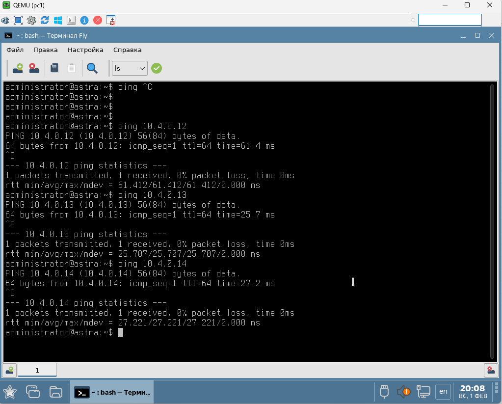

[Назад, к списку домашних заданий](../README.md)
# Домашнее задание №4. Построение Underlay сети(eBGP).
## 1. План работ.
1. Скопировать стенд с домашнего задания №1.
2. Настроить BGP peering между Leaf и Spine в AF l2vpn evpn
3. Убедиться в наличии связности между клиентами в первой зоне, с фиксацией результатов.
4. Сохранить конфигурацию сетевого оборудования.

## 2. Схема топологии CLOS.


## 3. Адресное пространство для Underlay.
### Таблица 1. Адресное пространство.
|Адресация|Назначение|
|--------|--------|
|10.0.1.**\<SN\>**/32|loopback интерфейсы для spine, где SN = 1-255|
|10.1.1.**\<LN\>**/32|loopback интерфейсы для leaf, где LN = 1-255|
|10.2.**\<SN\>**.**\<N\>**/30|p2p линки между spine и leaf, где SN = номер spine, N = 0-255|
|10.0.4.0/16|Overlay|
### Таблица 2. Сетевые адреса интерфейсов.
|Оборудование|Интерфейс|Адрес|
|--------|--------|----------|
|spine1|loopback1|10.0.1.1/32|
|spine2|loopback1|10.0.1.2/32|
|leaf1|loopback1|10.1.1.1/32|
|leaf2|loopback1|10.1.1.2/32|
|leaf3|loopback1|10.1.1.3/32|
|spine1|Eth1|10.2.1.0/31|
|leaf1|Eth1|10.2.1.1/31|
|spine1|Eth2|10.2.1.2/31|
|leaf2|Eth1|10.2.1.3/31|
|spine1|Eth3|10.2.1.4/31|
|leaf3|Eth1|10.2.1.5/31|
|spine2|Eth1|10.2.2.0/31|
|leaf1|Eth2|10.2.2.1/31|
|spine2|Eth2|10.2.2.2/31|
|leaf2|Eth2|10.2.2.3/31|
|spine2|Eth3|10.2.2.4/31|
|leaf3|Eth2|10.2.2.5/31|
|pc1|Eth1|10.4.0.11/16|
|pc2|Eth1|10.4.0.12/16|
|pc3|Eth1|10.4.0.13/16|
|pc4|Eth1|10.4.0.14/16|
### Таблица 3. Номера автономных систем (AS).
|Имя коммутатора|AS|комментарий|
|--------|--------|--------|
|spine1|65001||
|spine2|65001||
|leaf1|65101||
|leaf2|65102||
|leaf3|65103||
|leafN|65XXX|**\<где XXX = 100 + N\>**|
## 4. Настройки сетевого оборудования.
<details>
  <summary>spine1 configuration</summary>

  ```cisco
spine1#sh run
! Command: show running-config
! device: spine1 (vEOS-lab, EOS-4.27.0F)
!
! boot system flash:/vEOS-lab.swi
!
no aaa root
!
transceiver qsfp default-mode 4x10G
!
service routing protocols model multi-agent
!
hostname spine1
!
spanning-tree mode mstp
!
interface Ethernet1
   description leaf1
   no switchport
   ip address 10.2.1.0/31
   ip ospf network point-to-point
   ip ospf area 0.0.0.0
!
interface Ethernet2
   description leaf2
   no switchport
   ip address 10.2.1.2/31
   ip ospf network point-to-point
   ip ospf area 0.0.0.0
!
interface Ethernet3
   description leaf3
   no switchport
   ip address 10.2.1.4/31
   ip ospf network point-to-point
   ip ospf area 0.0.0.0
!
interface Loopback1
   ip address 10.0.1.1/32
   ip ospf area 0.0.0.0
!
interface Management1
!
ip routing
!
router bgp 65001
   router-id 10.0.1.1
   no bgp default ipv4-unicast
   distance bgp 20 200 200
   neighbor LEAF peer group
   neighbor LEAF remote-as 65001
   neighbor LEAF next-hop-unchanged
   neighbor LEAF update-source Loopback1
   neighbor LEAF bfd
   neighbor LEAF ebgp-multihop 2
   neighbor LEAF route-reflector-client
   neighbor LEAF send-community extended
   neighbor 10.1.1.1 peer group LEAF
   neighbor 10.1.1.1 remote-as 65101
   neighbor 10.1.1.1 description leaf1
   neighbor 10.1.1.2 peer group LEAF
   neighbor 10.1.1.2 remote-as 65102
   neighbor 10.1.1.2 description leaf2
   neighbor 10.1.1.3 peer group LEAF
   neighbor 10.1.1.3 remote-as 65103
   neighbor 10.1.1.3 description leaf3
   !
   address-family evpn
      neighbor LEAF activate
!
router ospf 1
   router-id 10.0.1.1
   bfd default
   passive-interface default
   no passive-interface Ethernet1
   no passive-interface Ethernet2
   no passive-interface Ethernet3
   max-lsa 12000
   log-adjacency-changes detail
!
end
spine1#

  ```
</details>

<details>
  <summary>spine2 configuration</summary>

  ```cisco
spine2#sh run
! Command: show running-config
! device: spine2 (vEOS-lab, EOS-4.27.0F)
!
! boot system flash:/vEOS-lab.swi
!
no aaa root
!
transceiver qsfp default-mode 4x10G
!
service routing protocols model multi-agent
!
no logging console
!
hostname spine2
!
spanning-tree mode mstp
!
interface Ethernet1
   description leaf1
   no switchport
   ip address 10.2.2.0/31
   ip ospf network point-to-point
   ip ospf area 0.0.0.0
!
interface Ethernet2
   description leaf2
   no switchport
   ip address 10.2.2.2/31
   ip ospf network point-to-point
   ip ospf area 0.0.0.0
!
interface Ethernet3
   description leaf3
   no switchport
   ip address 10.2.2.4/31
   ip ospf network point-to-point
   ip ospf area 0.0.0.0
!
interface Loopback1
   ip address 10.0.1.2/32
   ip ospf area 0.0.0.0
!
interface Management1
!
ip routing
!
router bgp 65001
   router-id 10.0.1.2
   no bgp default ipv4-unicast
   distance bgp 20 200 200
   neighbor LEAF peer group
   neighbor LEAF remote-as 65001
   neighbor LEAF next-hop-unchanged
   neighbor LEAF update-source Loopback1
   neighbor LEAF bfd
   neighbor LEAF ebgp-multihop 2
   neighbor LEAF route-reflector-client
   neighbor LEAF send-community extended
   neighbor 10.1.1.1 peer group LEAF
   neighbor 10.1.1.1 remote-as 65101
   neighbor 10.1.1.1 description leaf1
   neighbor 10.1.1.2 peer group LEAF
   neighbor 10.1.1.2 remote-as 65102
   neighbor 10.1.1.2 description leaf2
   neighbor 10.1.1.3 peer group LEAF
   neighbor 10.1.1.3 remote-as 65103
   neighbor 10.1.1.3 description leaf3
   !
   address-family evpn
      neighbor LEAF activate
!
router ospf 1
   router-id 10.0.1.2
   bfd default
   passive-interface default
   no passive-interface Ethernet1
   no passive-interface Ethernet2
   no passive-interface Ethernet3
   max-lsa 12000
   log-adjacency-changes detail
!
end
spine2#

  ```
</details>

<details>
  <summary>leaf1 configuration</summary>

  ```cisco
leaf1#sh run
! Command: show running-config
! device: leaf1 (vEOS-lab, EOS-4.27.0F)
!
! boot system flash:/vEOS-lab.swi
!
no aaa root
!
transceiver qsfp default-mode 4x10G
!
ip security
   profile VTEP
!
service routing protocols model multi-agent
!
no logging console
!
hostname leaf1
!
spanning-tree mode mstp
!
vlan 100
   name pc
!
interface Ethernet1
   description spine1
   no switchport
   ip address 10.2.1.1/31
   ip ospf network point-to-point
   ip ospf area 0.0.0.0
!
interface Ethernet2
   description spine2
   no switchport
   ip address 10.2.2.1/31
   ip ospf network point-to-point
   ip ospf area 0.0.0.0
!
interface Ethernet3
   switchport access vlan 100
!
interface Loopback1
   description UNDERLAY
   ip address 10.1.1.1/32
   ip ospf area 0.0.0.0
!
interface Management1
!
interface Vlan100
   description pc
   ip proxy-arp
   ip address 10.4.0.1/16
!
interface Vxlan1
   vxlan source-interface Loopback1
   vxlan udp-port 4789
   vxlan vlan 100 vni 100100
!
ip routing
!
router bgp 65101
   router-id 10.1.1.1
   no bgp default ipv4-unicast
   maximum-paths 4
   neighbor SPINE peer group
   neighbor SPINE remote-as 65001
   neighbor SPINE update-source Loopback1
   neighbor SPINE bfd
   neighbor SPINE local-v4-addr 10.1.1.1
   neighbor SPINE ebgp-multihop 4
   neighbor SPINE send-community extended
   neighbor 10.0.1.1 peer group SPINE
   neighbor 10.0.1.1 description spine1
   neighbor 10.0.1.2 peer group SPINE
   neighbor 10.0.1.2 description spine2
   !
   vlan 100
      rd 10.1.1.1:100
      route-target both 100:100100
      redistribute learned
   !
   address-family evpn
      neighbor SPINE activate
!
router ospf 1
   router-id 10.1.1.1
   bfd default
   passive-interface default
   no passive-interface Ethernet1
   no passive-interface Ethernet2
   max-lsa 12000
   log-adjacency-changes detail
!
end
leaf1#
  ```
</details>

<details>
  <summary>leaf2 configuration</summary>

  ```cisco
leaf2#sh run
! Command: show running-config
! device: leaf2 (vEOS-lab, EOS-4.27.0F)
!
! boot system flash:/vEOS-lab.swi
!
no aaa root
!
transceiver qsfp default-mode 4x10G
!
ip security
   profile VTEP
!
service routing protocols model multi-agent
!
no logging console
!
hostname leaf2
!
spanning-tree mode mstp
!
vlan 100
   name CLIENTS
!
interface Ethernet1
   description spine1
   no switchport
   ip address 10.2.1.3/31
   ip ospf network point-to-point
   ip ospf area 0.0.0.0
!
interface Ethernet2
   description spine2
   no switchport
   ip address 10.2.2.3/31
   ip ospf network point-to-point
   ip ospf area 0.0.0.0
!
interface Ethernet3
   switchport access vlan 100
!
interface Loopback1
   description UNDERLAY
   ip address 10.1.1.2/32
   ip ospf area 0.0.0.0
!
interface Management1
!
interface Vlan100
   ip proxy-arp
   ip address 10.4.0.1/16
!
interface Vxlan1
   vxlan source-interface Loopback1
   vxlan udp-port 4789
   vxlan vlan 100 vni 100100
   vxlan flood vtep 10.1.1.1 10.1.1.2 10.1.1.3
!
ip routing
!
router bgp 65102
   router-id 10.1.1.2
   no bgp default ipv4-unicast
   maximum-paths 4
   neighbor SPINE peer group
   neighbor SPINE remote-as 65001
   neighbor SPINE update-source Loopback1
   neighbor SPINE bfd
   neighbor SPINE local-v4-addr 10.1.1.2
   neighbor SPINE ebgp-multihop 4
   neighbor SPINE send-community extended
   neighbor 10.0.1.1 peer group SPINE
   neighbor 10.0.1.1 description spine1
   neighbor 10.0.1.2 peer group SPINE
   neighbor 10.0.1.2 description spine2
   !
   vlan 100
      rd 10.1.1.2:100
      route-target both 100:100100
      redistribute learned
   !
   address-family evpn
      neighbor SPINE activate
!
router ospf 1
   router-id 10.1.1.2
   bfd default
   passive-interface default
   no passive-interface Ethernet1
   no passive-interface Ethernet2
   max-lsa 12000
   log-adjacency-changes detail
!
end
leaf2#

  ```
</details>

<details>
  <summary>leaf3 configuration</summary>

  ```cisco
leaf3#sh run
! Command: show running-config
! device: leaf3 (vEOS-lab, EOS-4.27.0F)
!
! boot system flash:/vEOS-lab.swi
!
no aaa root
!
transceiver qsfp default-mode 4x10G
!
service routing protocols model multi-agent
!
no logging console
!
hostname leaf3
!
spanning-tree mode mstp
!
vlan 100
   name CLIENTS
!
interface Ethernet1
   description spine1
   no switchport
   ip address 10.2.1.5/31
   ip ospf network point-to-point
   ip ospf area 0.0.0.0
!
interface Ethernet2
   description spine2
   no switchport
   ip address 10.2.2.5/31
   ip ospf network point-to-point
   ip ospf area 0.0.0.0
!
interface Ethernet3
   switchport access vlan 100
!
interface Ethernet4
   switchport access vlan 100
!
interface Loopback1
   description UNDERLAY
   ip address 10.1.1.3/32
   ip ospf area 0.0.0.0
!
interface Management1
!
interface Vlan100
   ip proxy-arp
   ip address 10.4.0.1/16
!
interface Vxlan1
   vxlan source-interface Loopback1
   vxlan udp-port 4789
   vxlan vlan 100 vni 100100
!
ip routing
!
router bgp 65103
   router-id 10.1.1.3
   no bgp default ipv4-unicast
   maximum-paths 4
   neighbor SPINE peer group
   neighbor SPINE remote-as 65001
   neighbor SPINE update-source Loopback1
   neighbor SPINE bfd
   neighbor SPINE local-v4-addr 10.1.1.3
   neighbor SPINE ebgp-multihop 4
   neighbor SPINE send-community extended
   neighbor 10.0.1.1 peer group SPINE
   neighbor 10.0.1.1 description spine1
   neighbor 10.0.1.2 peer group SPINE
   neighbor 10.0.1.2 description spine2
   !
   vlan 100
      rd 10.1.1.3:100
      route-target both 100:100100
      redistribute learned
   !
   address-family evpn
      neighbor SPINE activate
!
router ospf 1
   router-id 10.1.1.3
   bfd default
   passive-interface default
   no passive-interface Ethernet1
   no passive-interface Ethernet2
   max-lsa 12000
   log-adjacency-changes detail
!
end
leaf3#
  ```
</details>

# Проверка сетевой связности.
<details>
  <summary>проверка UNDERLAY (OSPF)</summary>

  ```cisco
leaf1#sh ip ospf neighbor
Neighbor ID     Instance VRF      Pri State                  Dead Time   Address         Interface
10.0.1.1        1        default  0   FULL                   00:00:36    10.2.1.0        Ethernet1
10.0.1.2        1        default  0   FULL                   00:00:29    10.2.2.0        Ethernet2
  ```
  ```cisco
spine1#sh ip ospf neighbor
Neighbor ID     Instance VRF      Pri State                  Dead Time   Address         Interface
10.1.1.3        1        default  0   FULL                   00:00:32    10.2.1.5        Ethernet3
10.1.1.2        1        default  0   FULL                   00:00:32    10.2.1.3        Ethernet2
10.1.1.1        1        default  0   FULL                   00:00:37    10.2.1.1        Ethernet1
  ```
  ```cisco
leaf1#sh ip route ospf | inc Eth
 O        10.0.1.1/32 [110/20] via 10.2.1.0, Ethernet1
 O        10.0.1.2/32 [110/20] via 10.2.2.0, Ethernet2
 O        10.1.1.2/32 [110/30] via 10.2.1.0, Ethernet1
                               via 10.2.2.0, Ethernet2
 O        10.1.1.3/32 [110/30] via 10.2.1.0, Ethernet1
                               via 10.2.2.0, Ethernet2
 O        10.2.1.2/31 [110/20] via 10.2.1.0, Ethernet1
 O        10.2.1.4/31 [110/20] via 10.2.1.0, Ethernet1
 O        10.2.2.2/31 [110/20] via 10.2.2.0, Ethernet2
 O        10.2.2.4/31 [110/20] via 10.2.2.0, Ethernet2
  ```
  ```cisco
leaf1#ping 10.1.1.3
PING 10.1.1.3 (10.1.1.3) 72(100) bytes of data.
80 bytes from 10.1.1.3: icmp_seq=1 ttl=63 time=3.65 ms
80 bytes from 10.1.1.3: icmp_seq=2 ttl=63 time=2.70 ms
80 bytes from 10.1.1.3: icmp_seq=3 ttl=63 time=3.16 ms
80 bytes from 10.1.1.3: icmp_seq=4 ttl=63 time=2.78 ms
80 bytes from 10.1.1.3: icmp_seq=5 ttl=63 time=2.50 ms

--- 10.1.1.3 ping statistics ---
5 packets transmitted, 5 received, 0% packet loss, time 15ms
rtt min/avg/max/mdev = 2.501/2.965/3.658/0.409 ms, ipg/ewma 3.828/3.292 ms
  ```
  ```cisco
leaf1#sh bfd peers
VRF name: default
-----------------
DstAddr      MyDisc    YourDisc  Interface/Transport      Type          LastUp
-------- ----------- ----------- -------------------- --------- ---------------
10.0.1.1 2344248832   832295793                   NA  multihop  02/01/26 17:02
10.0.1.2 2805635142  2711332765                   NA  multihop  02/01/26 17:02
10.2.1.0  507741701   404184855         Ethernet1(8)    normal  02/01/26 17:02
10.2.2.0 2421140285  2559421329         Ethernet2(9)    normal  02/01/26 17:02
  ```
</details>

<details>
  <summary>проверка OVERLAY (BGP EVPN)</summary>

  ```cisco
spine1#sh bgp evpn summary
BGP summary information for VRF default
Router identifier 10.0.1.1, local AS number 65001
Neighbor Status Codes: m - Under maintenance
  Description              Neighbor         V AS           MsgRcvd   MsgSent  InQ OutQ  Up/Down State   PfxRcd PfxAcc
  leaf1                    10.1.1.1         4 65101             12        11    0    0 00:03:33 Estab   2      2
  leaf2                    10.1.1.2         4 65102             13        11    0    0 00:03:16 Estab   2      2
  leaf3                    10.1.1.3         4 65103             12        11    0    0 00:03:06 Estab   2      2
spine1#
  ```
  ```cisco
leaf1#sh bgp evpn summary
BGP summary information for VRF default
Router identifier 10.1.1.1, local AS number 65101
Neighbor Status Codes: m - Under maintenance
  Description              Neighbor         V AS           MsgRcvd   MsgSent  InQ OutQ  Up/Down State   PfxRcd PfxAcc
  spine1                   10.0.1.1         4 65001             11        12    0    0 00:03:55 Estab   4      4
  spine2                   10.0.1.2         4 65001             11        10    0    0 00:03:50 Estab   4      4
leaf1#
  ```

</details>

<details>
  <summary>Проверка VXLAN</summary>

  ```cisco
leaf1#show vxlan vni
VNI to VLAN Mapping for Vxlan1
VNI          VLAN       Source       Interface       802.1Q Tag
------------ ---------- ------------ --------------- ----------
100100       100        static       Ethernet3       untagged
                                     Vxlan1          100

VNI to dynamic VLAN Mapping for Vxlan1
VNI       VLAN       VRF       Source
--------- ---------- --------- ------------

leaf1#
  ```
  ```cisco
leaf1#show vxlan vtep
Remote VTEPS for Vxlan1:

VTEP           Tunnel Type(s)
-------------- --------------
10.1.1.2       unicast, flood
10.1.1.3       flood

Total number of remote VTEPS:  2
leaf1#
  ```
  ```cisco
leaf1# show vxlan address-table
          Vxlan Mac Address Table
----------------------------------------------------------------------

VLAN  Mac Address     Type      Prt  VTEP             Moves   Last Move
----  -----------     ----      ---  ----             -----   ---------
 100  0050.7966.685e  EVPN      Vx1  10.1.1.3         1       0:04:45 ago
 100  0050.7966.685f  EVPN      Vx1  10.1.1.3         1       0:04:44 ago
 100  5072.9c00.6a00  EVPN      Vx1  10.1.1.2         1       0:09:06 ago
Total Remote Mac Addresses for this criterion: 3

  ```
</details>
<details>
  <summary>Проверка EVPN маршруты</summary>

  ```cisco
# Маршруты типа 2
  leaf1#sh bgp evp route-type mac-ip
BGP routing table information for VRF default
Router identifier 10.1.1.1, local AS number 65101
Route status codes: s - suppressed, * - valid, > - active, E - ECMP head, e - ECMP
                    S - Stale, c - Contributing to ECMP, b - backup
                    % - Pending BGP convergence
Origin codes: i - IGP, e - EGP, ? - incomplete
AS Path Attributes: Or-ID - Originator ID, C-LST - Cluster List, LL Nexthop - Link Local Nexthop

          Network                Next Hop              Metric  LocPref Weight  Path
 * >Ec   RD: 10.1.1.3:100 mac-ip 0050.7966.685e
                                 10.1.1.3              -       100     0       65001 65103 i
 *  ec   RD: 10.1.1.3:100 mac-ip 0050.7966.685e
                                 10.1.1.3              -       100     0       65001 65103 i
 * >Ec   RD: 10.1.1.3:100 mac-ip 0050.7966.685f
                                 10.1.1.3              -       100     0       65001 65103 i
 *  ec   RD: 10.1.1.3:100 mac-ip 0050.7966.685f
                                 10.1.1.3              -       100     0       65001 65103 i
 * >Ec   RD: 10.1.1.2:100 mac-ip 5072.9c00.6a00
                                 10.1.1.2              -       100     0       65001 65102 i
 *  ec   RD: 10.1.1.2:100 mac-ip 5072.9c00.6a00
                                 10.1.1.2              -       100     0       65001 65102 i
 * >     RD: 10.1.1.1:100 mac-ip 50b7.6500.6900
                                 -                     -       -       0       i
 * >     RD: 10.1.1.1:100 mac-ip 50b7.6500.6900 10.4.0.11
                                 -                     -       -       0       i
leaf1#
```
> В таблице route-type 2 вижу только mac адреса потому что arp Таблицы на хостах пустые,
> только клиент 10.4.0.11 пинговал шлюза 10.4.0.1 и попал в arp таблицу
> в моей версии arista arp learning/suppression  на SVI интефрейсах недоступен
> *— Бодров Д.А.*
</details>
    

<details>
  <summary>Таблицы MAC-адресов</summary>

  ```
leaf1#sh mac address-table
          Mac Address Table
------------------------------------------------------------------

Vlan    Mac Address       Type        Ports      Moves   Last Move
----    -----------       ----        -----      -----   ---------
 100    0050.7966.685e    DYNAMIC     Vx1        1       0:00:05 ago
 100    0050.7966.685f    DYNAMIC     Vx1        1       0:00:04 ago
 100    5072.9c00.6a00    DYNAMIC     Vx1        1       0:00:08 ago
 100    50b7.6500.6900    DYNAMIC     Et3        1       0:00:08 ago
Total Mac Addresses for this criterion: 4

          Multicast Mac Address Table
------------------------------------------------------------------

Vlan    Mac Address       Type        Ports
----    -----------       ----        -----
Total Mac Addresses for this criterion: 0
leaf1#
  ```
  ```cisco
leaf1#sh vxlan address-table
          Vxlan Mac Address Table
----------------------------------------------------------------------

VLAN  Mac Address     Type      Prt  VTEP             Moves   Last Move
----  -----------     ----      ---  ----             -----   ---------
 100  0050.7966.685e  EVPN      Vx1  10.1.1.3         1       0:00:31 ago
 100  0050.7966.685f  EVPN      Vx1  10.1.1.3         1       0:00:30 ago
 100  5072.9c00.6a00  EVPN      Vx1  10.1.1.2         1       0:00:34 ago
Total Remote Mac Addresses for this criterion: 3
leaf1#
  ```
</details>
<details>
  <summary>Пинг клиентов между разными VTEP</summary>



</details>
  
[Назад, к списку домашних заданий](../README.md)
