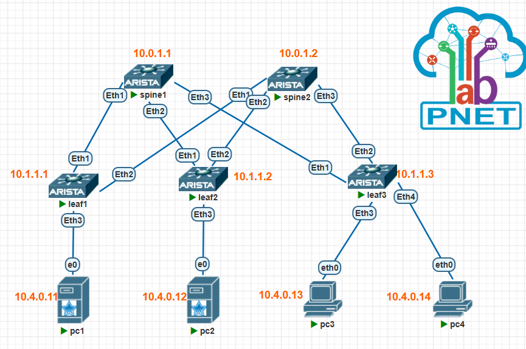

[Назад, к списку домашних заданий](../README.md)
# Домашнее задание №4. Построение Underlay сети(eBGP).
## 1. План работ.
1. Скопировать стенд с домашнего задания №1.
2. Настроить BGP peering между Leaf и Spine в AF l2vpn evpn
3. Убедиться в наличии связности между клиентами в первой зоне, с фиксацией результатов.
4. Сохранить конфигурацию сетевого оборудования.

## 2. Схема топологии CLOS.


## 3. Адресное пространство для Underlay.
### Таблица 1. Адресное пространство.
|Адресация|Назначение|
|--------|--------|
|10.0.1.**\<SN\>**/32|loopback интерфейсы для spine, где SN = 1-255|
|10.1.1.**\<LN\>**/32|loopback интерфейсы для leaf, где LN = 1-255|
|10.2.**\<SN\>**.**\<N\>**/30|p2p линки между spine и leaf, где SN = номер spine, N = 0-255|
|10.0.4.0/16|Overlay|
### Таблица 2. Сетевые адреса интерфейсов.
|Оборудование|Интерфейс|Адрес|
|--------|--------|----------|
|spine1|loopback1|10.0.1.1/32|
|spine2|loopback1|10.0.1.2/32|
|leaf1|loopback1|10.1.1.1/32|
|leaf2|loopback1|10.1.1.2/32|
|leaf3|loopback1|10.1.1.3/32|
|spine1|Eth1|10.2.1.0/31|
|leaf1|Eth1|10.2.1.1/31|
|spine1|Eth2|10.2.1.2/31|
|leaf2|Eth1|10.2.1.3/31|
|spine1|Eth3|10.2.1.4/31|
|leaf3|Eth1|10.2.1.5/31|
|spine2|Eth1|10.2.2.0/31|
|leaf1|Eth2|10.2.2.1/31|
|spine2|Eth2|10.2.2.2/31|
|leaf2|Eth2|10.2.2.3/31|
|spine2|Eth3|10.2.2.4/31|
|leaf3|Eth2|10.2.2.5/31|
|pc1|Eth1|10.4.0.11/16|
|pc2|Eth1|10.4.0.12/16|
|pc3|Eth1|10.4.0.13/16|
|pc4|Eth1|10.4.0.14/16|
### Таблица 3. Номера автономных систем (AS).
|Имя коммутатора|AS|комментарий|
|--------|--------|--------|
|spine1|65001||
|spine2|65001||
|leaf1|65101||
|leaf2|65102||
|leaf3|65103||
|leafN|65XXX|**\<где XXX = 100 + N\>**|
## 4. Настройки сетевого оборудования.
<details>
  <summary>spine1 configuration</summary>

  ```cisco
spine1#sh run
! Command: show running-config
! device: spine1 (vEOS-lab, EOS-4.27.0F)
!
! boot system flash:/vEOS-lab.swi
!
no aaa root
!
transceiver qsfp default-mode 4x10G
!
service routing protocols model multi-agent
!
hostname spine1
!
spanning-tree mode mstp
!
interface Ethernet1
   description leaf1
   no switchport
   ip address 10.2.1.0/31
   ip ospf network point-to-point
   ip ospf area 0.0.0.0
!
interface Ethernet2
   description leaf2
   no switchport
   ip address 10.2.1.2/31
   ip ospf network point-to-point
   ip ospf area 0.0.0.0
!
interface Ethernet3
   description leaf3
   no switchport
   ip address 10.2.1.4/31
   ip ospf network point-to-point
   ip ospf area 0.0.0.0
!
interface Loopback1
   ip address 10.0.1.1/32
   ip ospf area 0.0.0.0
!
interface Management1
!
ip routing
!
router bgp 65001
   router-id 10.0.1.1
   maximum-paths 4
   neighbor LEAF_PEERS peer group
   neighbor LEAF_PEERS remote-as 65001
   neighbor LEAF_PEERS next-hop-unchanged
   neighbor LEAF_PEERS update-source Loopback1
   neighbor LEAF_PEERS bfd
   neighbor LEAF_PEERS ebgp-multihop 3
   neighbor LEAF_PEERS route-reflector-client
   neighbor LEAF_PEERS send-community extended
   neighbor 10.1.1.1 peer group LEAF_PEERS
   neighbor 10.1.1.1 remote-as 65101
   neighbor 10.1.1.2 peer group LEAF_PEERS
   neighbor 10.1.1.2 remote-as 65102
   neighbor 10.1.1.3 peer group LEAF_PEERS
   neighbor 10.1.1.3 remote-as 65103
   !
   address-family evpn
      neighbor LEAF_PEERS activate
      neighbor LEAF_PEERS next-hop-unchanged
!
router ospf 1
   router-id 10.0.1.1
   passive-interface default
   no passive-interface Ethernet1
   no passive-interface Ethernet2
   no passive-interface Ethernet3
   max-lsa 12000
   log-adjacency-changes detail
!
end
spine1#
  ```
</details>

<details>
  <summary>spine2 configuration</summary>

  ```cisco
 spine2#sh run
! Command: show running-config
! device: spine2 (vEOS-lab, EOS-4.27.0F)
!
! boot system flash:/vEOS-lab.swi
!
no aaa root
!
transceiver qsfp default-mode 4x10G
!
service routing protocols model multi-agent
!
no logging console
!
hostname spine2
!
spanning-tree mode mstp
!
interface Ethernet1
   description leaf1
   no switchport
   ip address 10.2.2.0/31
   ip ospf network point-to-point
   ip ospf area 0.0.0.0
!
interface Ethernet2
   description leaf2
   no switchport
   ip address 10.2.2.2/31
   ip ospf network point-to-point
   ip ospf area 0.0.0.0
!
interface Ethernet3
   description leaf3
   no switchport
   ip address 10.2.2.4/31
   ip ospf network point-to-point
   ip ospf area 0.0.0.0
!
interface Loopback1
   ip address 10.0.1.2/32
   ip ospf area 0.0.0.0
!
interface Management1
!
ip routing
!
router bgp 65001
   router-id 10.0.1.2
   maximum-paths 4
   neighbor LEAF_PEERS peer group
   neighbor LEAF_PEERS remote-as 65001
   neighbor LEAF_PEERS next-hop-unchanged
   neighbor LEAF_PEERS update-source Loopback1
   neighbor LEAF_PEERS ebgp-multihop 3
   neighbor LEAF_PEERS route-reflector-client
   neighbor LEAF_PEERS send-community extended
   neighbor 10.1.1.1 peer group LEAF_PEERS
   neighbor 10.1.1.1 remote-as 65101
   neighbor 10.1.1.2 peer group LEAF_PEERS
   neighbor 10.1.1.2 remote-as 65102
   neighbor 10.1.1.3 peer group LEAF_PEERS
   neighbor 10.1.1.3 remote-as 65103
   !
   address-family evpn
      neighbor LEAF_PEERS activate
      neighbor LEAF_PEERS next-hop-unchanged
!
router ospf 1
   router-id 10.0.1.2
   bfd default
   passive-interface default
   no passive-interface Ethernet1
   no passive-interface Ethernet2
   no passive-interface Ethernet3
   max-lsa 12000
   log-adjacency-changes detail
!
end
spine2#
  ```
</details>

<details>
  <summary>leaf1 configuration</summary>

  ```cisco
leaf1#sh run
! Command: show running-config
! device: leaf1 (vEOS-lab, EOS-4.27.0F)
!
! boot system flash:/vEOS-lab.swi
!
no aaa root
!
transceiver qsfp default-mode 4x10G
!
ip security
   profile VTEP
!
service routing protocols model multi-agent
!
no logging console
!
hostname leaf1
!
spanning-tree mode mstp
!
vlan 100
   name CLIENTS
!
interface Ethernet1
   description spine1
   no switchport
   ip address 10.2.1.1/31
   ip ospf network point-to-point
   ip ospf area 0.0.0.0
!
interface Ethernet2
   description spine2
   no switchport
   ip address 10.2.2.1/31
   ip ospf network point-to-point
   ip ospf area 0.0.0.0
!
interface Ethernet3
   switchport access vlan 100
!
interface Loopback1
   ip address 10.1.1.1/32
   ip ospf area 0.0.0.0
!
interface Management1
!
interface Vlan100
   ip proxy-arp
   ip address 10.4.0.1/16
!
interface Vxlan1
   vxlan source-interface Loopback1
   vxlan udp-port 4789
   vxlan vlan 100 vni 100100
   vxlan flood vtep 10.1.1.1 10.1.1.2 10.1.1.3
!
ip routing
!
arp 10.4.0.12 00:50:79:66:68:5d arpa
!
router bgp 65101
   router-id 10.1.1.1
   maximum-paths 10
   neighbor SPINE_PEERS peer group
   neighbor SPINE_PEERS remote-as 65001
   neighbor SPINE_PEERS update-source Loopback1
   neighbor SPINE_PEERS bfd
   neighbor SPINE_PEERS ebgp-multihop 2
   neighbor 10.0.1.1 peer group SPINE_PEERS
   neighbor 10.0.1.2 peer group SPINE_PEERS
   redistribute connected
   !
   vlan 100
      rd 10.1.1.1:100
      route-target both 65001:100
      redistribute learned
   !
   address-family evpn
      neighbor SPINE_PEERS activate
!
router ospf 1
   router-id 10.1.1.1
   bfd default
   passive-interface default
   no passive-interface Ethernet1
   no passive-interface Ethernet2
   max-lsa 12000
   log-adjacency-changes detail
!
end
leaf1#

  ```
</details>

<details>
  <summary>leaf2 configuration</summary>

  ```cisco
leaf2#sh run
! Command: show running-config
! device: leaf2 (vEOS-lab, EOS-4.27.0F)
!
! boot system flash:/vEOS-lab.swi
!
no aaa root
!
transceiver qsfp default-mode 4x10G
!
ip security
   profile VTEP
!
service routing protocols model multi-agent
!
no logging console
!
hostname leaf2
!
spanning-tree mode mstp
!
vlan 100
   name CLIENTS
!
interface Ethernet1
   description spine1
   no switchport
   ip address 10.2.1.3/31
   ip ospf network point-to-point
   ip ospf area 0.0.0.0
!
interface Ethernet2
   description spine2
   no switchport
   ip address 10.2.2.3/31
   ip ospf network point-to-point
   ip ospf area 0.0.0.0
!
interface Ethernet3
   switchport access vlan 100
!
interface Loopback1
   ip address 10.1.1.2/32
   ip ospf area 0.0.0.0
!
interface Management1
!
interface Vlan100
   ip proxy-arp
   ip address 10.4.0.1/16
!
interface Vxlan1
   vxlan source-interface Loopback1
   vxlan udp-port 4789
   vxlan vlan 100 vni 100100
   vxlan flood vtep 10.1.1.1 10.1.1.2 10.1.1.3
!
ip routing
!
arp 10.4.0.11 00:50:79:66:68:69 arpa
!
router bgp 65102
   router-id 10.1.1.2
   maximum-paths 10
   neighbor SPINE_PEERS peer group
   neighbor SPINE_PEERS remote-as 65001
   neighbor SPINE_PEERS update-source Loopback1
   neighbor SPINE_PEERS bfd
   neighbor SPINE_PEERS ebgp-multihop 2
   neighbor 10.0.1.1 peer group SPINE_PEERS
   neighbor 10.0.1.2 peer group SPINE_PEERS
   !
   vlan 100
      rd 10.1.1.2:100
      route-target both 65001:100
      redistribute learned
   !
   address-family evpn
      neighbor SPINE_PEERS activate
!
router ospf 1
   router-id 10.1.1.2
   bfd default
   passive-interface default
   no passive-interface Ethernet1
   no passive-interface Ethernet2
   max-lsa 12000
   log-adjacency-changes detail
!
end
leaf2#
  ```
</details>

<details>
  <summary>leaf3 configuration</summary>

  ```cisco
leaf3#sh run
! Command: show running-config
! device: leaf3 (vEOS-lab, EOS-4.27.0F)
!
! boot system flash:/vEOS-lab.swi
!
no aaa root
!
transceiver qsfp default-mode 4x10G
!
service routing protocols model multi-agent
!
no logging console
!
hostname leaf3
!
spanning-tree mode mstp
!
vlan 100
   name CLIENTS
!
interface Ethernet1
   description spine1
   no switchport
   ip address 10.2.1.5/31
   ip ospf network point-to-point
   ip ospf area 0.0.0.0
!
interface Ethernet2
   description spine2
   no switchport
   ip address 10.2.2.5/31
   ip ospf network point-to-point
   ip ospf area 0.0.0.0
!
interface Ethernet3
   switchport access vlan 100
!
interface Ethernet4
   switchport access vlan 100
!
interface Loopback1
   ip address 10.1.1.3/32
   ip ospf area 0.0.0.0
!
interface Management1
!
interface Vlan100
   ip proxy-arp
   ip address 10.4.0.1/16
!
interface Vxlan1
   vxlan source-interface Loopback1
   vxlan udp-port 4789
   vxlan vlan 100 vni 100100
   vxlan flood vtep 10.1.1.1 10.1.1.2 10.1.1.3
!
ip routing
!
router bgp 65103
   router-id 10.1.1.3
   maximum-paths 10
   neighbor SPINE_PEERS peer group
   neighbor SPINE_PEERS remote-as 65001
   neighbor SPINE_PEERS update-source Loopback1
   neighbor SPINE_PEERS bfd
   neighbor SPINE_PEERS ebgp-multihop 2
   neighbor 10.0.1.1 peer group SPINE_PEERS
   neighbor 10.0.1.2 peer group SPINE_PEERS
   !
   vlan 100
      rd 10.1.1.3:100
      route-target both 65001:100
      redistribute learned
   !
   address-family evpn
      neighbor SPINE_PEERS activate
!
router ospf 1
   router-id 10.1.1.3
   bfd default
   passive-interface default
   no passive-interface Ethernet1
   no passive-interface Ethernet2
   max-lsa 12000
   log-adjacency-changes detail
!
end
leaf3#
  ```
</details>

# Проверка сетевой связности.
<details>
  <summary>проверка соседства</summary>

  ```cisco
  ```
</details>

<details>
  <summary>динамические маршруты</summary>

  ```cisco
  ```
</details>

<details>
  <summary>Проверка 1</summary>

  ```cisco
  ```
</details>

<details>
  <summary>Проверка 2</summary>

```cisco
```
</details>

<details>
  <summary>Проверка 3</summary>

  ```cisco
  ```
</details>
  
[Назад, к списку домашних заданий](../README.md)
