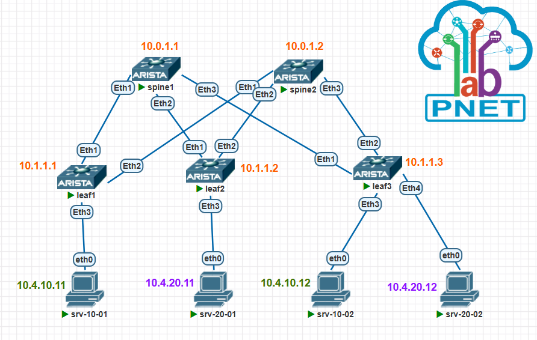

[Назад, к списку домашних заданий](../README.md)
# Домашнее задание №6. VxLAN. EVPN L3.
## 1. План работ.
1. Скопировать стенд с домашнего задания №1.
2. Настроить каждого клиента в своем VNI.
3. Настроите маршрутизацию между клиентами.
4. Убедиться в наличии связности между клиентами внутри VNI и между разными VNI, с фиксацией результатов.
5. Сохранить конфигурацию сетевого оборудования.

## 2. Схема топологии CLOS.



## 3. Адресное пространство для Underlay.
### Таблица 1. Адресное пространство.
|Адресация|Назначение|
|--------|--------|
|10.0.1.**\<SN\>**/32|loopback интерфейсы для spine, где SN = 1-255|
|10.1.1.**\<LN\>**/32|loopback интерфейсы для leaf, где LN = 1-255|
|10.2.**\<SN\>**.**\<N\>**/30|p2p линки между spine и leaf, где SN = номер spine, N = 0-255|
|10.4.10.0/24|Overlay - vlan 100, gw 10.4.10.1|
|10.4.20.0/24|Overlay - vlan 200,  gw 10.4.20.1|
### Таблица 2. Сетевые адреса интерфейсов.
|Оборудование|Интерфейс|Адрес|
|--------|--------|----------|
|spine1|loopback1|10.0.1.1/32|
|spine2|loopback1|10.0.1.2/32|
|leaf1|loopback1|10.1.1.1/32|
|leaf2|loopback1|10.1.1.2/32|
|leaf3|loopback1|10.1.1.3/32|
|spine1|Eth1|10.2.1.0/31|
|leaf1|Eth1|10.2.1.1/31|
|spine1|Eth2|10.2.1.2/31|
|leaf2|Eth1|10.2.1.3/31|
|spine1|Eth3|10.2.1.4/31|
|leaf3|Eth1|10.2.1.5/31|
|spine2|Eth1|10.2.2.0/31|
|leaf1|Eth2|10.2.2.1/31|
|spine2|Eth2|10.2.2.2/31|
|leaf2|Eth2|10.2.2.3/31|
|spine2|Eth3|10.2.2.4/31|
|leaf3|Eth2|10.2.2.5/31|
|srv-10-01|Eth1|10.4.10.11/24|
|srv-20-01|Eth1|10.4.20.11/24|
|srv-10-02|Eth1|10.4.10.12/24|
|srv-20-02|Eth1|10.4.20.12/24|
### Таблица 3. Номера автономных систем (AS).
|Имя коммутатора|AS|комментарий|
|--------|--------|--------|
|spine1|65001||
|spine2|65001||
|leaf1|65101||
|leaf2|65102||
|leaf3|65103||
|leafN|65XXX|**\<где XXX = 100 + N\>**|
## 4. Настройки сетевого оборудования.
<details>
  <summary>spine1 configuration</summary>

  ```cisco
  ```
</details>

<details>
  <summary>spine2 configuration</summary>

  ```cisco
  ```
</details>

<details>
  <summary>leaf1 configuration</summary>

  ```cisco
  ```
</details>

<details>
  <summary>leaf2 configuration</summary>

  ```cisco
  ```
</details>

<details>
  <summary>leaf3 configuration</summary>

  ```cisco
  ```
</details>

# Проверка сетевой связности.
<details>
  <summary>Проверка 1</summary>

  ```cisco
  ```
</details>

<details>
  <summary>Проверка 2</summary>

  ```cisco
  ```
</details>

<details>
  <summary>Проверка 3</summary>

  ```cisco
  ```
</details>

<details>
  <summary>Проверка 4</summary>

```cisco
```
</details>

<details>
  <summary>Проверка 5</summary>

  ```cisco
  ```
</details>
  
[Назад, к списку домашних заданий](../README.md)
