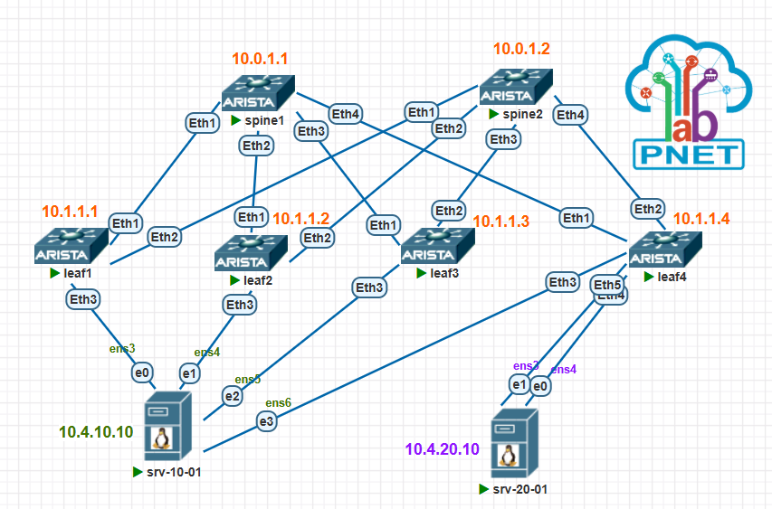
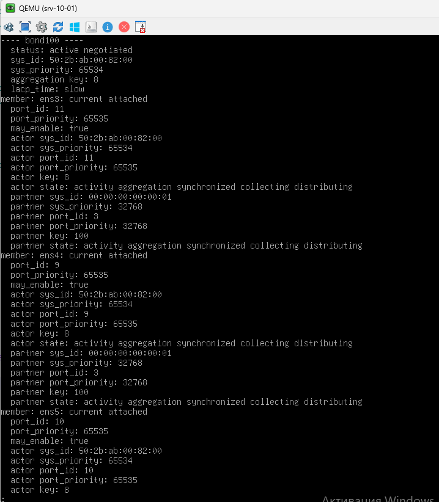
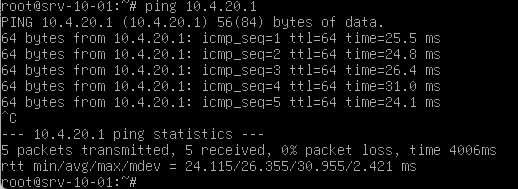
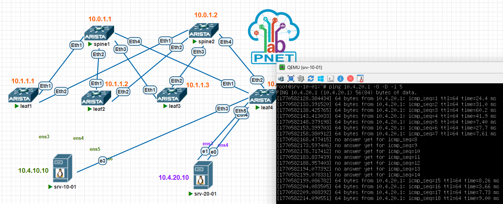
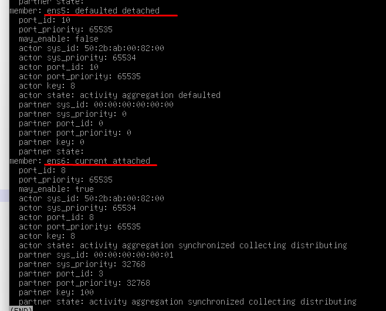

[Назад, к списку домашних заданий](../README.md)
# Домашнее задание №7. VxLAN. Аналоги VPC
## 1. План работ.
1. Скопировать стенд с домашнего задания №6, доработать стенд под текущее задание.
2. Подключить одного клиента 4 линками к 4 разным Leaf, другого 2 линками.
3. Настроите multihoming для работы в Overlay сети.
4. Настроить бондинг(lacp) на клиентах.
4. Убедиться в наличии связности между клиентами, с фиксацией результатов.
5. Сохранить конфигурацию сетевого оборудования.
6. Удалить лишние линки (имитация port down), проверить наличие связности, количество потерь при переключении.

## 2. Схема топологии CLOS.



## 3. Адресное пространство для Underlay.
### Таблица 1. Адресное пространство.
|Адресация|Назначение|
|--------|--------|
|10.0.1.**\<SN\>**/32|loopback интерфейсы для spine, где SN = 1-255|
|10.1.1.**\<LN\>**/32|loopback интерфейсы для leaf, где LN = 1-255|
|10.2.**\<SN\>**.**\<N\>**/30|p2p линки между spine и leaf, где SN = номер spine, N = 0-255|
|10.4.10.0/24|Overlay - vlan 100, gw 10.4.10.1|
|10.4.20.0/24|Overlay - vlan 200,  gw 10.4.20.1|
### Таблица 2. Сетевые адреса интерфейсов.
|Оборудование|Интерфейс|Адрес|
|--------|--------|----------|
|spine1|loopback1|10.0.1.1/32|
|spine2|loopback1|10.0.1.2/32|
|leaf1|loopback1|10.1.1.1/32|
|leaf2|loopback1|10.1.1.2/32|
|leaf3|loopback1|10.1.1.3/32|
|spine1|Eth1|10.2.1.0/31|	
|leaf1|Eth1|10.2.1.1/31|
|spine1|Eth2|10.2.1.2/31|
|leaf2|Eth1|10.2.1.3/31|
|spine1|Eth3|10.2.1.4/31|
|leaf3|Eth1|10.2.1.5/31|
|spine1|Eth4|10.2.1.6/31|
|leaf4|Eth1|10.2.1.7/31|
|spine2|Eth1|10.2.2.0/31|
|leaf1|Eth2|10.2.2.1/31|
|spine2|Eth2|10.2.2.2/31|
|leaf2|Eth2|10.2.2.3/31|
|spine2|Eth3|10.2.2.4/31|
|leaf3|Eth2|10.2.2.5/31|
|spine2|Eth3|10.2.2.6/31|
|leaf4|Eth2|10.2.2.7/31|
|srv-10-01|Eth1|10.4.10.10/24|
|srv-20-01|Eth1|10.4.20.10/24|
### Таблица 3. Номера автономных систем (AS).
|Имя коммутатора|AS|комментарий|
|--------|--------|--------|
|spine1|65001||
|spine2|65001||
|leaf1|65101||
|leaf2|65102||
|leaf3|65103||
|leaf4|65104||
|leafN|65XXX|**\<где XXX = 100 + N\>**|
## 4. Настройки сетевого оборудования.
<details>
  <summary>spine1 configuration</summary>

  ```cisco
spine1#sh run
! Command: show running-config
! device: spine1 (vEOS-lab, EOS-4.27.0F)
!
! boot system flash:/vEOS-lab.swi
!
no aaa root
!
transceiver qsfp default-mode 4x10G
!
service routing protocols model multi-agent
!
no logging console
!
hostname spine1
!
spanning-tree mode mstp
!
interface Ethernet1
   description leaf1
   no switchport
   ip address 10.2.1.0/31
   ip ospf network point-to-point
   ip ospf area 0.0.0.0
!
interface Ethernet2
   description leaf2
   no switchport
   ip address 10.2.1.2/31
   ip ospf network point-to-point
   ip ospf area 0.0.0.0
!
interface Ethernet3
   description leaf3
   no switchport
   ip address 10.2.1.4/31
   ip ospf network point-to-point
   ip ospf area 0.0.0.0
!
interface Ethernet4
   description leaf4
   no switchport
   ip address 10.2.1.6/31
   ip ospf network point-to-point
   ip ospf area 0.0.0.0
!
interface Loopback1
   ip address 10.0.1.1/32
   ip ospf area 0.0.0.0
!
interface Management1
!
ip routing
!
router bgp 65001
   router-id 10.0.1.1
   no bgp default ipv4-unicast
   distance bgp 20 200 200
   neighbor LEAF peer group
   neighbor LEAF remote-as 65001
   neighbor LEAF next-hop-unchanged
   neighbor LEAF update-source Loopback1
   neighbor LEAF bfd
   neighbor LEAF ebgp-multihop 2
   neighbor LEAF route-reflector-client
   neighbor LEAF send-community extended
   neighbor 10.1.1.1 peer group LEAF
   neighbor 10.1.1.1 remote-as 65101
   neighbor 10.1.1.1 description leaf1
   neighbor 10.1.1.2 peer group LEAF
   neighbor 10.1.1.2 remote-as 65102
   neighbor 10.1.1.2 description leaf2
   neighbor 10.1.1.3 peer group LEAF
   neighbor 10.1.1.3 remote-as 65103
   neighbor 10.1.1.3 description leaf3
   neighbor 10.1.1.4 peer group LEAF
   neighbor 10.1.1.4 remote-as 65104
   neighbor 10.1.1.4 description leaf4
   !
   address-family evpn
      neighbor LEAF activate
!
router ospf 1
   router-id 10.0.1.1
   bfd default
   passive-interface default
   no passive-interface Ethernet1
   no passive-interface Ethernet2
   no passive-interface Ethernet3
   no passive-interface Ethernet4
   max-lsa 12000
   log-adjacency-changes detail
!
end
spine1#

  ```
</details>

<details>
  <summary>spine2 configuration</summary>

  ```cisco
spine2#sh run
! Command: show running-config
! device: spine2 (vEOS-lab, EOS-4.27.0F)
!
! boot system flash:/vEOS-lab.swi
!
no aaa root
!
transceiver qsfp default-mode 4x10G
!
service routing protocols model multi-agent
!
no logging console
!
hostname spine2
!
spanning-tree mode mstp
!
interface Ethernet1
   description leaf1
   no switchport
   ip address 10.2.2.0/31
   ip ospf network point-to-point
   ip ospf area 0.0.0.0
!
interface Ethernet2
   description leaf2
   no switchport
   ip address 10.2.2.2/31
   ip ospf network point-to-point
   ip ospf area 0.0.0.0
!
interface Ethernet3
   description leaf3
   no switchport
   ip address 10.2.2.4/31
   ip ospf network point-to-point
   ip ospf area 0.0.0.0
!
interface Ethernet4
   description leaf4
   no switchport
   ip address 10.2.2.6/31
   ip ospf network point-to-point
   ip ospf area 0.0.0.0
!
interface Loopback1
   ip address 10.0.1.2/32
   ip ospf area 0.0.0.0
!
interface Management1
!
ip routing
!
router bgp 65001
   router-id 10.0.1.2
   no bgp default ipv4-unicast
   distance bgp 20 200 200
   neighbor LEAF peer group
   neighbor LEAF remote-as 65001
   neighbor LEAF next-hop-unchanged
   neighbor LEAF update-source Loopback1
   neighbor LEAF bfd
   neighbor LEAF ebgp-multihop 2
   neighbor LEAF route-reflector-client
   neighbor LEAF send-community extended
   neighbor 10.1.1.1 peer group LEAF
   neighbor 10.1.1.1 remote-as 65101
   neighbor 10.1.1.1 description leaf1
   neighbor 10.1.1.2 peer group LEAF
   neighbor 10.1.1.2 remote-as 65102
   neighbor 10.1.1.2 description leaf2
   neighbor 10.1.1.3 peer group LEAF
   neighbor 10.1.1.3 remote-as 65103
   neighbor 10.1.1.3 description leaf3
   neighbor 10.1.1.4 peer group LEAF
   neighbor 10.1.1.4 remote-as 65104
   neighbor 10.1.1.4 description leaf4
   !
   address-family evpn
      neighbor LEAF activate
!
router ospf 1
   router-id 10.0.1.2
   bfd default
   passive-interface default
   no passive-interface Ethernet1
   no passive-interface Ethernet2
   no passive-interface Ethernet3
   no passive-interface Ethernet4
   max-lsa 12000
   log-adjacency-changes detail
!
end
spine2#


  ```
</details>

<details>
  <summary>leaf1 configuration</summary>

  ```cisco
leaf1#sh run
! Command: show running-config
! device: leaf1 (vEOS-lab, EOS-4.27.0F)
!
! boot system flash:/vEOS-lab.swi
!
no aaa root
!
transceiver qsfp default-mode 4x10G
!
service routing protocols model multi-agent
!
no logging console
!
hostname leaf1
!
spanning-tree mode mstp
!
vlan 100
   name srv-10
!
vlan 200
   name srv-20
!
vrf instance SRV
   rd 1:1111
!
interface Port-Channel100
   switchport access vlan 100
   !
   evpn ethernet-segment
      identifier 0000:0000:0000:0000:0001
      designated-forwarder election algorithm preference 100
      route-target import 00:00:00:00:00:01
   lacp system-id 0000.0000.0001
!
interface Ethernet1
   description spine1
   no switchport
   ip address 10.2.1.1/31
   ip ospf network point-to-point
   ip ospf area 0.0.0.0
!
interface Ethernet2
   description spine2
   no switchport
   ip address 10.2.2.1/31
   ip ospf network point-to-point
   ip ospf area 0.0.0.0
!
interface Ethernet3
   description srv-10-01
   channel-group 100 mode active
!
interface Ethernet4
!
interface Loopback1
   description UNDERLAY
   ip address 10.1.1.1/32
   ip ospf area 0.0.0.0
!
interface Management1
!
interface Vlan100
   description pc
   vrf SRV
   ip proxy-arp
   ip address 10.4.10.1/24
!
interface Vlan200
   vrf SRV
   ip address 10.4.20.254/24
!
interface Vxlan1
   vxlan source-interface Loopback1
   vxlan udp-port 4789
   vxlan vlan 100 vni 100100
   vxlan vlan 200 vni 100200
   vxlan vrf SRV vni 1111
!
ip routing
ip routing vrf SRV
!
router bgp 65101
   router-id 10.1.1.1
   no bgp default ipv4-unicast
   maximum-paths 4
   neighbor SPINE peer group
   neighbor SPINE remote-as 65001
   neighbor SPINE update-source Loopback1
   neighbor SPINE bfd
   neighbor SPINE local-v4-addr 10.1.1.1
   neighbor SPINE ebgp-multihop 4
   neighbor SPINE send-community extended
   neighbor 10.0.1.1 peer group SPINE
   neighbor 10.0.1.1 description spine1
   neighbor 10.0.1.2 peer group SPINE
   neighbor 10.0.1.2 description spine2
   !
   vlan 100
      rd 10.1.1.1:100
      route-target both 100:100100
      redistribute learned
   !
   vlan 200
      rd 10.1.1.1:200
      route-target both 200:100200
      redistribute learned
   !
   address-family evpn
      neighbor SPINE activate
   !
   vrf SRV
      rd 65101:1
      route-target import evpn 1:1111
      route-target export evpn 1:1111
      redistribute connected
!
router ospf 1
   router-id 10.1.1.1
   bfd default
   passive-interface default
   no passive-interface Ethernet1
   no passive-interface Ethernet2
   max-lsa 12000
   log-adjacency-changes detail
!
end
leaf1#

  ```
</details>

<details>
  <summary>leaf2 configuration</summary>

  ```cisco
leaf2#sh run
! Command: show running-config
! device: leaf2 (vEOS-lab, EOS-4.27.0F)
!
! boot system flash:/vEOS-lab.swi
!
no aaa root
!
transceiver qsfp default-mode 4x10G
!
service routing protocols model multi-agent
!
no logging console
!
hostname leaf2
!
spanning-tree mode mstp
!
vlan 100
   name srv-10
!
vlan 200
   name srv-20
!
vrf instance SRV
   rd 1:1111
!
interface Port-Channel100
   description esi-lag-to-srv-10-01
   switchport access vlan 100
   !
   evpn ethernet-segment
      identifier 0000:0000:0000:0000:0001
      designated-forwarder election algorithm preference 90
      route-target import 00:00:00:00:00:01
   lacp system-id 0000.0000.0001
!
interface Ethernet1
   description spine1
   no switchport
   ip address 10.2.1.3/31
   ip ospf network point-to-point
   ip ospf area 0.0.0.0
!
interface Ethernet2
   description spine2
   no switchport
   ip address 10.2.2.3/31
   ip ospf network point-to-point
   ip ospf area 0.0.0.0
!
interface Ethernet3
   description srv-10-01
   channel-group 100 mode active
!
interface Loopback1
   description UNDERLAY
   ip address 10.1.1.2/32
   ip ospf area 0.0.0.0
!
interface Management1
!
interface Vlan100
   vrf SRV
   ip address 10.4.10.254/24
!
interface Vlan200
   vrf SRV
   ip address 10.4.20.1/24
!
interface Vxlan1
   vxlan source-interface Loopback1
   vxlan udp-port 4789
   vxlan vlan 100 vni 100100
   vxlan vlan 200 vni 100200
   vxlan vrf SRV vni 1111
!
ip routing
ip routing vrf SRV
!
router bgp 65102
   router-id 10.1.1.2
   no bgp default ipv4-unicast
   maximum-paths 4
   neighbor SPINE peer group
   neighbor SPINE remote-as 65001
   neighbor SPINE update-source Loopback1
   neighbor SPINE bfd
   neighbor SPINE local-v4-addr 10.1.1.2
   neighbor SPINE ebgp-multihop 4
   neighbor SPINE send-community extended
   neighbor 10.0.1.1 peer group SPINE
   neighbor 10.0.1.1 description spine1
   neighbor 10.0.1.2 peer group SPINE
   neighbor 10.0.1.2 description spine2
   redistribute connected
   !
   vlan 100
      rd 10.1.1.2:100
      route-target both 100:100100
      redistribute learned
   !
   vlan 200
      rd 10.1.1.2:200
      route-target both 200:100200
      redistribute learned
   !
   address-family evpn
      neighbor SPINE activate
   !
   vrf SRV
      rd 65102:1
      route-target import evpn 1:1111
      route-target export evpn 1:1111
      redistribute connected
!
router ospf 1
   router-id 10.1.1.2
   bfd default
   passive-interface default
   no passive-interface Ethernet1
   no passive-interface Ethernet2
   max-lsa 12000
   log-adjacency-changes detail
!
end
leaf2#

  ```
</details>

<details>
  <summary>leaf3 configuration</summary>

  ```cisco
leaf3#sh run
! Command: show running-config
! device: leaf3 (vEOS-lab, EOS-4.27.0F)
!
! boot system flash:/vEOS-lab.swi
!
no aaa root
!
transceiver qsfp default-mode 4x10G
!
service routing protocols model multi-agent
!
no logging console
!
hostname leaf3
!
spanning-tree mode mstp
!
vlan 100
   name srv-10
!
vlan 200
   name srv-20
!
vrf instance SRV
   rd 1:1111
!
interface Port-Channel100
   switchport access vlan 100
   !
   evpn ethernet-segment
      identifier 0000:0000:0000:0000:0001
      designated-forwarder election algorithm preference 80
      route-target import 00:00:00:00:00:01
   lacp system-id 0000.0000.0001
!
interface Ethernet1
   description spine1
   no switchport
   ip address 10.2.1.5/31
   ip ospf network point-to-point
   ip ospf area 0.0.0.0
!
interface Ethernet2
   description spine2
   no switchport
   ip address 10.2.2.5/31
   ip ospf network point-to-point
   ip ospf area 0.0.0.0
!
interface Ethernet3
   channel-group 100 mode active
!
interface Ethernet4
!
interface Ethernet5
!
interface Loopback1
   description UNDERLAY
   ip address 10.1.1.3/32
   ip ospf area 0.0.0.0
!
interface Management1
!
interface Vlan100
   vrf SRV
   ip proxy-arp
   ip address 10.4.10.1/24
!
interface Vlan200
   vrf SRV
   ip proxy-arp
   ip address 10.4.20.1/24
!
interface Vxlan1
   vxlan source-interface Loopback1
   vxlan udp-port 4789
   vxlan vlan 100 vni 100100
   vxlan vlan 200 vni 100200
   vxlan vrf SRV vni 1111
!
ip routing
ip routing vrf SRV
!
router bgp 65103
   router-id 10.1.1.3
   no bgp default ipv4-unicast
   maximum-paths 4
   neighbor SPINE peer group
   neighbor SPINE remote-as 65001
   neighbor SPINE update-source Loopback1
   neighbor SPINE bfd
   neighbor SPINE local-v4-addr 10.1.1.3
   neighbor SPINE ebgp-multihop 4
   neighbor SPINE send-community extended
   neighbor 10.0.1.1 peer group SPINE
   neighbor 10.0.1.1 description spine1
   neighbor 10.0.1.2 peer group SPINE
   neighbor 10.0.1.2 description spine2
   !
   vlan 100
      rd 10.1.1.3:100
      route-target both 100:100100
      redistribute learned
   !
   vlan 200
      rd 10.1.1.3:200
      route-target both 200:100200
      redistribute learned
   !
   address-family evpn
      neighbor SPINE activate
   !
   vrf SRV
      rd 65103:1
      route-target import evpn 1:1111
      route-target export evpn 1:1111
      redistribute connected
!
router ospf 1
   router-id 10.1.1.3
   bfd default
   passive-interface default
   no passive-interface Ethernet1
   no passive-interface Ethernet2
   max-lsa 12000
   log-adjacency-changes detail
!
end
leaf3#

  ```
</details>

<details>
  <summary>leaf4 configuration</summary>

  ```cisco
leaf4#sh run
! Command: show running-config
! device: leaf4 (vEOS-lab, EOS-4.27.0F)
!
! boot system flash:/vEOS-lab.swi
!
no aaa root
!
transceiver qsfp default-mode 4x10G
!
service routing protocols model multi-agent
!
no logging console
!
hostname leaf4
!
spanning-tree mode mstp
!
vlan 100
   name srv-10
!
vlan 200
   name srv-20
!
vrf instance SRV
   rd 1:1111
!
interface Port-Channel100
   switchport access vlan 100
   !
   evpn ethernet-segment
      identifier 0000:0000:0000:0000:0001
      designated-forwarder election algorithm preference 70
      route-target import 00:00:00:00:00:01
   lacp system-id 0000.0000.0001
!
interface Port-Channel200
   switchport access vlan 200
   !
   evpn ethernet-segment
      identifier 0000:0000:0000:0000:0002
      designated-forwarder election algorithm preference 100
      route-target import 00:00:00:00:00:02
   lacp system-id 0000.0000.0002
!
interface Ethernet1
   description spine1
   no switchport
   ip address 10.2.1.7/31
   ip ospf network point-to-point
   ip ospf area 0.0.0.0
!
interface Ethernet2
   description spine2
   no switchport
   ip address 10.2.2.7/31
   ip ospf network point-to-point
   ip ospf area 0.0.0.0
!
interface Ethernet3
   description srv-10-01;ens6
   channel-group 100 mode active
!
interface Ethernet4
   description srv-20-01;ens3
   channel-group 200 mode active
!
interface Ethernet5
   description srv-20-01;ens4
   channel-group 200 mode active
!
interface Ethernet6
!
interface Ethernet7
!
interface Ethernet8
!
interface Ethernet9
!
interface Ethernet10
!
interface Loopback1
   description UNDERLAY
   ip address 10.1.1.4/32
   ip ospf area 0.0.0.0
!
interface Management1
!
interface Vlan100
   vrf SRV
   ip proxy-arp
   ip address 10.4.10.1/24
!
interface Vlan200
   vrf SRV
   ip proxy-arp
   ip address 10.4.20.1/24
!
interface Vxlan1
   vxlan source-interface Loopback1
   vxlan udp-port 4789
   vxlan vlan 100 vni 100100
   vxlan vlan 200 vni 100200
   vxlan vrf SRV vni 1111
!
ip routing
ip routing vrf SRV
!
router bgp 65104
   router-id 10.1.1.4
   no bgp default ipv4-unicast
   maximum-paths 4
   neighbor SPINE peer group
   neighbor SPINE remote-as 65001
   neighbor SPINE update-source Loopback1
   neighbor SPINE bfd
   neighbor SPINE local-v4-addr 10.1.1.4
   neighbor SPINE ebgp-multihop 4
   neighbor SPINE send-community extended
   neighbor 10.0.1.1 peer group SPINE
   neighbor 10.0.1.1 description spine1
   neighbor 10.0.1.2 peer group SPINE
   neighbor 10.0.1.2 description spine2
   !
   vlan 100
      rd 10.1.1.4:100
      route-target both 100:100100
      redistribute learned
   !
   vlan 200
      rd 10.1.1.4:200
      route-target both 200:100200
      redistribute learned
   !
   address-family evpn
      neighbor SPINE activate
   !
   vrf SRV
      rd 65104:1
      route-target import evpn 1:1111
      route-target export evpn 1:1111
      redistribute connected
!
router ospf 1
   router-id 10.1.1.4
   bfd default
   passive-interface default
   no passive-interface Ethernet1
   no passive-interface Ethernet2
   max-lsa 12000
   log-adjacency-changes detail
!
end
leaf4#

  ```
  ```bash
# srv-10-01 configuration
apt update
apt install openvswitch-switch
ovs-vsctl add-br sw1
ovs-vsctl add-bond sw1 bond100 ens3 ens4 ens5 ens6 tag=100 lacp=active
ovs-vsctl add-port sw1 vlan100 -- set interface vlan100 type=internal
# nano /etc/network/interface
auto ens3
iface ens3 inet manual
auto ens4
iface ens4 inet manual
auto ens5
iface ens5 inet manual
auto ens6
iface ens6 inet manual
auto Vlan100
iface vlan100 inet static
	address 10.4.10.10/24
	gateway 10.4.10.1
  ```
  ```bash
# srv-20-01 configuration
apt update
apt install openvswitch-switch
ovs-vsctl add-br sw2
ovs-vsctl add-bond sw2 bond200 ens3 ens4 tag=200 lacp=active
ovs-vsctl add-port sw2 vlan200 -- set interface vlan200 type=internal
# nano /etc/network/interface
auto ens3
iface ens3 inet manual
auto ens4
iface ens4 inet manual
auto Vlan200
iface vlan200 inet static
	address 10.4.20.10/24
	gateway 10.4.20.1
  ```
</details>

# Проверка сетевой связности.
<details>
  <summary>проверка UNDERLAY (OSPF)</summary>

  ```cisco
spine1#sh ip ospf neighbor
Neighbor ID     Instance VRF      Pri State                  Dead Time   Address         Interface
10.1.1.3        1        default  0   FULL                   00:00:33    10.2.1.5        Ethernet3
10.1.1.2        1        default  0   FULL                   00:00:35    10.2.1.3        Ethernet2
10.1.1.4        1        default  0   FULL                   00:00:33    10.2.1.7        Ethernet4
10.1.1.1        1        default  0   FULL                   00:00:29    10.2.1.1        Ethernet1
  ```

  ```cisco
leaf4#sh ip ospf neighbor
Neighbor ID     Instance VRF      Pri State                  Dead Time   Address         Interface
10.0.1.1        1        default  0   FULL                   00:00:37    10.2.1.6        Ethernet1
10.0.1.2        1        default  0   FULL                   00:00:35    10.2.2.6        Ethernet2
  ```
  ```cisco
leaf4#sh ip route ospf | inc Eth
 O        10.0.1.1/32 [110/20] via 10.2.1.6, Ethernet1
 O        10.0.1.2/32 [110/20] via 10.2.2.6, Ethernet2
 O        10.1.1.1/32 [110/30] via 10.2.1.6, Ethernet1
                               via 10.2.2.6, Ethernet2
 O        10.1.1.2/32 [110/30] via 10.2.1.6, Ethernet1
                               via 10.2.2.6, Ethernet2
 O        10.1.1.3/32 [110/30] via 10.2.1.6, Ethernet1
                               via 10.2.2.6, Ethernet2
 O        10.2.1.0/31 [110/20] via 10.2.1.6, Ethernet1
 O        10.2.1.2/31 [110/20] via 10.2.1.6, Ethernet1
 O        10.2.1.4/31 [110/20] via 10.2.1.6, Ethernet1
 O        10.2.2.0/31 [110/20] via 10.2.2.6, Ethernet2
 O        10.2.2.2/31 [110/20] via 10.2.2.6, Ethernet2
 O        10.2.2.4/31 [110/20] via 10.2.2.6, Ethernet2
  ```
  ```cisco
leaf4#sh bfd peers
VRF name: default
-----------------
DstAddr      MyDisc    YourDisc  Interface/Transport      Type          LastUp
-------- ----------- ----------- -------------------- --------- ---------------
10.0.1.1  624563366  1278460025                   NA  multihop  02/08/26 17:45
10.0.1.2 4199037575  3500345769                   NA  multihop  02/08/26 19:53
10.2.1.6 1574157597  1100025462        Ethernet1(12)    normal  02/08/26 17:45
10.2.2.6 1344620702   360095015        Ethernet2(13)    normal  02/08/26 19:52

         LastDown            LastDiag    State
-------------------- ------------------- -----
               NA       No Diagnostic       Up
   02/08/26 19:47       No Diagnostic       Up
               NA       No Diagnostic       Up
               NA       No Diagnostic       Up
  ```

</details>

<details>
  <summary>Проверка VXLAN</summary>

  ```cisco
leaf4#show vxlan vni
VNI to VLAN Mapping for Vxlan1
VNI          VLAN       Source       Interface             802.1Q Tag
------------ ---------- ------------ --------------------- ----------
100100       100        static       Port-Channel100       untagged
                                     Vxlan1                100
100200       200        static       Port-Channel200       untagged
                                     Vxlan1                200

VNI to dynamic VLAN Mapping for Vxlan1
VNI        VLAN       VRF       Source
---------- ---------- --------- ------------
1111       4090       SRV       evpn

  ```
</details>

<details>
  <summary>Проверка EVPN соседства</summary>

```cisco
leaf4#sh bgp evpn summary
BGP summary information for VRF default
Router identifier 10.1.1.4, local AS number 65104
Neighbor Status Codes: m - Under maintenance
  Description              Neighbor         V AS           MsgRcvd   MsgSent  InQ OutQ  Up/Down State   PfxRcd PfxAcc
  spine1                   10.0.1.1         4 65001            217       183    0    0 02:09:18 Estab   26     26
  spine2                   10.0.1.2         4 65001             53        74    0    0 00:01:27 Estab   26     26

```
</details>

<details>
  <summary>Проверка EVPN инстансов</summary>

  ```cisco
leaf4#sh bgp evpn instance
EVPN instance: VLAN 100
  Route distinguisher: 10.1.1.4:100
  Route target import: Route-Target-AS:100:100100
  Route target export: Route-Target-AS:100:100100
  Service interface: VLAN-based
  Local IP address: 10.1.1.4
  Encapsulation type: VXLAN
  Local ethernet segment:
    ESI: 0000:0000:0000:0000:0001
      Interface: Port-Channel100
      Mode: all-active
      State: up
      ES-Import RT: 00:00:00:00:00:01
      DF election algorithm: preference
      Designated forwarder: 10.1.1.1
      Non-Designated forwarder: 10.1.1.2
      Non-Designated forwarder: 10.1.1.3
      Non-Designated forwarder: 10.1.1.4
EVPN instance: VLAN 200
  Route distinguisher: 10.1.1.4:200
  Route target import: Route-Target-AS:200:100200
  Route target export: Route-Target-AS:200:100200
  Service interface: VLAN-based
  Local IP address: 10.1.1.4
  Encapsulation type: VXLAN
  Local ethernet segment:
    ESI: 0000:0000:0000:0000:0002
      Interface: Port-Channel200
      Mode: all-active
      State: up
      ES-Import RT: 00:00:00:00:00:02
      Designated forwarder: 10.1.1.4

  ```
> Вижу, что есть ESI: 0000:0000:0000:0000:0001 и ESI: 0000:0000:0000:0000:0002

</details>
<details>
	<summary>Проверка LACP</summary>

  ```cisco
leaf1#sh lacp peer
State: A = Active, P = Passive; S=ShortTimeout, L=LongTimeout;
       G = Aggregable, I = Individual; s+=InSync, s-=OutOfSync;
       C = Collecting, X = state machine expired,
       D = Distributing, d = default neighbor state
                 |                        Partner
 Port    Status  | Sys-id                    Port#   State     OperKey  PortPri
------ ----------|------------------------- ------- --------- --------- -------
Port Channel Port-Channel100:
 Et3     Bundled | FFFE,50-2b-ab-00-82-00       11   ALGs+CD    0x0008    65535
  ```
  ```cisco
leaf2#sh lacp peer
State: A = Active, P = Passive; S=ShortTimeout, L=LongTimeout;
       G = Aggregable, I = Individual; s+=InSync, s-=OutOfSync;
       C = Collecting, X = state machine expired,
       D = Distributing, d = default neighbor state
                 |                        Partner
 Port    Status  | Sys-id                    Port#   State     OperKey  PortPri
------ ----------|------------------------- ------- --------- --------- -------
Port Channel Port-Channel100:
 Et3     Bundled | FFFE,50-2b-ab-00-82-00        9   ALGs+CD    0x0008    65535
  ```
  ```cisco
leaf3#sh lacp peer
State: A = Active, P = Passive; S=ShortTimeout, L=LongTimeout;
       G = Aggregable, I = Individual; s+=InSync, s-=OutOfSync;
       C = Collecting, X = state machine expired,
       D = Distributing, d = default neighbor state
                 |                        Partner
 Port    Status  | Sys-id                    Port#   State     OperKey  PortPri
------ ----------|------------------------- ------- --------- --------- -------
Port Channel Port-Channel100:
 Et3     Bundled | FFFE,50-2b-ab-00-82-00       10   ALGs+CD    0x0008    65535

  ```
  ```cisco
leaf4#sh lacp peer
State: A = Active, P = Passive; S=ShortTimeout, L=LongTimeout;
       G = Aggregable, I = Individual; s+=InSync, s-=OutOfSync;
       C = Collecting, X = state machine expired,
       D = Distributing, d = default neighbor state
                 |                        Partner
 Port    Status  | Sys-id                    Port#   State     OperKey  PortPri
------ ----------|------------------------- ------- --------- --------- -------
Port Channel Port-Channel100:
 Et3     Bundled | FFFE,50-2b-ab-00-82-00        8   ALGs+CD    0x0008    65535
Port Channel Port-Channel200:
 Et4     Bundled | FFFE,50-bc-c7-00-84-00        1   ALGs+CD    0x0001    65535
 Et5     Bundled | FFFE,50-bc-c7-00-84-00        2   ALGs+CD    0x0001    65535
```	

> Вижу, что есть активные пиры для Port-Channel100 и Port-Channel200 на всех коммутаторах

</details>

<details>
	<summary>Проверка маршрутов 4 типа	</summary>
	
  ```
leaf4#sh bgp evpn route-typ ethernet-segment
BGP routing table information for VRF default
Router identifier 10.1.1.4, local AS number 65104
Route status codes: s - suppressed, * - valid, > - active, E - ECMP head, e - ECMP
                    S - Stale, c - Contributing to ECMP, b - backup
                    % - Pending BGP convergence
Origin codes: i - IGP, e - EGP, ? - incomplete
AS Path Attributes: Or-ID - Originator ID, C-LST - Cluster List, LL Nexthop - Link Local Nexthop

          Network                Next Hop              Metric  LocPref Weight  Path
 * >Ec   RD: 10.1.1.1:1 ethernet-segment 0000:0000:0000:0000:0001 10.1.1.1
                                 10.1.1.1              -       100     0       65001 65101 i
 *  ec   RD: 10.1.1.1:1 ethernet-segment 0000:0000:0000:0000:0001 10.1.1.1
                                 10.1.1.1              -       100     0       65001 65101 i
 * >Ec   RD: 10.1.1.2:1 ethernet-segment 0000:0000:0000:0000:0001 10.1.1.2
                                 10.1.1.2              -       100     0       65001 65102 i
 *  ec   RD: 10.1.1.2:1 ethernet-segment 0000:0000:0000:0000:0001 10.1.1.2
                                 10.1.1.2              -       100     0       65001 65102 i
 * >Ec   RD: 10.1.1.3:1 ethernet-segment 0000:0000:0000:0000:0001 10.1.1.3
                                 10.1.1.3              -       100     0       65001 65103 i
 *  ec   RD: 10.1.1.3:1 ethernet-segment 0000:0000:0000:0000:0001 10.1.1.3
                                 10.1.1.3              -       100     0       65001 65103 i
 * >     RD: 10.1.1.4:1 ethernet-segment 0000:0000:0000:0000:0001 10.1.1.4
                                 -                     -       -       0       i
 * >     RD: 10.1.1.4:1 ethernet-segment 0000:0000:0000:0000:0002 10.1.1.4
                                 -                     -       -       0       i
```	
> Вывод детальной информации:

```
leaf4#sh bgp evpn route-typ ethernet-segment detail
BGP routing table information for VRF default
Router identifier 10.1.1.4, local AS number 65104
BGP routing table entry for ethernet-segment 0000:0000:0000:0000:0001 10.1.1.1, Route Distinguisher: 10.1.1.1:1
 Paths: 2 available
  65001 65101
    10.1.1.1 from 10.0.1.1 (10.0.1.1)
      Origin IGP, metric -, localpref 100, weight 0, valid, external, ECMP head, ECMP, best, ECMP contributor
      Extended Community: TunnelEncap:tunnelTypeVxlan EvpnEsImportRt:00:00:00:00:00:01 DF Election: Preference 100
  65001 65101
    10.1.1.1 from 10.0.1.2 (10.0.1.2)
      Origin IGP, metric -, localpref 100, weight 0, valid, external, ECMP, ECMP contributor
      Extended Community: TunnelEncap:tunnelTypeVxlan EvpnEsImportRt:00:00:00:00:00:01 DF Election: Preference 100
BGP routing table entry for ethernet-segment 0000:0000:0000:0000:0001 10.1.1.2, Route Distinguisher: 10.1.1.2:1
 Paths: 2 available
  65001 65102
    10.1.1.2 from 10.0.1.1 (10.0.1.1)
      Origin IGP, metric -, localpref 100, weight 0, valid, external, ECMP head, ECMP, best, ECMP contributor
      Extended Community: TunnelEncap:tunnelTypeVxlan EvpnEsImportRt:00:00:00:00:00:01 DF Election: Preference 90
  65001 65102
    10.1.1.2 from 10.0.1.2 (10.0.1.2)
      Origin IGP, metric -, localpref 100, weight 0, valid, external, ECMP, ECMP contributor
      Extended Community: TunnelEncap:tunnelTypeVxlan EvpnEsImportRt:00:00:00:00:00:01 DF Election: Preference 90
BGP routing table entry for ethernet-segment 0000:0000:0000:0000:0001 10.1.1.3, Route Distinguisher: 10.1.1.3:1
 Paths: 2 available
  65001 65103
    10.1.1.3 from 10.0.1.1 (10.0.1.1)
      Origin IGP, metric -, localpref 100, weight 0, valid, external, ECMP head, ECMP, best, ECMP contributor
      Extended Community: TunnelEncap:tunnelTypeVxlan EvpnEsImportRt:00:00:00:00:00:01 DF Election: Preference 80
  65001 65103
    10.1.1.3 from 10.0.1.2 (10.0.1.2)
      Origin IGP, metric -, localpref 100, weight 0, valid, external, ECMP, ECMP contributor
      Extended Community: TunnelEncap:tunnelTypeVxlan EvpnEsImportRt:00:00:00:00:00:01 DF Election: Preference 80
BGP routing table entry for ethernet-segment 0000:0000:0000:0000:0001 10.1.1.4, Route Distinguisher: 10.1.1.4:1
 Paths: 1 available
  Local
    - from - (0.0.0.0)
      Origin IGP, metric -, localpref -, weight 0, valid, local, best
      Extended Community: TunnelEncap:tunnelTypeVxlan EvpnEsImportRt:00:00:00:00:00:01 DF Election: Preference 70
BGP routing table entry for ethernet-segment 0000:0000:0000:0000:0002 10.1.1.4, Route Distinguisher: 10.1.1.4:1
 Paths: 1 available
  Local
    - from - (0.0.0.0)
      Origin IGP, metric -, localpref -, weight 0, valid, local, best
      Extended Community: TunnelEncap:tunnelTypeVxlan EvpnEsImportRt:00:00:00:00:00:02 DF Election: Preference 100
leaf4#
```
> вижу различные настроенные мною приоритеты: 70,80,90,100.
> доп проверка статуса lacp на сервере:



</details>


<details>
  <summary>Проверка прохождения ping с сервера srv-10-01 с исправной агрегацией:</summary>


</details>
  
<details>
  <summary>Проверка прохождения ping с сервера srv-10-01 при отказе lacp</summary>

> Для выполнения имитации падения линков - я их удалял со стенда
> пинг с интервалом в 5 секунд




> Маршруты 4 типа на leaf4 после поломки агрегации:

```cisco
leaf4#sh bgp evpn route-type ethernet-segment
BGP routing table information for VRF default
Router identifier 10.1.1.4, local AS number 65104
Route status codes: s - suppressed, * - valid, > - active, E - ECMP head, e - ECMP
                    S - Stale, c - Contributing to ECMP, b - backup
                    % - Pending BGP convergence
Origin codes: i - IGP, e - EGP, ? - incomplete
AS Path Attributes: Or-ID - Originator ID, C-LST - Cluster List, LL Nexthop - Link Local Nexthop

          Network                Next Hop              Metric  LocPref Weight  Path
 * >     RD: 10.1.1.4:1 ethernet-segment 0000:0000:0000:0000:0001 10.1.1.4
                                 -                     -       -       0       i
 * >     RD: 10.1.1.4:1 ethernet-segment 0000:0000:0000:0000:0002 10.1.1.4
                                 -                     -       -       0       i
leaf4#

```
```cisco
leaf1#sh bgp evpn route-type ethernet-segment
BGP routing table information for VRF default
Router identifier 10.1.1.1, local AS number 65101
Route status codes: s - suppressed, * - valid, > - active, E - ECMP head, e - ECMP
                    S - Stale, c - Contributing to ECMP, b - backup
                    % - Pending BGP convergence
Origin codes: i - IGP, e - EGP, ? - incomplete
AS Path Attributes: Or-ID - Originator ID, C-LST - Cluster List, LL Nexthop - Link Local Nexthop

          Network                Next Hop              Metric  LocPref Weight  Path
 * >Ec   RD: 10.1.1.4:1 ethernet-segment 0000:0000:0000:0000:0001 10.1.1.4
                                 10.1.1.4              -       100     0       65001 65104 i
 *  ec   RD: 10.1.1.4:1 ethernet-segment 0000:0000:0000:0000:0001 10.1.1.4
                                 10.1.1.4              -       100     0       65001 65104 i
 * >Ec   RD: 10.1.1.4:1 ethernet-segment 0000:0000:0000:0000:0002 10.1.1.4
                                 10.1.1.4              -       100     0       65001 65104 i
 *  ec   RD: 10.1.1.4:1 ethernet-segment 0000:0000:0000:0000:0002 10.1.1.4
                                 10.1.1.4              -       100     0       65001 65104 i

```
> Вернул все линки назад, lacp собрался, маршруты 4 ого типа снова появились:

```cisco
leaf4#sh bgp evpn route-type ethernet-segment
BGP routing table information for VRF default
Router identifier 10.1.1.4, local AS number 65104
Route status codes: s - suppressed, * - valid, > - active, E - ECMP head, e - ECMP
                    S - Stale, c - Contributing to ECMP, b - backup
                    % - Pending BGP convergence
Origin codes: i - IGP, e - EGP, ? - incomplete
AS Path Attributes: Or-ID - Originator ID, C-LST - Cluster List, LL Nexthop - Link Local Nexthop

          Network                Next Hop              Metric  LocPref Weight  Path
 * >Ec   RD: 10.1.1.1:1 ethernet-segment 0000:0000:0000:0000:0001 10.1.1.1
                                 10.1.1.1              -       100     0       65001 65101 i
 *  ec   RD: 10.1.1.1:1 ethernet-segment 0000:0000:0000:0000:0001 10.1.1.1
                                 10.1.1.1              -       100     0       65001 65101 i
 * >Ec   RD: 10.1.1.2:1 ethernet-segment 0000:0000:0000:0000:0001 10.1.1.2
                                 10.1.1.2              -       100     0       65001 65102 i
 *  ec   RD: 10.1.1.2:1 ethernet-segment 0000:0000:0000:0000:0001 10.1.1.2
                                 10.1.1.2              -       100     0       65001 65102 i
 * >Ec   RD: 10.1.1.3:1 ethernet-segment 0000:0000:0000:0000:0001 10.1.1.3
                                 10.1.1.3              -       100     0       65001 65103 i
 *  ec   RD: 10.1.1.3:1 ethernet-segment 0000:0000:0000:0000:0001 10.1.1.3
                                 10.1.1.3              -       100     0       65001 65103 i
 * >     RD: 10.1.1.4:1 ethernet-segment 0000:0000:0000:0000:0001 10.1.1.4
                                 -                     -       -       0       i
 * >     RD: 10.1.1.4:1 ethernet-segment 0000:0000:0000:0000:0002 10.1.1.4
                                 -                     -       -       0       i
leaf4#

```
</details>
  

[Назад, к списку домашних заданий](../README.md)
