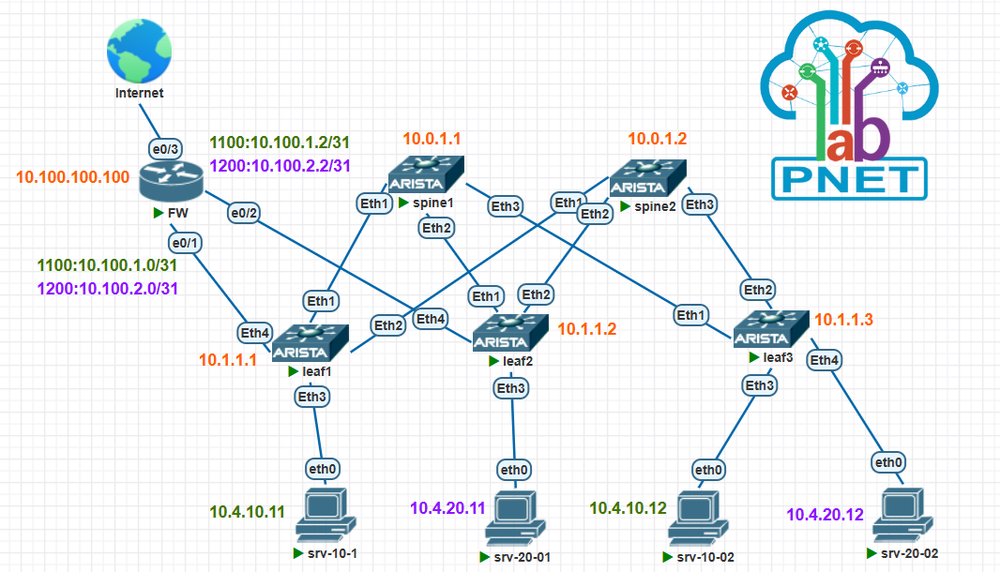

[Назад, к списку домашних заданий](../README.md)
# Домашнее задание №8. VxLAN. Routing.
## 1. План работ.
1. Скопировать стенд с домашнего задания №6.
2. Настроить каждого клиента в своем VNI, VRF.
3. Настроите маршрутизацию между VRF, используя пограничный роутер FW.
4. Убедиться в наличии связности между клиентами между разными VRF, выхода в интернет с фиксацией результатов.
5. Сохранить конфигурацию сетевого оборудования.

> **P.S.:>**
> В идеале нужно дополнить конфигурацию, используя route-map и prefix-list, для фильтрации маршрутов.  
> Требуется реализовать анонсирование маршрутов на FW, c учетом принадлежности к различным VRF.  
> В рамках данного задания я этого не делал, на FW анонсируется всё и всем.  

## 2. Схема топологии CLOS.



## 3. Адресное пространство для Underlay.
### Таблица 1. Адресное пространство.
|Адресация|Назначение|
|--------|--------|
|10.0.1.**\<SN\>**/32|loopback интерфейсы для spine, где SN = 1-255|
|10.1.1.**\<LN\>**/32|loopback интерфейсы для leaf, где LN = 1-255|
|10.2.**\<SN\>**.**\<N\>**/30|p2p линки между spine и leaf, где SN = номер spine, N = 0-255|
|10.4.10.0/24|Overlay - vlan 100, vrf srv-10, gw 10.4.10.1|
|10.4.20.0/24|Overlay - vlan 200, vrf srv-20, gw 10.4.20.1|
|10.100.0.0/16|Внешние сети, firewall|
### Таблица 2. Сетевые адреса интерфейсов.
<details>
  <summary>Таблица 2</summary>

|Оборудование|Интерфейс|Адрес|
|--------|--------|----------|
|spine1|loopback1|10.0.1.1/32|
|spine2|loopback1|10.0.1.2/32|
|leaf1|loopback1|10.1.1.1/32|
|leaf2|loopback1|10.1.1.2/32|
|leaf3|loopback1|10.1.1.3/32|
|spine1|Eth1|10.2.1.0/31|	
|leaf1|Eth1|10.2.1.1/31|
|spine1|Eth2|10.2.1.2/31|
|leaf2|Eth1|10.2.1.3/31|
|spine1|Eth3|10.2.1.4/31|
|leaf3|Eth1|10.2.1.5/31|
|spine2|Eth1|10.2.2.0/31|
|leaf1|Eth2|10.2.2.1/31|
|spine2|Eth2|10.2.2.2/31|
|leaf2|Eth2|10.2.2.3/31|
|spine2|Eth3|10.2.2.4/31|
|leaf3|Eth2|10.2.2.5/31|
|srv-10-01|Eth1|10.4.10.11/24|
|srv-20-01|Eth1|10.4.20.11/24|
|srv-10-02|Eth1|10.4.10.12/24|
|srv-20-02|Eth1|10.4.20.12/24|
|fw|eth1.1100|10.100.1.0/31|
|fw|eth1.1200|10.100.2.0/31|
|fw|eth2.1100|10.100.1.2/31|
|fw|eth2.1200|10.100.2.2/31|
|leaf1|eth4,vlan 1100|10.100.1.1/31|
|leaf1|eth4,vlan 1200|10.100.2.1/31|
|leaf2|eth4,vlan 1100|10.100.1.3/31|
|leaf2|eth4,vlan 1200|10.100.2.3/31|
</details>

### Таблица 3. Номера автономных систем (AS).
|Имя коммутатора|AS|комментарий|
|--------|--------|--------|
|spine1|65001||
|spine2|65001||
|leaf1|65101||
|leaf2|65102||
|leaf3|65103||
|fw|65100||
|leafN|65XXX|**\<где XXX = 100 + N\>**|

## 4. Настройки сетевого оборудования.
<details>
  <summary>spine1 configuration</summary>

  ```cisco
spine1#sh run
! Command: show running-config
! device: spine1 (vEOS-lab, EOS-4.27.0F)
!
! boot system flash:/vEOS-lab.swi
!
no aaa root
!
transceiver qsfp default-mode 4x10G
!
service routing protocols model multi-agent
!
hostname spine1
!
spanning-tree mode mstp
!
interface Ethernet1
   description leaf1
   no switchport
   ip address 10.2.1.0/31
   ip ospf network point-to-point
   ip ospf area 0.0.0.0
!
interface Ethernet2
   description leaf2
   no switchport
   ip address 10.2.1.2/31
   ip ospf network point-to-point
   ip ospf area 0.0.0.0
!
interface Ethernet3
   description leaf3
   no switchport
   ip address 10.2.1.4/31
   ip ospf network point-to-point
   ip ospf area 0.0.0.0
!
interface Loopback1
   ip address 10.0.1.1/32
   ip ospf area 0.0.0.0
!
interface Management1
!
ip routing
!
router bgp 65001
   router-id 10.0.1.1
   no bgp default ipv4-unicast
   distance bgp 20 200 200
   neighbor LEAF peer group
   neighbor LEAF remote-as 65001
   neighbor LEAF next-hop-unchanged
   neighbor LEAF update-source Loopback1
   neighbor LEAF bfd
   neighbor LEAF ebgp-multihop 2
   neighbor LEAF route-reflector-client
   neighbor LEAF send-community extended
   neighbor 10.1.1.1 peer group LEAF
   neighbor 10.1.1.1 remote-as 65101
   neighbor 10.1.1.1 description leaf1
   neighbor 10.1.1.2 peer group LEAF
   neighbor 10.1.1.2 remote-as 65102
   neighbor 10.1.1.2 description leaf2
   neighbor 10.1.1.3 peer group LEAF
   neighbor 10.1.1.3 remote-as 65103
   neighbor 10.1.1.3 description leaf3
   !
   address-family evpn
      neighbor LEAF activate
!
router ospf 1
   router-id 10.0.1.1
   bfd default
   passive-interface default
   no passive-interface Ethernet1
   no passive-interface Ethernet2
   no passive-interface Ethernet3
   max-lsa 12000
   log-adjacency-changes detail
!
end
spine1#


  ```
</details>

<details>
  <summary>spine2 configuration</summary>

  ```cisco
spine2#sh run
! Command: show running-config
! device: spine2 (vEOS-lab, EOS-4.27.0F)
!
! boot system flash:/vEOS-lab.swi
!
no aaa root
!
transceiver qsfp default-mode 4x10G
!
service routing protocols model multi-agent
!
no logging console
!
hostname spine2
!
spanning-tree mode mstp
!
interface Ethernet1
   description leaf1
   no switchport
   ip address 10.2.2.0/31
   ip ospf network point-to-point
   ip ospf area 0.0.0.0
!
interface Ethernet2
   description leaf2
   no switchport
   ip address 10.2.2.2/31
   ip ospf network point-to-point
   ip ospf area 0.0.0.0
!
interface Ethernet3
   description leaf3
   no switchport
   ip address 10.2.2.4/31
   ip ospf network point-to-point
   ip ospf area 0.0.0.0
!
interface Loopback1
   ip address 10.0.1.2/32
   ip ospf area 0.0.0.0
!
interface Management1
!
ip routing
!
router bgp 65001
   router-id 10.0.1.2
   no bgp default ipv4-unicast
   distance bgp 20 200 200
   neighbor LEAF peer group
   neighbor LEAF remote-as 65001
   neighbor LEAF next-hop-unchanged
   neighbor LEAF update-source Loopback1
   neighbor LEAF bfd
   neighbor LEAF ebgp-multihop 2
   neighbor LEAF route-reflector-client
   neighbor LEAF send-community extended
   neighbor 10.1.1.1 peer group LEAF
   neighbor 10.1.1.1 remote-as 65101
   neighbor 10.1.1.1 description leaf1
   neighbor 10.1.1.2 peer group LEAF
   neighbor 10.1.1.2 remote-as 65102
   neighbor 10.1.1.2 description leaf2
   neighbor 10.1.1.3 peer group LEAF
   neighbor 10.1.1.3 remote-as 65103
   neighbor 10.1.1.3 description leaf3
   !
   address-family evpn
      neighbor LEAF activate
!
router ospf 1
   router-id 10.0.1.2
   bfd default
   passive-interface default
   no passive-interface Ethernet1
   no passive-interface Ethernet2
   no passive-interface Ethernet3
   max-lsa 12000
   log-adjacency-changes detail
!
end
spine2#


  ```
</details>

<details>
  <summary>leaf1 configuration</summary>

  ```cisco
leaf1#sh run
! Command: show running-config
! device: leaf1 (vEOS-lab, EOS-4.27.0F)
!
! boot system flash:/vEOS-lab.swi
!
no aaa root
!
transceiver qsfp default-mode 4x10G
!
ip security
   profile VTEP
!
service routing protocols model multi-agent
!
no logging console
!
hostname leaf1
!
spanning-tree mode mstp
!
vlan 100
   name srv-10
!
vlan 200
   name srv-20
!
vlan 1100
   name fw-srv-10
!
vlan 1200
   name fw-srv-20
!
vrf instance srv-10
!
vrf instance srv-20
!
interface Ethernet1
   description spine1
   no switchport
   ip address 10.2.1.1/31
   ip ospf network point-to-point
   ip ospf area 0.0.0.0
!
interface Ethernet2
   description spine2
   no switchport
   ip address 10.2.2.1/31
   ip ospf network point-to-point
   ip ospf area 0.0.0.0
!
interface Ethernet3
   description srv-10-1
   switchport access vlan 100
!
interface Ethernet4
   description fw-leaf1
   switchport trunk allowed vlan 1100,1200
   switchport mode trunk
!
interface Loopback1
   description UNDERLAY
   ip address 10.1.1.1/32
   ip ospf area 0.0.0.0
!
interface Management1
!
interface Vlan100
   description srv-10
   vrf srv-10
   ip proxy-arp
   ip address 10.4.10.1/24
!
interface Vlan200
   description srv-20
   vrf srv-20
   ip address 10.4.20.1/24
!
interface Vlan1100
   description fw-leaf1-srv-10
   vrf srv-10
   ip address 10.100.1.1/31
!
interface Vlan1200
   description fw-leaf1-srv-20
   vrf srv-20
   ip address 10.100.2.1/31
!
interface Vxlan1
   vxlan source-interface Loopback1
   vxlan udp-port 4789
   vxlan vlan 100 vni 100100
   vxlan vlan 200 vni 100200
   vxlan vrf srv-10 vni 10100
   vxlan vrf srv-20 vni 10200
   vxlan learn-restrict any
!
ip routing
ip routing vrf srv-10
ip routing vrf srv-20
!
router bgp 65101
   router-id 10.1.1.1
   no bgp default ipv4-unicast
   maximum-paths 4
   neighbor SPINE peer group
   neighbor SPINE remote-as 65001
   neighbor SPINE update-source Loopback1
   neighbor SPINE bfd
   neighbor SPINE local-v4-addr 10.1.1.1
   neighbor SPINE ebgp-multihop 4
   neighbor SPINE send-community extended
   neighbor 10.0.1.1 peer group SPINE
   neighbor 10.0.1.1 description spine1
   neighbor 10.0.1.2 peer group SPINE
   neighbor 10.0.1.2 description spine2
   redistribute connected
   !
   vlan 100
      rd 10.1.1.1:100
      route-target both 100:100100
      redistribute learned
   !
   vlan 200
      rd 10.1.1.1:200
      route-target both 200:100200
      redistribute learned
   !
   address-family evpn
      neighbor SPINE activate
   !
   address-family ipv4
      no neighbor SPINE activate
   !
   vrf srv-10
      rd 65101:10100
      route-target import evpn 1:10100
      route-target export evpn 1:10100
      neighbor 10.100.1.0 remote-as 65100
      neighbor 10.100.1.0 update-source Vlan1100
      redistribute connected
      !
      address-family ipv4
         neighbor 10.100.1.0 activate
         network 10.4.10.0/24
   !
   vrf srv-20
      rd 65101:10200
      route-target import evpn 2:10200
      route-target export evpn 2:10200
      neighbor 10.100.2.0 remote-as 65100
      neighbor 10.100.2.0 update-source Vlan1200
      redistribute connected
      !
      address-family ipv4
         neighbor 10.100.2.0 activate
         network 10.4.20.0/24
!
router ospf 1
   router-id 10.1.1.1
   bfd default
   passive-interface default
   no passive-interface Ethernet1
   no passive-interface Ethernet2
   max-lsa 12000
   log-adjacency-changes detail
!
end
leaf1#


  ```
</details>

<details>
  <summary>leaf2 configuration</summary>

  ```cisco
leaf2#sh run
! Command: show running-config
! device: leaf2 (vEOS-lab, EOS-4.27.0F)
!
! boot system flash:/vEOS-lab.swi
!
no aaa root
!
transceiver qsfp default-mode 4x10G
!
ip security
   profile VTEP
!
service routing protocols model multi-agent
!
no logging console
!
hostname leaf2
!
spanning-tree mode mstp
!
vlan 100
   name srv-10
!
vlan 200
   name srv-20
!
vlan 1100
   name fw-srv-10
!
vlan 1200
   name fw-srv-20
!
vrf instance srv-10
!
vrf instance srv-20
!
interface Ethernet1
   description spine1
   no switchport
   ip address 10.2.1.3/31
   ip ospf network point-to-point
   ip ospf area 0.0.0.0
!
interface Ethernet2
   description spine2
   no switchport
   ip address 10.2.2.3/31
   ip ospf network point-to-point
   ip ospf area 0.0.0.0
!
interface Ethernet3
   description srv-20-01
   switchport access vlan 200
!
interface Ethernet4
   description fw-leaf1
   switchport trunk allowed vlan 1100,1200
   switchport mode trunk
!
interface Loopback1
   description UNDERLAY
   ip address 10.1.1.2/32
   ip ospf area 0.0.0.0
!
interface Management1
!
interface Vlan100
   description srv-10
   vrf srv-10
   ip proxy-arp
   ip address 10.4.10.1/24
!
interface Vlan200
   description srv-20
   vrf srv-20
   ip address 10.4.20.1/24
!
interface Vlan1100
   description fw-leaf2-srv-10
   vrf srv-10
   ip address 10.100.1.3/31
!
interface Vlan1200
   description fw-leaf2-srv-20
   vrf srv-20
   ip address 10.100.2.3/31
!
interface Vxlan1
   vxlan source-interface Loopback1
   vxlan udp-port 4789
   vxlan vlan 100 vni 100100
   vxlan vlan 200 vni 100200
   vxlan vrf srv-10 vni 10100
   vxlan vrf srv-20 vni 10200
   vxlan learn-restrict any
!
ip routing
ip routing vrf srv-10
ip routing vrf srv-20
!
router bgp 65102
   router-id 10.1.1.2
   no bgp default ipv4-unicast
   maximum-paths 4
   neighbor SPINE peer group
   neighbor SPINE remote-as 65001
   neighbor SPINE update-source Loopback1
   neighbor SPINE bfd
   neighbor SPINE local-v4-addr 10.1.1.2
   neighbor SPINE ebgp-multihop 4
   neighbor SPINE send-community extended
   neighbor 10.0.1.1 peer group SPINE
   neighbor 10.0.1.1 description spine1
   neighbor 10.0.1.2 peer group SPINE
   neighbor 10.0.1.2 description spine2
   redistribute connected
   !
   vlan 100
      rd 10.1.1.2:100
      route-target both 100:100100
      redistribute learned
   !
   vlan 200
      rd 10.1.1.2:200
      route-target both 200:100200
      redistribute learned
   !
   address-family evpn
      neighbor SPINE activate
   !
   vrf srv-10
      rd 65102:10100
      route-target import evpn 1:10100
      route-target export evpn 1:10100
      neighbor 10.100.1.2 remote-as 65100
      neighbor 10.100.1.2 update-source Vlan1100
      redistribute connected
      !
      address-family ipv4
         neighbor 10.100.1.2 activate
         network 10.4.10.0/24
   !
   vrf srv-20
      rd 65102:10200
      route-target import evpn 2:10200
      route-target export evpn 2:10200
      neighbor 10.100.2.2 remote-as 65100
      neighbor 10.100.2.2 update-source Vlan1200
      redistribute connected
      !
      address-family ipv4
         neighbor 10.100.2.2 activate
         network 10.4.20.0/24
!
router ospf 1
   router-id 10.1.1.2
   bfd default
   passive-interface default
   no passive-interface Ethernet1
   no passive-interface Ethernet2
   max-lsa 12000
   log-adjacency-changes detail
!
end
leaf2#

  ```
</details>

<details>
  <summary>leaf3 configuration</summary>

  ```cisco
leaf3#sh run
! Command: show running-config
! device: leaf3 (vEOS-lab, EOS-4.27.0F)
!
! boot system flash:/vEOS-lab.swi
!
no aaa root
!
transceiver qsfp default-mode 4x10G
!
service routing protocols model multi-agent
!
no logging console
!
hostname leaf3
!
spanning-tree mode mstp
!
vlan 100
   name srv-10
!
vlan 200
   name srv-20
!
vrf instance srv-10
!
vrf instance srv-20
!
interface Ethernet1
   description spine1
   no switchport
   ip address 10.2.1.5/31
   ip ospf network point-to-point
   ip ospf area 0.0.0.0
!
interface Ethernet2
   description spine2
   no switchport
   ip address 10.2.2.5/31
   ip ospf network point-to-point
   ip ospf area 0.0.0.0
!
interface Ethernet3
   switchport access vlan 100
!
interface Ethernet4
   switchport access vlan 200
!
interface Loopback1
   description UNDERLAY
   ip address 10.1.1.3/32
   ip ospf area 0.0.0.0
!
interface Management1
!
interface Vlan100
   description srv-10
   vrf srv-10
   ip proxy-arp
   ip address 10.4.10.1/24
!
interface Vlan200
   description srv-20
   vrf srv-20
   ip address 10.4.20.1/24
!
interface Vxlan1
   vxlan source-interface Loopback1
   vxlan udp-port 4789
   vxlan vlan 100 vni 100100
   vxlan vlan 200 vni 100200
   vxlan vrf srv-10 vni 10100
   vxlan vrf srv-20 vni 10200
   vxlan learn-restrict any
!
ip routing
ip routing vrf srv-10
ip routing vrf srv-20
!
router bgp 65103
   router-id 10.1.1.3
   no bgp default ipv4-unicast
   maximum-paths 4
   neighbor SPINE peer group
   neighbor SPINE remote-as 65001
   neighbor SPINE update-source Loopback1
   neighbor SPINE bfd
   neighbor SPINE local-v4-addr 10.1.1.3
   neighbor SPINE ebgp-multihop 4
   neighbor SPINE send-community extended
   neighbor 10.0.1.1 peer group SPINE
   neighbor 10.0.1.1 description spine1
   neighbor 10.0.1.2 peer group SPINE
   neighbor 10.0.1.2 description spine2
   !
   vlan 100
      rd 10.1.1.3:100
      route-target both 100:100100
      redistribute learned
   !
   vlan 200
      rd 10.1.1.3:200
      route-target both 200:100200
      redistribute learned
   !
   address-family evpn
      neighbor SPINE activate
   !
   vrf srv-10
      rd 65103:10100
      route-target import evpn 1:10100
      route-target export evpn 1:10100
   !
   vrf srv-20
      rd 65103:10200
      route-target import evpn 2:10200
      route-target export evpn 2:10200
!
router ospf 1
   router-id 10.1.1.3
   bfd default
   passive-interface default
   no passive-interface Ethernet1
   no passive-interface Ethernet2
   max-lsa 12000
   log-adjacency-changes detail
!
end
leaf3#

  ```
</details>

<details>
  <summary>FW configuration</summary>

  ```cisco
FW#sh run
Building configuration...

Current configuration : 2647 bytes
! Last configuration change at 23:27:54 UTC Mon Feb 9 2026
!
version 15.4
service config
service timestamps debug datetime msec
service timestamps log datetime msec
no service password-encryption
!
hostname FW
!
boot-start-marker
boot system flash
boot-end-marker
!
no logging console
!
no aaa new-model
mmi polling-interval 60
no mmi auto-configure
no mmi pvc
mmi snmp-timeout 180
!
ip cef
no ipv6 cef
!
multilink bundle-name authenticated
!
redundancy
!
interface Loopback1
 ip address 10.100.100.100 255.255.255.255
!
interface Ethernet0/0
 no ip address
 shutdown
!
interface Ethernet0/1
 description leaf1
 no ip address
!
interface Ethernet0/1.1100
 description fw-leaf1-srv-10
 encapsulation dot1Q 1100
 ip address 10.100.1.0 255.255.255.254
 ip nat inside
 ip virtual-reassembly in
!
interface Ethernet0/1.1200
 description fw-leaf1-srv-20
 encapsulation dot1Q 1200
 ip address 10.100.2.0 255.255.255.254
 ip nat inside
 ip virtual-reassembly in
!
interface Ethernet0/2
 description leaf2
 no ip address
!
interface Ethernet0/2.1100
 description fw-leaf1-srv-10
 encapsulation dot1Q 1100
 ip address 10.100.1.2 255.255.255.254
 ip nat inside
 ip virtual-reassembly in
!
interface Ethernet0/2.1200
 description fw-leaf2-srv-20
 encapsulation dot1Q 1200
 ip address 10.100.2.2 255.255.255.254
 ip nat inside
 ip virtual-reassembly in
!
interface Ethernet0/3
 description Internet
 ip address dhcp
 ip nat outside
 ip virtual-reassembly in
!
router bgp 65100
 bgp router-id 10.100.100.100
 bgp log-neighbor-changes
 neighbor leaf1 peer-group
 neighbor leaf1 remote-as 65101
 neighbor leaf2 peer-group
 neighbor leaf2 remote-as 65102
 neighbor 10.100.1.1 peer-group leaf1
 neighbor 10.100.1.1 update-source Ethernet0/1.1100
 neighbor 10.100.1.3 peer-group leaf2
 neighbor 10.100.1.3 update-source Ethernet0/2.1100
 neighbor 10.100.2.1 peer-group leaf1
 neighbor 10.100.2.1 update-source Ethernet0/1.1200
 neighbor 10.100.2.3 peer-group leaf2
 neighbor 10.100.2.3 update-source Ethernet0/2.1200
 !
 address-family ipv4
  redistribute static
  neighbor 10.100.1.1 activate
  neighbor 10.100.1.3 activate
  neighbor 10.100.2.1 activate
  neighbor 10.100.2.3 activate
  maximum-paths 4
  default-information originate
 exit-address-family
!
ip forward-protocol nd
!
no ip http server
no ip http secure-server
ip nat inside source list NAT_ALL interface Ethernet0/3 overload
!
ip access-list standard NAT_ALL
 permit 10.0.0.0 0.255.255.255
!
control-plane
!
line con 0
 logging synchronous
line aux 0
line vty 0 4
 login
 transport input none
!
end

FW#

  ```
</details>

# Проверка сетевой связности.
<details>
  <summary>проверка UNDERLAY (OSPF)</summary>

  ```cisco
leaf1#sh ip ospf neighbor
Neighbor ID     Instance VRF      Pri State                  Dead Time   Address         Interface
10.0.1.1        1        default  0   FULL                   00:00:36    10.2.1.0        Ethernet1
10.0.1.2        1        default  0   FULL                   00:00:29    10.2.2.0        Ethernet2
  ```
  ```cisco
spine1#sh ip ospf neighbor
Neighbor ID     Instance VRF      Pri State                  Dead Time   Address         Interface
10.1.1.3        1        default  0   FULL                   00:00:32    10.2.1.5        Ethernet3
10.1.1.2        1        default  0   FULL                   00:00:32    10.2.1.3        Ethernet2
10.1.1.1        1        default  0   FULL                   00:00:37    10.2.1.1        Ethernet1
  ```
  ```cisco
leaf1#sh ip route ospf | inc Eth
 O        10.0.1.1/32 [110/20] via 10.2.1.0, Ethernet1
 O        10.0.1.2/32 [110/20] via 10.2.2.0, Ethernet2
 O        10.1.1.2/32 [110/30] via 10.2.1.0, Ethernet1
                               via 10.2.2.0, Ethernet2
 O        10.1.1.3/32 [110/30] via 10.2.1.0, Ethernet1
                               via 10.2.2.0, Ethernet2
 O        10.2.1.2/31 [110/20] via 10.2.1.0, Ethernet1
 O        10.2.1.4/31 [110/20] via 10.2.1.0, Ethernet1
 O        10.2.2.2/31 [110/20] via 10.2.2.0, Ethernet2
 O        10.2.2.4/31 [110/20] via 10.2.2.0, Ethernet2
  ```
</details>
<details>
  <summary>проверка OVERLAY (BGP EVPN)</summary>

  ```cisco
spine1#sh bgp evpn summary
BGP summary information for VRF default
Router identifier 10.0.1.1, local AS number 65001
Neighbor Status Codes: m - Under maintenance
  Description              Neighbor         V AS           MsgRcvd   MsgSent  InQ OutQ  Up/Down State   PfxRcd PfxAcc
  leaf1                    10.1.1.1         4 65101             12        11    0    0 00:03:33 Estab   2      2
  leaf2                    10.1.1.2         4 65102             13        11    0    0 00:03:16 Estab   2      2
  leaf3                    10.1.1.3         4 65103             12        11    0    0 00:03:06 Estab   2      2
spine1#
  ```
  ```cisco
leaf1#sh bgp evpn summary
BGP summary information for VRF default
Router identifier 10.1.1.1, local AS number 65101
Neighbor Status Codes: m - Under maintenance
  Description              Neighbor         V AS           MsgRcvd   MsgSent  InQ OutQ  Up/Down State   PfxRcd PfxAcc
  spine1                   10.0.1.1         4 65001             11        12    0    0 00:03:55 Estab   4      4
  spine2                   10.0.1.2         4 65001             11        10    0    0 00:03:50 Estab   4      4
leaf1#
  ```

</details>

<details>
  <summary>Проверка VXLAN</summary>

  ```cisco
leaf1#sh vxlan vni
VNI to VLAN Mapping for Vxlan1
VNI          VLAN       Source       Interface       802.1Q Tag
------------ ---------- ------------ --------------- ----------
100100       100        static       Ethernet3       untagged
                                     Vxlan1          100
100200       200        static       Vxlan1          200

VNI to dynamic VLAN Mapping for Vxlan1
VNI         VLAN       VRF          Source
----------- ---------- ------------ ------------
10100       4094       srv-10       evpn
10200       4093       srv-20       evpn
  ```
  ```cisco
leaf1#sh vxlan vtep
Remote VTEPS for Vxlan1:

VTEP           Tunnel Type(s)
-------------- --------------
10.1.1.2       unicast, flood
10.1.1.3       flood

Total number of remote VTEPS:  2
leaf1#

  ```
</details>

<details>
  <summary>Проверка EVPN соседства</summary>

```cisco
leaf1#sh bgp evpn summary
BGP summary information for VRF default
Router identifier 10.1.1.1, local AS number 65101
Neighbor Status Codes: m - Under maintenance
  Description              Neighbor         V AS           MsgRcvd   MsgSent  InQ OutQ  Up/Down State   PfxRcd PfxAcc
  spine1                   10.0.1.1         4 65001            164       173    0    0 02:03:47 Estab   8      8
  spine2                   10.0.1.2         4 65001            166       171    0    0 02:03:50 Estab   8      8

```
</details>

<details>
  <summary>Проверка маршрутов на leaf1 в различных VRF</summary>
  
```cisco
leaf1#sh ip route vrf srv-20

VRF: srv-20
Codes: C - connected, S - static, K - kernel,
       O - OSPF, IA - OSPF inter area, E1 - OSPF external type 1,
       E2 - OSPF external type 2, N1 - OSPF NSSA external type 1,
       N2 - OSPF NSSA external type2, B - BGP, B I - iBGP, B E - eBGP,
       R - RIP, I L1 - IS-IS level 1, I L2 - IS-IS level 2,
       O3 - OSPFv3, A B - BGP Aggregate, A O - OSPF Summary,
       NG - Nexthop Group Static Route, V - VXLAN Control Service,
       DH - DHCP client installed default route, M - Martian,
       DP - Dynamic Policy Route, L - VRF Leaked,
       G  - gRIBI, RC - Route Cache Route

Gateway of last resort:
 B E      0.0.0.0/0 [200/0] via 10.100.2.0, Vlan1200

 C        10.4.20.0/24 is directly connected, Vlan200
 B E      10.100.1.2/31 [200/0] via 10.100.2.0, Vlan1200
 C        10.100.2.0/31 is directly connected, Vlan1200
 B E      10.100.2.2/31 [200/0] via 10.100.2.0, Vlan1200

```
</details>

<details>
  <summary>Проверка EVPN маршрутов на leaf1</summary>

  ```cisco
leaf1#sh bgp evpn
BGP routing table information for VRF default
Router identifier 10.1.1.1, local AS number 65101
Route status codes: s - suppressed, * - valid, > - active, E - ECMP head, e - ECMP
                    S - Stale, c - Contributing to ECMP, b - backup
                    % - Pending BGP convergence
Origin codes: i - IGP, e - EGP, ? - incomplete
AS Path Attributes: Or-ID - Originator ID, C-LST - Cluster List, LL Nexthop - Link Local Nexthop

          Network                Next Hop              Metric  LocPref Weight  Path
 * >Ec   RD: 10.1.1.2:200 mac-ip 0050.7966.688a
                                 10.1.1.2              -       100     0       65001 65102 i
 *  ec   RD: 10.1.1.2:200 mac-ip 0050.7966.688a
                                 10.1.1.2              -       100     0       65001 65102 i
 * >Ec   RD: 10.1.1.2:200 mac-ip 0050.7966.688a 10.4.20.11
                                 10.1.1.2              -       100     0       65001 65102 i
 *  ec   RD: 10.1.1.2:200 mac-ip 0050.7966.688a 10.4.20.11
                                 10.1.1.2              -       100     0       65001 65102 i
 * >Ec   RD: 10.1.1.3:100 mac-ip 0050.7966.688b
                                 10.1.1.3              -       100     0       65001 65103 i
 *  ec   RD: 10.1.1.3:100 mac-ip 0050.7966.688b
                                 10.1.1.3              -       100     0       65001 65103 i
 * >Ec   RD: 10.1.1.3:200 mac-ip 0050.7966.688c
                                 10.1.1.3              -       100     0       65001 65103 i
 *  ec   RD: 10.1.1.3:200 mac-ip 0050.7966.688c
                                 10.1.1.3              -       100     0       65001 65103 i
 * >Ec   RD: 10.1.1.3:200 mac-ip 0050.7966.688c 10.4.20.12
                                 10.1.1.3              -       100     0       65001 65103 i
 *  ec   RD: 10.1.1.3:200 mac-ip 0050.7966.688c 10.4.20.12
                                 10.1.1.3              -       100     0       65001 65103 i
 * >     RD: 10.1.1.1:100 mac-ip 0050.7966.688d
                                 -                     -       -       0       i
 * >     RD: 10.1.1.1:100 mac-ip 0050.7966.688d 10.4.10.11
                                 -                     -       -       0       i
 * >     RD: 10.1.1.1:100 imet 10.1.1.1
                                 -                     -       -       0       i
 * >     RD: 10.1.1.1:200 imet 10.1.1.1
                                 -                     -       -       0       i
 * >Ec   RD: 10.1.1.2:100 imet 10.1.1.2
                                 10.1.1.2              -       100     0       65001 65102 i
 *  ec   RD: 10.1.1.2:100 imet 10.1.1.2
                                 10.1.1.2              -       100     0       65001 65102 i
 * >Ec   RD: 10.1.1.2:200 imet 10.1.1.2
                                 10.1.1.2              -       100     0       65001 65102 i
 *  ec   RD: 10.1.1.2:200 imet 10.1.1.2
                                 10.1.1.2              -       100     0       65001 65102 i
 * >Ec   RD: 10.1.1.3:100 imet 10.1.1.3
                                 10.1.1.3              -       100     0       65001 65103 i
 *  ec   RD: 10.1.1.3:100 imet 10.1.1.3
                                 10.1.1.3              -       100     0       65001 65103 i
 * >Ec   RD: 10.1.1.3:200 imet 10.1.1.3
                                 10.1.1.3              -       100     0       65001 65103 i
 *  ec   RD: 10.1.1.3:200 imet 10.1.1.3
                                 10.1.1.3              -       100     0       65001 65103 i
 * >     RD: 65101:10100 ip-prefix 0.0.0.0/0
                                 -                     0       100     0       65100 ?
 * >     RD: 65101:10200 ip-prefix 0.0.0.0/0
                                 -                     0       100     0       65100 ?
 * >Ec   RD: 65102:10100 ip-prefix 0.0.0.0/0
                                 10.1.1.2              -       100     0       65001 65102 65100 ?
 *  ec   RD: 65102:10100 ip-prefix 0.0.0.0/0
                                 10.1.1.2              -       100     0       65001 65102 65100 ?
 * >Ec   RD: 65102:10200 ip-prefix 0.0.0.0/0
                                 10.1.1.2              -       100     0       65001 65102 65100 ?
 *  ec   RD: 65102:10200 ip-prefix 0.0.0.0/0
                                 10.1.1.2              -       100     0       65001 65102 65100 ?
 * >Ec   RD: 65101:10100 ip-prefix 10.4.10.0/24
                                 -                     -       -       0       i
 *  ec   RD: 65101:10100 ip-prefix 10.4.10.0/24
                                 -                     -       -       0       i
 * >Ec   RD: 65102:10100 ip-prefix 10.4.10.0/24
                                 10.1.1.2              -       100     0       65001 65102 i
 *  ec   RD: 65102:10100 ip-prefix 10.4.10.0/24
                                 10.1.1.2              -       100     0       65001 65102 i
 * >Ec   RD: 65101:10200 ip-prefix 10.4.20.0/24
                                 -                     -       -       0       i
 *  ec   RD: 65101:10200 ip-prefix 10.4.20.0/24
                                 -                     -       -       0       i
 * >Ec   RD: 65102:10200 ip-prefix 10.4.20.0/24
                                 10.1.1.2              -       100     0       65001 65102 i
 *  ec   RD: 65102:10200 ip-prefix 10.4.20.0/24
                                 10.1.1.2              -       100     0       65001 65102 i
 * >     RD: 65101:10100 ip-prefix 10.100.1.0/31
                                 -                     -       -       0       i
 * >     RD: 65101:10100 ip-prefix 10.100.1.2/31
                                 -                     -       100     0       65100 65102 i
 * >     RD: 65101:10200 ip-prefix 10.100.1.2/31
                                 -                     -       100     0       65100 65102 i
 * >Ec   RD: 65102:10100 ip-prefix 10.100.1.2/31
                                 10.1.1.2              -       100     0       65001 65102 i
 *  ec   RD: 65102:10100 ip-prefix 10.100.1.2/31
                                 10.1.1.2              -       100     0       65001 65102 i
 * >     RD: 65101:10200 ip-prefix 10.100.2.0/31
                                 -                     -       -       0       i
 * >     RD: 65101:10100 ip-prefix 10.100.2.2/31
                                 -                     -       100     0       65100 65102 i
 * >     RD: 65101:10200 ip-prefix 10.100.2.2/31
                                 -                     -       100     0       65100 65102 i
 * >Ec   RD: 65102:10200 ip-prefix 10.100.2.2/31
                                 10.1.1.2              -       100     0       65001 65102 i
 *  ec   RD: 65102:10200 ip-prefix 10.100.2.2/31
                                 10.1.1.2              -       100     0       65001 65102 i
leaf1#
```

</details>
<details>
  <summary>Проверка маршрутов на FW</summary>
  
```cisco
FW#sh ip route
Codes: L - local, C - connected, S - static, R - RIP, M - mobile, B - BGP
       D - EIGRP, EX - EIGRP external, O - OSPF, IA - OSPF inter area
       N1 - OSPF NSSA external type 1, N2 - OSPF NSSA external type 2
       E1 - OSPF external type 1, E2 - OSPF external type 2
       i - IS-IS, su - IS-IS summary, L1 - IS-IS level-1, L2 - IS-IS level-2
       ia - IS-IS inter area, * - candidate default, U - per-user static route
       o - ODR, P - periodic downloaded static route, H - NHRP, l - LISP
       a - application route
       + - replicated route, % - next hop override

Gateway of last resort is 10.0.137.254 to network 0.0.0.0

S*    0.0.0.0/0 [254/0] via 10.0.137.254
      10.0.0.0/8 is variably subnetted, 16 subnets, 3 masks
C        10.0.137.0/24 is directly connected, Ethernet0/3
L        10.0.137.187/32 is directly connected, Ethernet0/3
B        10.4.10.0/24 [20/0] via 10.100.1.1, 00:13:49
B        10.4.10.11/32 [20/0] via 10.100.1.3, 00:13:48
B        10.4.20.0/24 [20/0] via 10.100.2.1, 00:13:49
B        10.4.20.11/32 [20/0] via 10.100.2.1, 00:08:22
B        10.4.20.12/32 [20/0] via 10.100.2.1, 00:01:26
C        10.100.1.0/31 is directly connected, Ethernet0/1.1100
L        10.100.1.0/32 is directly connected, Ethernet0/1.1100
C        10.100.1.2/31 is directly connected, Ethernet0/2.1100
L        10.100.1.2/32 is directly connected, Ethernet0/2.1100
C        10.100.2.0/31 is directly connected, Ethernet0/1.1200
L        10.100.2.0/32 is directly connected, Ethernet0/1.1200
C        10.100.2.2/31 is directly connected, Ethernet0/2.1200
L        10.100.2.2/32 is directly connected, Ethernet0/2.1200
C        10.100.100.100/32 is directly connected, Loopback1
```
</details>
<details>
  <summary>Проверка маршрутов на leaf3, не подключенном к FW</summary>

  ```cisco
leaf3#sh bgp evpn
BGP routing table information for VRF default
Router identifier 10.1.1.3, local AS number 65103
Route status codes: s - suppressed, * - valid, > - active, E - ECMP head, e - ECMP
                    S - Stale, c - Contributing to ECMP, b - backup
                    % - Pending BGP convergence
Origin codes: i - IGP, e - EGP, ? - incomplete
AS Path Attributes: Or-ID - Originator ID, C-LST - Cluster List, LL Nexthop - Link Local Nexthop

          Network                Next Hop              Metric  LocPref Weight  Path
 * >     RD: 10.1.1.3:100 mac-ip 0050.7966.688b
                                 -                     -       -       0       i
 * >     RD: 10.1.1.3:200 mac-ip 0050.7966.688c
                                 -                     -       -       0       i
 * >     RD: 10.1.1.3:200 mac-ip 0050.7966.688c 10.4.20.12
                                 -                     -       -       0       i
 * >Ec   RD: 10.1.1.1:100 mac-ip 0050.7966.688d
                                 10.1.1.1              -       100     0       65001 65101 i
 *  ec   RD: 10.1.1.1:100 mac-ip 0050.7966.688d
                                 10.1.1.1              -       100     0       65001 65101 i
 * >Ec   RD: 10.1.1.1:100 mac-ip 0050.7966.688d 10.4.10.11
                                 10.1.1.1              -       100     0       65001 65101 i
 *  ec   RD: 10.1.1.1:100 mac-ip 0050.7966.688d 10.4.10.11
                                 10.1.1.1              -       100     0       65001 65101 i
 * >Ec   RD: 10.1.1.1:100 imet 10.1.1.1
                                 10.1.1.1              -       100     0       65001 65101 i
 *  ec   RD: 10.1.1.1:100 imet 10.1.1.1
                                 10.1.1.1              -       100     0       65001 65101 i
 * >Ec   RD: 10.1.1.1:200 imet 10.1.1.1
                                 10.1.1.1              -       100     0       65001 65101 i
 *  ec   RD: 10.1.1.1:200 imet 10.1.1.1
                                 10.1.1.1              -       100     0       65001 65101 i
 * >Ec   RD: 10.1.1.2:100 imet 10.1.1.2
                                 10.1.1.2              -       100     0       65001 65102 i
 *  ec   RD: 10.1.1.2:100 imet 10.1.1.2
                                 10.1.1.2              -       100     0       65001 65102 i
 * >Ec   RD: 10.1.1.2:200 imet 10.1.1.2
                                 10.1.1.2              -       100     0       65001 65102 i
 *  ec   RD: 10.1.1.2:200 imet 10.1.1.2
                                 10.1.1.2              -       100     0       65001 65102 i
 * >     RD: 10.1.1.3:100 imet 10.1.1.3
                                 -                     -       -       0       i
 * >     RD: 10.1.1.3:200 imet 10.1.1.3
                                 -                     -       -       0       i
 * >Ec   RD: 65101:10100 ip-prefix 0.0.0.0/0
                                 10.1.1.1              -       100     0       65001 65101 65100 ?
 *  ec   RD: 65101:10100 ip-prefix 0.0.0.0/0
                                 10.1.1.1              -       100     0       65001 65101 65100 ?
 * >Ec   RD: 65101:10200 ip-prefix 0.0.0.0/0
                                 10.1.1.1              -       100     0       65001 65101 65100 ?
 *  ec   RD: 65101:10200 ip-prefix 0.0.0.0/0
                                 10.1.1.1              -       100     0       65001 65101 65100 ?
 * >Ec   RD: 65102:10100 ip-prefix 0.0.0.0/0
                                 10.1.1.2              -       100     0       65001 65102 65100 ?
 *  ec   RD: 65102:10100 ip-prefix 0.0.0.0/0
                                 10.1.1.2              -       100     0       65001 65102 65100 ?
 * >Ec   RD: 65102:10200 ip-prefix 0.0.0.0/0
                                 10.1.1.2              -       100     0       65001 65102 65100 ?
 *  ec   RD: 65102:10200 ip-prefix 0.0.0.0/0
                                 10.1.1.2              -       100     0       65001 65102 65100 ?
 * >Ec   RD: 65101:10100 ip-prefix 10.4.10.0/24
                                 10.1.1.1              -       100     0       65001 65101 i
 *  ec   RD: 65101:10100 ip-prefix 10.4.10.0/24
                                 10.1.1.1              -       100     0       65001 65101 i
 * >Ec   RD: 65102:10100 ip-prefix 10.4.10.0/24
                                 10.1.1.2              -       100     0       65001 65102 i
 *  ec   RD: 65102:10100 ip-prefix 10.4.10.0/24
                                 10.1.1.2              -       100     0       65001 65102 i
 * >Ec   RD: 65102:10200 ip-prefix 10.4.10.0/24
                                 10.1.1.2              -       100     0       65001 65102 65100 65101 i
 *  ec   RD: 65102:10200 ip-prefix 10.4.10.0/24
                                 10.1.1.2              -       100     0       65001 65102 65100 65101 i
 * >Ec   RD: 65101:10200 ip-prefix 10.4.20.0/24
                                 10.1.1.1              -       100     0       65001 65101 i
 *  ec   RD: 65101:10200 ip-prefix 10.4.20.0/24
                                 10.1.1.1              -       100     0       65001 65101 i
 * >Ec   RD: 65102:10100 ip-prefix 10.4.20.0/24
                                 10.1.1.2              -       100     0       65001 65102 65100 65101 i
 *  ec   RD: 65102:10100 ip-prefix 10.4.20.0/24
                                 10.1.1.2              -       100     0       65001 65102 65100 65101 i
 * >Ec   RD: 65102:10200 ip-prefix 10.4.20.0/24
                                 10.1.1.2              -       100     0       65001 65102 i
 *  ec   RD: 65102:10200 ip-prefix 10.4.20.0/24
                                 10.1.1.2              -       100     0       65001 65102 i
 * >Ec   RD: 65101:10100 ip-prefix 10.100.1.0/31
                                 10.1.1.1              -       100     0       65001 65101 i
 *  ec   RD: 65101:10100 ip-prefix 10.100.1.0/31
                                 10.1.1.1              -       100     0       65001 65101 i
 * >Ec   RD: 65102:10100 ip-prefix 10.100.1.0/31
                                 10.1.1.2              -       100     0       65001 65102 65100 65101 i
 *  ec   RD: 65102:10100 ip-prefix 10.100.1.0/31
                                 10.1.1.2              -       100     0       65001 65102 65100 65101 i
 * >Ec   RD: 65102:10200 ip-prefix 10.100.1.0/31
                                 10.1.1.2              -       100     0       65001 65102 65100 65101 i
 *  ec   RD: 65102:10200 ip-prefix 10.100.1.0/31
                                 10.1.1.2              -       100     0       65001 65102 65100 65101 i
 * >Ec   RD: 65101:10100 ip-prefix 10.100.1.2/31
                                 10.1.1.1              -       100     0       65001 65101 65100 65102 i
 *  ec   RD: 65101:10100 ip-prefix 10.100.1.2/31
                                 10.1.1.1              -       100     0       65001 65101 65100 65102 i
 * >Ec   RD: 65101:10200 ip-prefix 10.100.1.2/31
                                 10.1.1.1              -       100     0       65001 65101 65100 65102 i
 *  ec   RD: 65101:10200 ip-prefix 10.100.1.2/31
                                 10.1.1.1              -       100     0       65001 65101 65100 65102 i
 * >Ec   RD: 65102:10100 ip-prefix 10.100.1.2/31
                                 10.1.1.2              -       100     0       65001 65102 i
 *  ec   RD: 65102:10100 ip-prefix 10.100.1.2/31
                                 10.1.1.2              -       100     0       65001 65102 i
 * >Ec   RD: 65101:10200 ip-prefix 10.100.2.0/31
                                 10.1.1.1              -       100     0       65001 65101 i
 *  ec   RD: 65101:10200 ip-prefix 10.100.2.0/31
                                 10.1.1.1              -       100     0       65001 65101 i
 * >Ec   RD: 65102:10100 ip-prefix 10.100.2.0/31
                                 10.1.1.2              -       100     0       65001 65102 65100 65101 i
 *  ec   RD: 65102:10100 ip-prefix 10.100.2.0/31
                                 10.1.1.2              -       100     0       65001 65102 65100 65101 i
 * >Ec   RD: 65102:10200 ip-prefix 10.100.2.0/31
                                 10.1.1.2              -       100     0       65001 65102 65100 65101 i
 *  ec   RD: 65102:10200 ip-prefix 10.100.2.0/31
                                 10.1.1.2              -       100     0       65001 65102 65100 65101 i
 * >Ec   RD: 65101:10100 ip-prefix 10.100.2.2/31
                                 10.1.1.1              -       100     0       65001 65101 65100 65102 i
 *  ec   RD: 65101:10100 ip-prefix 10.100.2.2/31
                                 10.1.1.1              -       100     0       65001 65101 65100 65102 i
 * >Ec   RD: 65101:10200 ip-prefix 10.100.2.2/31
                                 10.1.1.1              -       100     0       65001 65101 65100 65102 i
 *  ec   RD: 65101:10200 ip-prefix 10.100.2.2/31
                                 10.1.1.1              -       100     0       65001 65101 65100 65102 i
 * >Ec   RD: 65102:10200 ip-prefix 10.100.2.2/31
                                 10.1.1.2              -       100     0       65001 65102 i
 *  ec   RD: 65102:10200 ip-prefix 10.100.2.2/31
                                 10.1.1.2              -       100     0       65001 65102 i
leaf3#

  ```
</details>


<details>
  <summary>Проверка доступности хостов в другом VRF и выхода в интернет</summary>

  ```cisco
srv-10-1> trace 10.4.20.11
trace to 10.4.20.11, 8 hops max, press Ctrl+C to stop
 1   10.4.10.1   1.441 ms  1.222 ms  1.796 ms
 2   10.100.1.0   4.974 ms  4.784 ms  4.682 ms
 3   10.100.2.1   6.116 ms  5.999 ms  5.879 ms
 4   10.100.2.3   7.856 ms  7.765 ms  7.855 ms
 5   *10.4.20.11   13.234 ms (ICMP type:3, code:3, Destination port unreachable)

srv-10-1> trace 10.4.20.12
trace to 10.4.20.12, 8 hops max, press Ctrl+C to stop
 1   10.4.10.1   1.565 ms  1.242 ms  1.214 ms
 2   10.100.1.0   5.180 ms  5.609 ms  6.022 ms
 3   10.100.2.1   6.399 ms  6.716 ms  5.760 ms
 4   10.4.20.1   9.755 ms  9.628 ms  14.402 ms
 5   *10.4.20.12   11.329 ms (ICMP type:3, code:3, Destination port unreachable)

srv-10-1>

srv-20-02> trace 8.8.8.8
trace to 8.8.8.8, 8 hops max, press Ctrl+C to stop
 1   10.100.2.1   6.083 ms  5.520 ms  5.770 ms
 2   10.100.2.0   7.163 ms  8.306 ms  7.351 ms
 3   10.0.137.254   7.741 ms  7.596 ms  7.527 ms
 4   192.168.0.1   7.579 ms  7.812 ms  7.224 ms
 5   10.254.254.13   8.535 ms  7.918 ms  8.055 ms
 6   109.94.0.71   8.721 ms  8.995 ms  9.492 ms
 7   109.94.0.65   9.098 ms  9.000 ms  9.120 ms
 8   91.227.188.10   9.406 ms  8.643 ms  8.669 ms

srv-20-02>


  ```
</details>
  
[Назад, к списку домашних заданий](../README.md)
