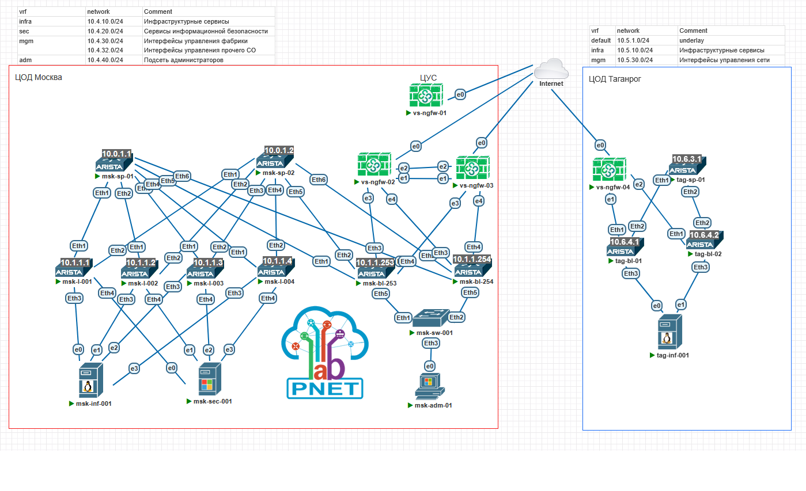
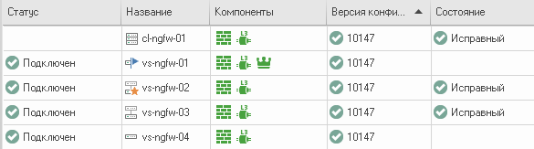
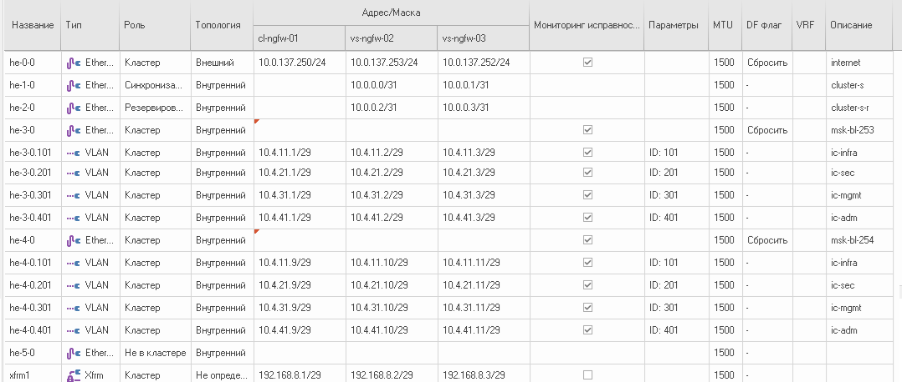
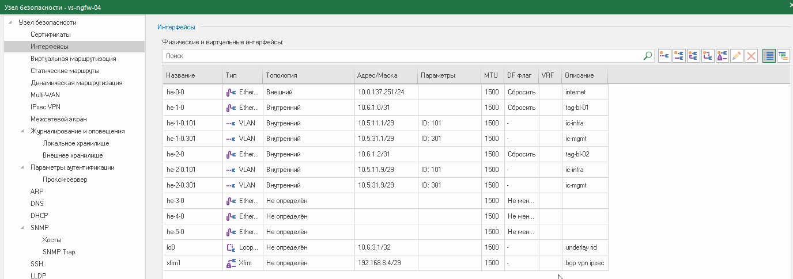

[Назад, к списку домашних заданий](../README.md)
## 1. План работ.  
1. Спроектировать схему сети с учетом вводных данных.
2. Сконфигурировать CLOS в COD Moscow.
3. Сконфигурировать CLOS в COD Taganrog.
4. Настроить связность между двумя цод с использованием NGFW Континент 4.  
5. Протестировать связность.
6. Протестировать отказоустойчивость.
7. Зафиксировать конфигурации сетевого оборудования.

## 2. Схема топологии CLOS.  


## 3. Адресное пространство  
<details>
  <summary>Адресное пространство COD Moscow</summary>

### Таблица 1. Адресное пространство COD Moscow.  
|Адресация|Назначение|
|--------|--------|
|10.0.1.**\<SN\>**/32|loopback интерфейсы для spine, где SN = 1-255|
|10.1.1.**\<LN\>**/32|loopback интерфейсы для leaf, где LN = 1-255|
|10.2.**\<SN\>**.**\<N\>**/31|p2p линки между spine и leaf 1-128, где SN = номер spine, N = 0-255|
|10.3.**\<SN\>.**\<N\>**/31|p2p линки между spine и leaf 129-254, где SN = номер spine, N = 0-255|
|10.4.10.0/24|overlay infra - vlan 100, vrf infra, gw 10.4.10.1|
|10.4.11.0/24|ic-infra - vlan 101, vrf infra|
|10.4.20.0/24|overlay sec - vlan 200, vrf sec, gw 10.4.20.1|
|10.4.21.0/24|ic-sec - vlan 200, vrf sec|
|10.4.30.0/24|overlay mgmt - loopback2, vrf mgmt|
|10.4.31.0/24|ic-mgmt - vlan 301, vrf mgmt|
|10.4.32.0/24|overlay mgmt other - vlan 302, vrf mgmt, gw 10.4.32.1|
|10.4.40.0/24|overlay adm - vlan 400, vrf , gw 10.4.40.1|
|10.4.41.0/24|ic-adm - vlan 400, vrf|
</details>

<details>
  <summary>Адресное пространство COD Taganrog</summary>

### Таблица 2. Адресное пространство COD Taganrog.  
|Адресация|Назначение|
|--------|--------|
|10.6.3.**\<SN\>**/32|loopback интерфейсы для spine, где SN = 1-255|
|10.6.4.**\<LN\>**/32|loopback интерфейсы для leaf, где LN = 1-255|
|10.6.1.**\<N\>**/31|p2p линки между spine и leaf, N = 0-255|
|10.5.10.0/24|overlay infra - vlan 100, vrf infra, gw 10.4.10.1|
|10.5.11.0/24|ic-infra - vlan 101, vrf infra|
|10.5.30.0/24|overlay mgmt - loopback2, vrf mgmt|
|10.5.31.0/24|ic-mgmt - vlan 301, vrf mgmt|
</details>

<details>
  <summary>Перечень NGFW</summary>

### Таблица 3. Перечень NGFW.



</details>

<details>
  <summary>Интерфейсы кластера NGFW c-ngfw-01 в COD Moscow. </summary>
  
### Таблица 4. Интерфейсы кластера NGFW c-ngfw-01 в COD Moscow.  

</details>
</details>

<details>
  <summary>Интерфейсы NGFW vs-ngfw-04 в COD Taganrog. </summary>
  
### Таблица 4. Интерфейсы NGFW vs-ngfw-04 в COD Taganrog.  

</details>

## 4. Настройки сетевого оборудования ЦОД Moscow
<details>
  <summary>msk-sp-01 configuration</summary>
  
```cisco
msk-sp-01#sh run
! Command: show running-config
! device: msk-sp-01 (vEOS-lab, EOS-4.27.0F)
!
! boot system flash:/vEOS-lab.swi
!
no aaa root
!
transceiver qsfp default-mode 4x10G
!
service routing protocols model multi-agent
!
hostname msk-sp-01
!
spanning-tree mode mstp
!
interface Ethernet1
   description msk-l-001
   no switchport
   ip address 10.2.1.0/31
   ip ospf network point-to-point
   ip ospf area 0.0.0.0
!
interface Ethernet2
   description msk-l-002
   no switchport
   ip address 10.2.1.2/31
   ip ospf network point-to-point
   ip ospf area 0.0.0.0
!
interface Ethernet3
   description msk-l-003
   no switchport
   ip address 10.2.1.4/31
   ip ospf network point-to-point
   ip ospf area 0.0.0.0
!
interface Ethernet4
   description msk-l-004
   no switchport
   ip address 10.2.1.6/31
   ip ospf network point-to-point
   ip ospf area 0.0.0.0
!
interface Ethernet5
   description msk-bl-253
   no switchport
   ip address 10.2.1.248/31
   ip ospf network point-to-point
   ip ospf area 0.0.0.0
!
interface Ethernet6
   description msk-bl-254
   no switchport
   ip address 10.2.1.250/31
   ip ospf network point-to-point
   ip ospf area 0.0.0.0
!
interface Loopback1
   ip address 10.0.1.1/32
   ip ospf area 0.0.0.0
!
interface Management1
!
ip routing
!
router bgp 65001
   router-id 10.0.1.1
   no bgp default ipv4-unicast
   timers bgp 1 3
   distance bgp 20 200 200
   neighbor LEAF peer group
   neighbor LEAF next-hop-unchanged
   neighbor LEAF update-source Loopback1
   neighbor LEAF bfd
   neighbor LEAF ebgp-multihop 2
   neighbor LEAF route-reflector-client
   neighbor LEAF send-community extended
   neighbor 10.1.1.1 peer group LEAF
   neighbor 10.1.1.1 remote-as 65101
   neighbor 10.1.1.1 description msk-l-001
   neighbor 10.1.1.2 peer group LEAF
   neighbor 10.1.1.2 remote-as 65102
   neighbor 10.1.1.2 description msk-l-002
   neighbor 10.1.1.3 peer group LEAF
   neighbor 10.1.1.3 remote-as 65103
   neighbor 10.1.1.3 description msk-l-003
   neighbor 10.1.1.4 peer group LEAF
   neighbor 10.1.1.4 remote-as 65104
   neighbor 10.1.1.4 description msk-l-004
   neighbor 10.1.1.253 peer group LEAF
   neighbor 10.1.1.253 remote-as 65353
   neighbor 10.1.1.253 description msk-bl-253
   neighbor 10.1.1.254 peer group LEAF
   neighbor 10.1.1.254 remote-as 65354
   neighbor 10.1.1.254 description msk-bl-254
   !
   address-family evpn
      neighbor LEAF activate
!
router ospf 1
   router-id 10.0.1.1
   bfd default
   passive-interface default
   no passive-interface Ethernet1
   no passive-interface Ethernet2
   no passive-interface Ethernet3
   no passive-interface Ethernet4
   no passive-interface Ethernet5
   no passive-interface Ethernet6
   max-lsa 12000
   log-adjacency-changes detail
!
end
msk-sp-01#
```
</details>
<details>
  <summary>msk-sp-02 configuration</summary>
  
```cisco
msk-sp-02#sh run
! Command: show running-config
! device: msk-sp-02 (vEOS-lab, EOS-4.27.0F)
!
! boot system flash:/vEOS-lab.swi
!
no aaa root
!
transceiver qsfp default-mode 4x10G
!
service routing protocols model multi-agent
!
hostname msk-sp-02
!
spanning-tree mode mstp
!
interface Ethernet1
   description msk-l-001
   no switchport
   ip address 10.2.2.0/31
   ip ospf network point-to-point
   ip ospf area 0.0.0.0
!
interface Ethernet2
   description msk-l-002
   no switchport
   ip address 10.2.2.2/31
   ip ospf network point-to-point
   ip ospf area 0.0.0.0
!
interface Ethernet3
   description msk-l-003
   no switchport
   ip address 10.2.2.4/31
   ip ospf network point-to-point
   ip ospf area 0.0.0.0
!
interface Ethernet4
   description msk-l-004
   no switchport
   ip address 10.2.2.6/31
   ip ospf network point-to-point
   ip ospf area 0.0.0.0
!
interface Ethernet5
   description msk-bl-253
   no switchport
   ip address 10.2.2.248/31
   ip ospf network point-to-point
   ip ospf area 0.0.0.0
!
interface Ethernet6
   description msk-bl-254
   no switchport
   ip address 10.2.2.250/31
   ip ospf network point-to-point
   ip ospf area 0.0.0.0
!
interface Loopback1
   ip address 10.0.1.2/32
   ip ospf area 0.0.0.0
!
interface Management1
!
ip routing
!
router bgp 65001
   router-id 10.0.1.2
   no bgp default ipv4-unicast
   timers bgp 1 3
   distance bgp 20 200 200
   neighbor LEAF peer group
   neighbor LEAF next-hop-unchanged
   neighbor LEAF update-source Loopback1
   neighbor LEAF bfd
   neighbor LEAF ebgp-multihop 2
   neighbor LEAF route-reflector-client
   neighbor LEAF send-community extended
   neighbor 10.1.1.1 peer group LEAF
   neighbor 10.1.1.1 remote-as 65101
   neighbor 10.1.1.1 description msk-l-001
   neighbor 10.1.1.2 peer group LEAF
   neighbor 10.1.1.2 remote-as 65102
   neighbor 10.1.1.2 description msk-l-002
   neighbor 10.1.1.3 peer group LEAF
   neighbor 10.1.1.3 remote-as 65103
   neighbor 10.1.1.3 description msk-l-003
   neighbor 10.1.1.4 peer group LEAF
   neighbor 10.1.1.4 remote-as 65104
   neighbor 10.1.1.4 description msk-l-004
   neighbor 10.1.1.253 peer group LEAF
   neighbor 10.1.1.253 remote-as 65353
   neighbor 10.1.1.253 description msk-bl-253
   neighbor 10.1.1.254 peer group LEAF
   neighbor 10.1.1.254 remote-as 65354
   neighbor 10.1.1.254 description msk-bl-254
   !
   address-family evpn
      neighbor LEAF activate
!
router ospf 1
   router-id 10.0.1.2
   bfd default
   passive-interface default
   no passive-interface Ethernet1
   no passive-interface Ethernet2
   no passive-interface Ethernet3
   no passive-interface Ethernet4
   no passive-interface Ethernet5
   no passive-interface Ethernet6
   max-lsa 12000
   log-adjacency-changes detail
!
end
msk-sp-02#
```
</details>
<details>
  <summary>msk-l-001 configuration</summary>

```cisco
msk-l-001#sh run
! Command: show running-config
! device: msk-l-001 (vEOS-lab, EOS-4.27.0F)
!
! boot system flash:/vEOS-lab.swi
!
no aaa root
!
transceiver qsfp default-mode 4x10G
!
service routing protocols model multi-agent
!
no logging console
!
hostname msk-l-001
!
spanning-tree mode mstp
!
vlan 100
   name infra
!
vlan 200
   name sec
!
vlan 300
   name mgmt
!
vlan 400
   name adm
!
vrf instance adm
!
vrf instance infra
!
vrf instance mgmt
!
vrf instance sec
!
interface Port-Channel100
   description msk-inf-001
   switchport access vlan 100
   !
   evpn ethernet-segment
      identifier 0000:0000:0000:0000:0001
      designated-forwarder election algorithm preference 100
      route-target import 00:00:00:00:00:01
   lacp system-id 0000.0000.0001
!
interface Port-Channel200
   description msk-sec-001
   switchport access vlan 200
   !
   evpn ethernet-segment
      identifier 0000:0000:0000:0000:0002
      designated-forwarder election algorithm preference 70
      route-target import 00:00:00:00:00:02
   lacp system-id 0000.0000.0002
!
interface Ethernet1
   description msk-sp-01
   no switchport
   ip address 10.2.1.1/31
   ip ospf network point-to-point
   ip ospf area 0.0.0.0
!
interface Ethernet2
   description msk-sp-02
   no switchport
   ip address 10.2.2.1/31
   ip ospf network point-to-point
   ip ospf area 0.0.0.0
!
interface Ethernet3
   description msk-inf-001
   channel-group 100 mode active
!
interface Ethernet4
   description msk-sec-001
   channel-group 200 mode active
!
interface Loopback1
   description UNDERLAY
   ip address 10.1.1.1/32
   ip ospf area 0.0.0.0
!
interface Loopback2
   description mgmt
   vrf mgmt
   ip address 10.4.30.1/32
!
interface Management1
!
interface Vlan100
   description infra
   vrf infra
   ip proxy-arp
   ip address 10.4.10.1/24
!
interface Vlan200
   description sec
   vrf sec
   ip proxy-arp
   ip address 10.4.20.1/24
!
interface Vlan300
   description mgmt
   vrf mgmt
   ip proxy-arp
   ip address 10.4.32.1/24
!
interface Vlan400
   description adm
   vrf mgmt
   ip proxy-arp
   ip address 10.4.40.1/24
!
interface Vlan1200
!
interface Vxlan1
   vxlan source-interface Loopback1
   vxlan udp-port 4789
   vxlan vlan 100 vni 100100
   vxlan vlan 200 vni 100200
   vxlan vlan 300 vni 100300
   vxlan vlan 400 vni 100400
   vxlan vrf adm vni 10400
   vxlan vrf infra vni 10100
   vxlan vrf mgmt vni 10300
   vxlan vrf sec vni 10200
   bfd vtep evpn interval 50 min-rx 50 multiplier 3
   vxlan learn-restrict any
!
ip routing
ip routing vrf adm
ip routing vrf infra
ip routing vrf mgmt
ip routing vrf sec
!
router bgp 65101
   router-id 10.1.1.1
   no bgp default ipv4-unicast
   timers bgp 1 3
   maximum-paths 3
   neighbor SPINE peer group
   neighbor SPINE remote-as 65001
   neighbor SPINE update-source Loopback1
   neighbor SPINE bfd
   neighbor SPINE local-v4-addr 10.1.1.1
   neighbor SPINE ebgp-multihop 4
   neighbor SPINE send-community extended
   neighbor 10.0.1.1 peer group SPINE
   neighbor 10.0.1.1 description msk-sp-01
   neighbor 10.0.1.2 peer group SPINE
   neighbor 10.0.1.2 description msk-sp-02
   redistribute connected
   !
   vlan 100
      rd 10.1.1.1:100
      route-target both 100:100100
      redistribute learned
   !
   vlan 200
      rd 10.1.1.1:200
      route-target both 200:100200
      redistribute learned
   !
   vlan 300
      rd 10.1.1.1:300
      route-target both 300:100300
      redistribute learned
   !
   vlan 400
      rd 10.1.1.1:400
      route-target both 400:100400
      redistribute learned
   !
   address-family evpn
      neighbor SPINE activate
   !
   address-family ipv4
      no neighbor SPINE activate
   !
   vrf adm
      rd 65101:10400
      route-target import evpn 4:10400
      route-target export evpn 4:10400
      maximum-paths 2
      redistribute connected
   !
   vrf infra
      rd 65101:10100
      route-target import evpn 1:10100
      route-target export evpn 1:10100
      maximum-paths 2
      redistribute connected
   !
   vrf mgmt
      rd 65101:10300
      route-target import evpn 3:10300
      route-target export evpn 3:10300
      maximum-paths 2
      redistribute connected
   !
   vrf sec
      rd 65101:10200
      route-target import evpn 2:10200
      route-target export evpn 2:10200
      maximum-paths 2
      redistribute connected
!
router ospf 1
   router-id 10.1.1.1
   bfd default
   passive-interface default
   no passive-interface Ethernet1
   no passive-interface Ethernet2
   max-lsa 12000
   log-adjacency-changes detail
!
end
msk-l-001#
```
</details>
<details>
  <summary>msk-l-002 configuration</summary>

```cisco
msk-l-002#sh run
! Command: show running-config
! device: msk-l-002 (vEOS-lab, EOS-4.27.0F)
!
! boot system flash:/vEOS-lab.swi
!
no aaa root
!
transceiver qsfp default-mode 4x10G
!
service routing protocols model multi-agent
!
no logging console
!
hostname msk-l-002
!
spanning-tree mode mstp
!
vlan 100
   name infra
!
vlan 200
   name sec
!
vlan 300
   name mgmt
!
vlan 400
   name adm
!
vrf instance adm
!
vrf instance infra
!
vrf instance mgmt
!
vrf instance sec
!
vrf instance srv-10
!
vrf instance srv-20
!
interface Port-Channel100
   description msk-inf-001
   switchport access vlan 100
   !
   evpn ethernet-segment
      identifier 0000:0000:0000:0000:0001
      designated-forwarder election algorithm preference 90
      route-target import 00:00:00:00:00:01
   lacp system-id 0000.0000.0001
!
interface Port-Channel200
   description msk-sec-001
   switchport access vlan 200
   !
   evpn ethernet-segment
      identifier 0000:0000:0000:0000:0002
      designated-forwarder election algorithm preference 80
      route-target import 00:00:00:00:00:02
   lacp system-id 0000.0000.0002
!
interface Ethernet1
   description msk-sp-01
   no switchport
   ip address 10.2.1.3/31
   ip ospf network point-to-point
   ip ospf area 0.0.0.0
!
interface Ethernet2
   description msk-sp-02
   no switchport
   ip address 10.2.2.3/31
   ip ospf network point-to-point
   ip ospf area 0.0.0.0
!
interface Ethernet3
   description msk-inf-001
   channel-group 100 mode active
!
interface Ethernet4
   description msk-sec-001
   channel-group 200 mode active
!
interface Loopback1
   description UNDERLAY
   ip address 10.1.1.2/32
   ip ospf area 0.0.0.0
!
interface Loopback2
   description mgmt
   vrf mgmt
   ip address 10.4.30.2/32
!
interface Management1
!
interface Vlan100
   description infra
   vrf infra
   ip proxy-arp
   ip address 10.4.10.1/24
!
interface Vlan200
   description sec
   vrf sec
   ip proxy-arp
   ip address 10.4.20.1/24
!
interface Vlan300
   description mgmt
   vrf mgmt
   ip proxy-arp
   ip address 10.4.32.1/24
!
interface Vlan400
   description adm
   vrf mgmt
   ip proxy-arp
   ip address 10.4.40.1/24
!
interface Vlan1200
!
interface Vxlan1
   vxlan source-interface Loopback1
   vxlan udp-port 4789
   vxlan vlan 100 vni 100100
   vxlan vlan 200 vni 100200
   vxlan vlan 300 vni 100300
   vxlan vlan 400 vni 100400
   vxlan vrf adm vni 10400
   vxlan vrf infra vni 10100
   vxlan vrf mgmt vni 10300
   vxlan vrf sec vni 10200
   bfd vtep evpn interval 50 min-rx 50 multiplier 3
   vxlan learn-restrict any
!
ip routing
ip routing vrf adm
ip routing vrf infra
ip routing vrf mgmt
ip routing vrf sec
no ip routing vrf srv-10
no ip routing vrf srv-20
!
router bgp 65102
   router-id 10.1.1.2
   no bgp default ipv4-unicast
   timers bgp 1 3
   maximum-paths 3
   neighbor SPINE peer group
   neighbor SPINE remote-as 65001
   neighbor SPINE update-source Loopback1
   neighbor SPINE bfd
   neighbor SPINE local-v4-addr 10.1.1.2
   neighbor SPINE ebgp-multihop 4
   neighbor SPINE send-community extended
   neighbor 10.0.1.1 peer group SPINE
   neighbor 10.0.1.1 description msk-sp-01
   neighbor 10.0.1.2 peer group SPINE
   neighbor 10.0.1.2 description msk-sp-02
   redistribute connected
   !
   vlan 100
      rd 10.1.1.2:100
      route-target both 100:100100
      redistribute learned
   !
   vlan 200
      rd 10.1.1.2:200
      route-target both 200:100200
      redistribute learned
   !
   vlan 300
      rd 10.1.1.2:300
      route-target both 300:100300
      redistribute learned
   !
   vlan 400
      rd 10.1.1.2:400
      route-target both 400:100400
      redistribute learned
   !
   address-family evpn
      neighbor SPINE activate
   !
   address-family ipv4
      no neighbor SPINE activate
   !
   vrf adm
      rd 65102:10400
      route-target import evpn 4:10400
      route-target export evpn 4:10400
      maximum-paths 2
      redistribute connected
   !
   vrf infra
      rd 65102:10100
      route-target import evpn 1:10100
      route-target export evpn 1:10100
      maximum-paths 2
      redistribute connected
   !
   vrf mgmt
      rd 65102:10300
      route-target import evpn 3:10300
      route-target export evpn 3:10300
      maximum-paths 2
      redistribute connected
   !
   vrf sec
      rd 65102:10200
      route-target import evpn 2:10200
      route-target export evpn 2:10200
      maximum-paths 2
      redistribute connected
!
router ospf 1
   router-id 10.1.1.2
   bfd default
   passive-interface default
   no passive-interface Ethernet1
   no passive-interface Ethernet2
   max-lsa 12000
   log-adjacency-changes detail
!
end
msk-l-002#
```
</details>
<details>
  <summary>msk-l-003 configuration</summary>

```cisco
msk-l-003#sh run
! Command: show running-config
! device: msk-l-003 (vEOS-lab, EOS-4.27.0F)
!
! boot system flash:/vEOS-lab.swi
!
no aaa root
!
transceiver qsfp default-mode 4x10G
!
service routing protocols model multi-agent
!
no logging console
!
hostname msk-l-003
!
spanning-tree mode mstp
!
vlan 100
   name infra
!
vlan 200
   name sec
!
vlan 300
   name mgmt
!
vlan 400
   name adm
!
vrf instance adm
!
vrf instance infra
!
vrf instance mgmt
!
vrf instance sec
!
vrf instance srv-10
!
vrf instance srv-20
!
interface Port-Channel100
   description msk-inf-001
   switchport access vlan 100
   !
   evpn ethernet-segment
      identifier 0000:0000:0000:0000:0001
      designated-forwarder election algorithm preference 80
      route-target import 00:00:00:00:00:01
   lacp system-id 0000.0000.0001
!
interface Port-Channel200
   description msk-sec-001
   switchport access vlan 200
   !
   evpn ethernet-segment
      identifier 0000:0000:0000:0000:0002
      designated-forwarder election algorithm preference 90
      route-target import 00:00:00:00:00:02
   lacp system-id 0000.0000.0002
!
interface Ethernet1
   description msk-sp-01
   no switchport
   ip address 10.2.1.5/31
   ip ospf network point-to-point
   ip ospf area 0.0.0.0
!
interface Ethernet2
   description msk-sp-02
   no switchport
   ip address 10.2.2.5/31
   ip ospf network point-to-point
   ip ospf area 0.0.0.0
!
interface Ethernet3
   description msk-inf-001
   channel-group 100 mode active
!
interface Ethernet4
   description msk-sec-001
   channel-group 200 mode active
!
interface Loopback1
   description UNDERLAY
   ip address 10.1.1.3/32
   ip ospf area 0.0.0.0
!
interface Loopback2
   description mgmt
   vrf mgmt
   ip address 10.4.30.3/32
!
interface Management1
!
interface Vlan100
   description infra
   vrf infra
   ip proxy-arp
   ip address 10.4.10.1/24
!
interface Vlan200
   description sec
   vrf sec
   ip proxy-arp
   ip address 10.4.20.1/24
!
interface Vlan300
   description mgmt
   vrf mgmt
   ip proxy-arp
   ip address 10.4.32.1/24
!
interface Vlan400
   description adm
   vrf mgmt
   ip proxy-arp
   ip address 10.4.40.1/24
!
interface Vlan1200
!
interface Vxlan1
   vxlan source-interface Loopback1
   vxlan udp-port 4789
   vxlan vlan 100 vni 100100
   vxlan vlan 200 vni 100200
   vxlan vlan 300 vni 100300
   vxlan vlan 400 vni 100400
   vxlan vrf adm vni 10400
   vxlan vrf infra vni 10100
   vxlan vrf mgmt vni 10300
   vxlan vrf sec vni 10200
   bfd vtep evpn interval 50 min-rx 50 multiplier 3
   vxlan learn-restrict any
!
ip routing
ip routing vrf adm
ip routing vrf infra
ip routing vrf mgmt
ip routing vrf sec
no ip routing vrf srv-10
no ip routing vrf srv-20
!
router bgp 65103
   router-id 10.1.1.3
   no bgp default ipv4-unicast
   timers bgp 1 3
   maximum-paths 3
   neighbor SPINE peer group
   neighbor SPINE remote-as 65001
   neighbor SPINE update-source Loopback1
   neighbor SPINE bfd
   neighbor SPINE local-v4-addr 10.1.1.3
   neighbor SPINE ebgp-multihop 4
   neighbor SPINE send-community extended
   neighbor 10.0.1.1 peer group SPINE
   neighbor 10.0.1.1 description msk-sp-01
   neighbor 10.0.1.2 peer group SPINE
   neighbor 10.0.1.2 description msk-sp-02
   redistribute connected
   !
   vlan 100
      rd 10.1.1.3:100
      route-target both 100:100100
      redistribute learned
   !
   vlan 200
      rd 10.1.1.3:200
      route-target both 200:100200
      redistribute learned
   !
   vlan 300
      rd 10.1.1.3:300
      route-target both 300:100300
      redistribute learned
   !
   vlan 400
      rd 10.1.1.3:400
      route-target both 400:100400
      redistribute learned
   !
   address-family evpn
      neighbor SPINE activate
   !
   address-family ipv4
      no neighbor SPINE activate
   !
   vrf adm
      route-target import evpn 4:10400
      route-target export evpn 4:10400
      maximum-paths 2
      redistribute connected
   !
   vrf infra
      rd 65103:10100
      route-target import evpn 1:10100
      route-target export evpn 1:10100
      maximum-paths 2
      redistribute connected
   !
   vrf mgmt
      rd 65103:10300
      route-target import evpn 3:10300
      route-target export evpn 3:10300
      maximum-paths 2
      redistribute connected
   !
   vrf sec
      rd 65103:10200
      route-target import evpn 2:10200
      route-target export evpn 2:10200
      maximum-paths 2
      redistribute connected
!
router ospf 1
   router-id 10.1.1.3
   bfd default
   passive-interface default
   no passive-interface Ethernet1
   no passive-interface Ethernet2
   max-lsa 12000
   log-adjacency-changes detail
!
end
msk-l-003#
```
</details>
<details>
  <summary>msk-l-004 configuration</summary>

```cisco
msk-l-004#sh run
'! Command: show running-config
! device: msk-l-004 (vEOS-lab, EOS-4.27.0F)
!
! boot system flash:/vEOS-lab.swi
!
no aaa root
!
transceiver qsfp default-mode 4x10G
!
service routing protocols model multi-agent
!
no logging console
!
hostname msk-l-004
!
spanning-tree mode mstp
!
vlan 100
   name infra
!
vlan 200
   name sec
!
vlan 300
   name mgmt
!
vlan 400
   name adm
!
vrf instance adm
!
vrf instance infra
!
vrf instance mgmt
!
vrf instance sec
!
interface Port-Channel100
   description msk-inf-001
   switchport access vlan 100
   !
   evpn ethernet-segment
      identifier 0000:0000:0000:0000:0001
      designated-forwarder election algorithm preference 70
      route-target import 00:00:00:00:00:01
   lacp system-id 0000.0000.0001
!
interface Port-Channel200
   description msk-sec-001
   switchport access vlan 200
   !
   evpn ethernet-segment
      identifier 0000:0000:0000:0000:0002
      designated-forwarder election algorithm preference 100
      route-target import 00:00:00:00:00:02
   lacp system-id 0000.0000.0002
!
interface Ethernet1
   description msk-sp-01
   no switchport
   ip address 10.2.1.7/31
   ip ospf network point-to-point
   ip ospf area 0.0.0.0
!
interface Ethernet2
   description msk-sp-02
   no switchport
   ip address 10.2.2.7/31
   ip ospf network point-to-point
   ip ospf area 0.0.0.0
!
interface Ethernet3
   description msk-inf-001
   channel-group 100 mode active
!
interface Ethernet4
   description msc-sec-001
   channel-group 200 mode active
!
interface Loopback1
   description UNDERLAY
   ip address 10.1.1.4/32
   ip ospf area 0.0.0.0
!
interface Loopback2
   description mgmt
   vrf mgmt
   ip address 10.4.30.4/32
!
interface Management1
!
interface Vlan100
   description infra
   vrf infra
   ip proxy-arp
   ip address 10.4.10.1/24
!
interface Vlan200
   description sec
   vrf sec
   ip proxy-arp
   ip address 10.4.20.1/24
!
interface Vlan300
   description mgmt
   vrf mgmt
   ip proxy-arp
   ip address 10.4.32.1/24
!
interface Vlan400
   description adm
   vrf mgmt
   ip proxy-arp
   ip address 10.4.40.1/24
!
interface Vlan1200
!
interface Vxlan1
   vxlan source-interface Loopback1
   vxlan udp-port 4789
   vxlan vlan 100 vni 100100
   vxlan vlan 200 vni 100200
   vxlan vlan 300 vni 100300
   vxlan vlan 400 vni 100400
   vxlan vrf adm vni 10400
   vxlan vrf infra vni 10100
   vxlan vrf mgmt vni 10300
   vxlan vrf sec vni 10200
   bfd vtep evpn interval 50 min-rx 50 multiplier 3
   vxlan learn-restrict any
!
ip routing
ip routing vrf adm
ip routing vrf infra
ip routing vrf mgmt
ip routing vrf sec
!
router bgp 65104
   router-id 10.1.1.4
   no bgp default ipv4-unicast
   timers bgp 1 3
   maximum-paths 3
   neighbor SPINE peer group
   neighbor SPINE remote-as 65001
   neighbor SPINE update-source Loopback1
   neighbor SPINE bfd
   neighbor SPINE local-v4-addr 10.1.1.4
   neighbor SPINE ebgp-multihop 4
   neighbor SPINE send-community extended
   neighbor 10.0.1.1 peer group SPINE
   neighbor 10.0.1.1 description msk-sp-01
   neighbor 10.0.1.2 peer group SPINE
   neighbor 10.0.1.2 description msk-sp-02
   redistribute connected
   !
   vlan 100
      rd 10.1.1.4:100
      route-target both 100:100100
      redistribute learned
   !
   vlan 200
      rd 10.1.1.4:200
      route-target both 200:100200
      redistribute learned
   !
   vlan 300
      rd 10.1.1.4:300
      route-target both 300:100300
      redistribute learned
   !
   vlan 400
      rd 10.1.1.4:400
      route-target both 400:100400
      redistribute learned
   !
   address-family evpn
      neighbor SPINE activate
   !
   address-family ipv4
      no neighbor SPINE activate
   !
   vrf adm
      rd 65104:10400
      route-target import evpn 4:10400
      route-target export evpn 4:10400
      maximum-paths 2
      redistribute connected
   !
   vrf infra
      rd 65104:10100
      route-target import evpn 1:10100
      route-target export evpn 1:10100
      maximum-paths 2
      redistribute connected
   !
   vrf mgmt
      rd 65104:10300
      route-target import evpn 3:10300
      route-target export evpn 3:10300
      maximum-paths 2
      redistribute connected
   !
   vrf sec
      rd 65104:10200
      route-target import evpn 2:10200
      route-target export evpn 2:10200
      maximum-paths 2
      redistribute connected
!
router ospf 1
   router-id 10.1.1.4
   bfd default
   passive-interface default
   no passive-interface Ethernet1
   no passive-interface Ethernet2
   max-lsa 12000
   log-adjacency-changes detail
!
end
msk-l-004#
```
</details>
<details>
  <summary>msk-l-253 configuration</summary>

```cisco
msk-l-253#sh run
! Command: show running-config
! device: msk-l-253 (vEOS-lab, EOS-4.27.0F)
!
! boot system flash:/vEOS-lab.swi
!
no aaa root
!
transceiver qsfp default-mode 4x10G
!
service routing protocols model multi-agent
!
no logging console
!
hostname msk-l-253
!
spanning-tree mode mstp
!
vlan 100
   name infra
!
vlan 101
   name ic-infra
!
vlan 200
   name sec
!
vlan 201
   name ic-sec
!
vlan 300
   name mgmt
!
vlan 301
   name ic-mgmt
!
vlan 400
   name adm
!
vlan 401
   name ic-adm
!
vrf instance adm
!
vrf instance infra
!
vrf instance mgmt
!
vrf instance sec
!
interface Port-Channel300
   description msk-sw-001
   switchport mode trunk
   !
   evpn ethernet-segment
      identifier 0000:0000:0000:0000:0003
      designated-forwarder election algorithm preference 100
      route-target import 00:00:00:00:00:03
   lacp system-id 0000.0000.0003
!
interface Ethernet1
   description msk-sp-01
   no switchport
   ip address 10.2.1.249/31
   ip ospf network point-to-point
   ip ospf area 0.0.0.0
!
interface Ethernet2
   description msk-sp-02
   no switchport
   ip address 10.2.2.249/31
   ip ospf network point-to-point
   ip ospf area 0.0.0.0
!
interface Ethernet3
   description vs-ngfw-02
   switchport trunk allowed vlan 101,201,301,401
   switchport mode trunk
   bfd interval 50 min-rx 50 multiplier 3
!
interface Ethernet4
   description vs-ngfw-03
   switchport trunk allowed vlan 101,201,301,401
   switchport mode trunk
   bfd interval 50 min-rx 50 multiplier 3
!
interface Ethernet5
   description msk-sw-001
   channel-group 300 mode active
   lacp timer fast
!
interface Loopback1
   description UNDERLAY
   ip address 10.1.1.253/32
   ip ospf area 0.0.0.0
!
interface Loopback2
   description mgmt
   vrf mgmt
   ip address 10.4.30.253/32
!
interface Management1
!
interface Vlan100
   description infra
   vrf infra
   ip proxy-arp
   ip address 10.4.10.1/24
!
interface Vlan101
   vrf infra
   ip address 10.4.11.4/29
!
interface Vlan200
   description sec
   vrf sec
   ip proxy-arp
   ip address 10.4.20.1/24
!
interface Vlan201
   vrf sec
   ip address 10.4.21.4/29
!
interface Vlan300
   description mgmt
   vrf mgmt
   ip proxy-arp
   ip address 10.4.32.1/24
!
interface Vlan301
   vrf mgmt
   ip address 10.4.31.4/29
!
interface Vlan400
   description adm
   vrf adm
   ip proxy-arp
   ip address 10.4.40.1/24
!
interface Vlan401
   vrf adm
   ip address 10.4.41.4/29
!
interface Vlan1200
!
interface Vxlan1
   vxlan source-interface Loopback1
   vxlan udp-port 4789
   vxlan vlan 100 vni 100100
   vxlan vlan 200 vni 100200
   vxlan vlan 300 vni 100300
   vxlan vlan 400 vni 100400
   vxlan vrf adm vni 10400
   vxlan vrf infra vni 10100
   vxlan vrf mgmt vni 10300
   vxlan vrf sec vni 10200
   bfd vtep evpn interval 50 min-rx 50 multiplier 3
   vxlan learn-restrict any
!
ip routing
ip routing vrf adm
ip routing vrf infra
ip routing vrf mgmt
ip routing vrf sec
!
router bgp 65353
   router-id 10.1.1.253
   no bgp default ipv4-unicast
   timers bgp 1 3
   maximum-paths 3
   neighbor SPINE peer group
   neighbor SPINE remote-as 65001
   neighbor SPINE update-source Loopback1
   neighbor SPINE bfd
   neighbor SPINE local-v4-addr 10.1.1.253
   neighbor SPINE ebgp-multihop 4
   neighbor SPINE send-community extended
   neighbor 10.0.1.1 peer group SPINE
   neighbor 10.0.1.1 description msk-sp-01
   neighbor 10.0.1.2 peer group SPINE
   neighbor 10.0.1.2 description msk-sp-02
   redistribute connected
   !
   vlan 100
      rd 10.1.1.253:100
      route-target both 100:100100
      redistribute learned
   !
   vlan 200
      rd 10.1.1.253:200
      route-target both 200:100200
      redistribute learned
   !
   vlan 300
      rd 10.1.1.253:300
      route-target both 300:100300
      redistribute learned
   !
   vlan 400
      rd 10.1.1.253:400
      route-target both 400:100400
      redistribute learned
   !
   address-family evpn
      neighbor SPINE activate
   !
   address-family ipv4
      no neighbor SPINE activate
   !
   vrf adm
      rd 65353:10400
      route-target import evpn 4:10400
      route-target export evpn 4:10400
      maximum-paths 2
      neighbor 10.4.41.1 remote-as 65100
      neighbor 10.4.41.1 bfd
      redistribute connected
      !
      address-family ipv4
         neighbor 10.4.41.1 activate
         network 10.4.40.0/24
   !
   vrf infra
      rd 65353:10100
      route-target import evpn 1:10100
      route-target export evpn 1:10100
      maximum-paths 2
      neighbor 10.4.11.1 remote-as 65100
      neighbor 10.4.11.1 update-source Vlan101
      neighbor 10.4.11.1 bfd
      redistribute connected
      !
      address-family ipv4
         neighbor 10.4.11.1 activate
         network 10.4.10.0/24
   !
   vrf mgmt
      rd 65353:10300
      route-target import evpn 3:10300
      route-target export evpn 3:10300
      maximum-paths 2
      neighbor 10.4.31.1 remote-as 65100
      neighbor 10.4.31.1 update-source Vlan301
      neighbor 10.4.31.1 bfd
      redistribute connected
      !
      address-family ipv4
         neighbor 10.4.31.1 activate
         network 10.4.30.0/24
   !
   vrf sec
      rd 65353:10200
      route-target import evpn 2:10200
      route-target export evpn 2:10200
      maximum-paths 2
      neighbor 10.4.21.1 remote-as 65100
      neighbor 10.4.21.1 update-source Vlan201
      neighbor 10.4.21.1 bfd
      redistribute connected
      !
      address-family ipv4
         neighbor 10.4.21.1 activate
         network 10.4.20.0/24
!
router ospf 1
   router-id 10.1.1.253
   bfd default
   passive-interface default
   no passive-interface Ethernet1
   no passive-interface Ethernet2
   max-lsa 12000
   log-adjacency-changes detail
!
end
msk-l-253#
```
</details>
<details>
  <summary>msk-l-254 configuration</summary>

```cisco
msk-l-254#sh run
! Command: show running-config
! device: msk-l-254 (vEOS-lab, EOS-4.27.0F)
!
! boot system flash:/vEOS-lab.swi
!
no aaa root
!
transceiver qsfp default-mode 4x10G
!
service routing protocols model multi-agent
!
no logging console
!
hostname msk-l-254
!
spanning-tree mode mstp
!
vlan 100
   name infra
!
vlan 101
   name ic-infra
!
vlan 200
   name sec
!
vlan 201
   name ic-sec
!
vlan 300
   name mgmt
!
vlan 301
   name ic-mgmt
!
vlan 400
   name adm
!
vlan 401
   name ic-adm
!
vrf instance adm
!
vrf instance infra
!
vrf instance mgmt
!
vrf instance sec
!
interface Port-Channel300
   description msk-sw-001
   switchport mode trunk
   !
   evpn ethernet-segment
      identifier 0000:0000:0000:0000:0003
      designated-forwarder election algorithm preference 90
      route-target import 00:00:00:00:00:03
   lacp system-id 0000.0000.0003
!
interface Ethernet1
   description msk-sp-01
   no switchport
   ip address 10.2.1.251/31
   ip ospf network point-to-point
   ip ospf area 0.0.0.0
!
interface Ethernet2
   description msk-sp-02
   no switchport
   ip address 10.2.2.251/31
   ip ospf network point-to-point
   ip ospf area 0.0.0.0
!
interface Ethernet3
   description vs-ngfw-02
   switchport trunk allowed vlan 101,201,301,401
   switchport mode trunk
   bfd interval 50 min-rx 50 multiplier 3
!
interface Ethernet4
   description vs-ngfw-03
   switchport trunk allowed vlan 101,201,301,401
   switchport mode trunk
   bfd interval 50 min-rx 50 multiplier 3
!
interface Ethernet5
   description msk-sw-001
   channel-group 300 mode active
   lacp timer fast
!
interface Loopback1
   description UNDERLAY
   ip address 10.1.1.254/32
   ip ospf area 0.0.0.0
!
interface Loopback2
   description mgmt
   vrf mgmt
   ip address 10.4.30.254/32
!
interface Management1
!
interface Vlan100
   description infra
   vrf infra
   ip proxy-arp
   ip address 10.4.10.1/24
!
interface Vlan101
   vrf infra
   ip address 10.4.11.12/29
   bfd interval 50 min-rx 50 multiplier 3
!
interface Vlan200
   description sec
   vrf sec
   ip proxy-arp
   ip address 10.4.20.1/24
!
interface Vlan201
   vrf sec
   ip address 10.4.21.12/29
!
interface Vlan300
   description mgmt
   vrf mgmt
   ip proxy-arp
   ip address 10.4.32.1/24
!
interface Vlan301
   vrf mgmt
   ip address 10.4.31.12/29
   bfd interval 50 min-rx 50 multiplier 3
!
interface Vlan400
   description adm
   vrf adm
   ip proxy-arp
   ip address 10.4.40.1/24
!
interface Vlan401
   vrf adm
   ip address 10.4.41.12/29
!
interface Vlan1200
!
interface Vxlan1
   vxlan source-interface Loopback1
   vxlan udp-port 4789
   vxlan vlan 100 vni 100100
   vxlan vlan 200 vni 100200
   vxlan vlan 300 vni 100300
   vxlan vlan 400 vni 100400
   vxlan vrf adm vni 10400
   vxlan vrf infra vni 10100
   vxlan vrf mgmt vni 10300
   vxlan vrf sec vni 10200
   bfd vtep evpn interval 50 min-rx 50 multiplier 3
   vxlan learn-restrict any
!
ip routing
ip routing vrf adm
ip routing vrf infra
ip routing vrf mgmt
ip routing vrf sec
!
router bgp 65354
   router-id 10.1.1.254
   no bgp default ipv4-unicast
   timers bgp 1 3
   maximum-paths 3
   neighbor SPINE peer group
   neighbor SPINE remote-as 65001
   neighbor SPINE update-source Loopback1
   neighbor SPINE bfd
   neighbor SPINE local-v4-addr 10.1.1.254
   neighbor SPINE ebgp-multihop 4
   neighbor SPINE send-community extended
   neighbor 10.0.1.1 peer group SPINE
   neighbor 10.0.1.1 description msk-sp-01
   neighbor 10.0.1.2 peer group SPINE
   neighbor 10.0.1.2 description msk-sp-02
   redistribute connected
   !
   vlan 100
      rd 10.1.1.254:100
      route-target both 100:100100
      redistribute learned
   !
   vlan 200
      rd 10.1.1.254:200
      route-target both 200:100200
      redistribute learned
   !
   vlan 300
      rd 10.1.1.254:300
      route-target both 300:100300
      redistribute learned
   !
   vlan 400
      rd 10.1.1.254:400
      route-target both 400:100400
      redistribute learned
   !
   address-family evpn
      neighbor SPINE activate
   !
   address-family ipv4
      no neighbor SPINE activate
   !
   vrf adm
      rd 65354:10400
      route-target import evpn 4:10400
      route-target export evpn 4:10400
      maximum-paths 2
      neighbor 10.4.41.9 remote-as 65100
      neighbor 10.4.41.9 update-source Vlan401
      neighbor 10.4.41.9 bfd
      redistribute connected
      !
      address-family ipv4
         neighbor 10.4.41.9 activate
         network 10.4.40.0/24
   !
   vrf infra
      rd 65354:10100
      route-target import evpn 1:10100
      route-target export evpn 1:10100
      maximum-paths 2
      neighbor 10.4.11.9 remote-as 65100
      neighbor 10.4.11.9 update-source Vlan101
      neighbor 10.4.11.9 bfd
      redistribute connected
      !
      address-family ipv4
         neighbor 10.4.11.9 activate
         network 10.4.10.0/24
   !
   vrf mgmt
      rd 65354:10300
      route-target import evpn 3:10300
      route-target export evpn 3:10300
      maximum-paths 2
      neighbor 10.4.31.9 remote-as 65100
      neighbor 10.4.31.9 update-source Vlan301
      neighbor 10.4.31.9 bfd
      redistribute connected
      !
      address-family ipv4
         neighbor 10.4.31.9 activate
         network 10.4.30.0/24
   !
   vrf sec
      rd 65354:10200
      route-target import evpn 2:10200
      route-target export evpn 2:10200
      maximum-paths 2
      neighbor 10.4.21.9 remote-as 65100
      neighbor 10.4.21.9 update-source Vlan201
      neighbor 10.4.21.9 bfd
      redistribute connected
      !
      address-family ipv4
         neighbor 10.4.21.9 activate
         network 10.4.20.0/24
!
router ospf 1
   router-id 10.1.1.254
   bfd default
   passive-interface default
   no passive-interface Ethernet1
   no passive-interface Ethernet2
   max-lsa 12000
   log-adjacency-changes detail
!
end
msk-l-254#
```
</details>
<details>
  <summary>msk-sw-001 configuration</summary>

```cisco
msk-sw-001#sh run
! Command: show running-config
! device: msk-sw-001 (vEOS-lab, EOS-4.27.0F)
!
! boot system flash:/vEOS-lab.swi
!
no aaa root
!
transceiver qsfp default-mode 4x10G
!
service routing protocols model ribd
!
hostname msk-sw-001
!
spanning-tree mode mstp
!
vlan 300
   name mgmt
!
vlan 400
   name adm
!
interface Port-Channel300
   description bl-253-bl-254
   switchport mode trunk
!
interface Ethernet1
   description msk-bl-253
   channel-group 300 mode active
   lacp timer fast
!
interface Ethernet2
   description msk-bl-254
   channel-group 300 mode active
   lacp timer fast
!
interface Ethernet3
   description msk-adm-01
   switchport access vlan 400
!
interface Management1
!
interface Vlan300
   ip address 10.4.32.10/24
!
no ip routing
!
ip route 0.0.0.0/0 10.4.32.1
!
end
msk-sw-001#
```
</details>
<details>
  <summary>cl-ngfw-01 configuration (Bird)</summary>

```cisco
router id 10.4.11.1;

protocol device {
        scan time 2;
}

protocol bfd {
        interface "he-3-0.101", "he-3-0.201", "he-3-0.301", "he-3-0.401",
                          "he-4-0.101", "he-4-0.201", "he-4-0.301", "he-4-0.401" {
                                        min tx interval 50 ms;
                                        min rx interval 50 ms;
                                        multiplier 3;
                          };
}

protocol direct {
        ipv4 { import all;  };
}

filter kernel_export {
        if source ~ [RTS_DEVICE ] then reject;
        accept;
}

filter kernel_import {
        if net = 0.0.0.0/0 then {
                preference = 150;
                accept; # only default route
        }
        reject;
}

protocol kernel {
        learn; # import routes from system
        metric 0;
        ipv4 {
                import filter kernel_import;
                export filter kernel_export;
        };
        scan time 10;
}


filter set_pref_110 {
        if bgp_path ~ [= 65353 =] then {
                bgp_local_pref= 110;
                accept;
        }
        accept;
}
filter set_pref_90 {
        if bgp_path ~ [= 65354 =] then {
                bgp_local_pref= 90;
                accept;
        }
        accept;
}

filter export_default {
        if net = 0.0.0.0/0 then accept;
        reject;
}

filter accept_all {
        accept;
}

template bgp msk_bl_253 {
        local as 65100;
        bfd on;

        ipv4 {
                import filter set_pref_110;
                export filter accept_all;
        };
}

template bgp msk_bl_254 {
        local as 65100;
        bfd on;

        ipv4 {
                import filter set_pref_90;
                export filter accept_all;
        };
}

protocol bgp msk_bl_253_infra from msk_bl_253 {
        neighbor 10.4.11.4 as 65353;
        interface "he-3-0.101";
        hold time 3;
        keepalive time 1;
}

protocol bgp msk_bl_253_sec from msk_bl_253 {
        neighbor 10.4.21.4 as 65353;
        interface "he-3-0.201";
        hold time 3;
        keepalive time 1;
}

protocol bgp msk_bl_253_mgmt from msk_bl_253 {
        neighbor 10.4.31.4 as 65353;
        interface "he-3-0.301";
        hold time 3;
        keepalive time 1;
}

protocol bgp msk_bl_253_adm from msk_bl_253 {
        neighbor 10.4.41.4 as 65353;
        interface "he-3-0.401";
        hold time 3;
        keepalive time 1;
}

protocol bgp msk_bl_254_infra from msk_bl_254 {
        neighbor 10.4.11.12 as 65354;
        interface "he-4-0.101";
        hold time 3;
        keepalive time 1;
}

protocol bgp msk_bl_254_sec from msk_bl_254 {
        neighbor 10.4.21.12 as 65354;
        interface "he-4-0.201";
        hold time 3;
        keepalive time 1;
}

protocol bgp msk_bl_254_mgmt from msk_bl_254 {
        neighbor 10.4.31.12 as 65354;
        interface "he-4-0.301";
        hold time 3;
        keepalive time 1;
}

protocol bgp msk_bl_254_adm from msk_bl_254 {
        neighbor 10.4.41.12 as 65354;
        interface "he-4-0.401";
        hold time 3;
        keepalive time 1;
}

protocol bgp internet_vs_ngfw_04 {
        local as 65200;
        neighbor 192.168.8.4 as 65400;
        source address 192.168.8.1;
        hold time 3;
        keepalive time 1;

        ipv4 {
                import filter accept_all;
                export filter accept_all;
        };
```
</details>
<details>
  <summary>cl-ngfw-01 configuration (Interfaces)</summary>

... картинки

</details>

## 4. Настройки сетевого оборудования ЦОД Taganrog
<details>
  <summary>tag-sp-01 configuration</summary>

```cisco
tag-sp-01#sh run
! Command: show running-config
! device: tag-sp-01 (vEOS-lab, EOS-4.27.0F)
!
! boot system flash:/vEOS-lab.swi
!
no aaa root
!
transceiver qsfp default-mode 4x10G
!
service routing protocols model multi-agent
!
hostname tag-sp-01
!
spanning-tree mode mstp
!
interface Ethernet1
   description tag-bl-01
   no switchport
   ip address 10.6.1.0/31
   ip ospf network point-to-point
   ip ospf area 0.0.0.0
!
interface Ethernet2
   description tag-bl-02
   no switchport
   ip address 10.6.1.2/31
   ip ospf network point-to-point
   ip ospf area 0.0.0.0
!
interface Ethernet3
!
interface Loopback1
   ip address 10.6.3.1/32
   ip ospf area 0.0.0.0
!
interface Management1
!
ip routing
!
router bgp 65401
   router-id 10.6.3.1
   no bgp default ipv4-unicast
   timers bgp 1 3
   distance bgp 20 200 200
   maximum-paths 3
   neighbor LEAF peer group
   neighbor LEAF next-hop-unchanged
   neighbor LEAF update-source Loopback1
   neighbor LEAF bfd
   neighbor LEAF ebgp-multihop 2
   neighbor LEAF route-reflector-client
   neighbor LEAF send-community extended
   neighbor 10.6.4.1 peer group LEAF
   neighbor 10.6.4.1 remote-as 65501
   neighbor 10.6.4.1 description tag-bl-01
   neighbor 10.6.4.2 peer group LEAF
   neighbor 10.6.4.2 remote-as 65502
   neighbor 10.6.4.2 description tag-bl-02
   !
   address-family evpn
      neighbor LEAF activate
!
router ospf 1
   router-id 10.6.3.1
   bfd default
   no passive-interface Ethernet2
   max-lsa 12000
   log-adjacency-changes detail
!
end
tag-sp-01#
```
</details>
<details>
  <summary>tag-bl-01 configuration</summary>

```cisco
tag-bl-01#sh run
! Command: show running-config
! device: tag-bl-01 (vEOS-lab, EOS-4.27.0F)
!
! boot system flash:/vEOS-lab.swi
!
no aaa root
!
transceiver qsfp default-mode 4x10G
!
service routing protocols model multi-agent
!
hostname tag-bl-01
!
spanning-tree mode mstp
!
vlan 100
   name infra
!
vlan 101
   name ic-infra
!
vlan 300
   name mgmt
!
vlan 301
   name ic-mgmt
!
vrf instance infra
!
vrf instance mgmt
!
interface Port-Channel100
   description tag-inf-001
   switchport access vlan 100
   !
   evpn ethernet-segment
      identifier 0000:0000:0000:2222:0001
      designated-forwarder election algorithm preference 100
      route-target import 00:00:00:02:00:01
   lacp system-id 0000.0002.0001
!
interface Ethernet1
   description vs-ngfw-04
   switchport trunk allowed vlan 101,301
   switchport mode trunk
   bfd interval 50 min-rx 50 multiplier 3
!
interface Ethernet2
   description tag-sp-01
   no switchport
   ip address 10.6.1.1/31
   ip ospf network point-to-point
   ip ospf area 0.0.0.0
!
interface Ethernet3
   description tag-inf-001
   channel-group 100 mode active
   lacp timer fast
!
interface Ethernet4
!
interface Loopback1
   description rid
   ip address 10.6.4.1/32
   ip ospf area 0.0.0.0
!
interface Loopback2
   description mgmt
   vrf mgmt
   ip address 10.5.30.1/32
!
interface Management1
!
interface Vlan100
   description infra
   vrf infra
   ip proxy-arp
   ip address 10.5.10.1/24
!
interface Vlan101
   description ic-infra
   vrf infra
   ip address 10.5.11.2/29
   bfd interval 50 min-rx 50 multiplier 3
!
interface Vlan300
   description mgmt
   vrf mgmt
   ip proxy-arp
!
interface Vlan301
   description ic-mgmt
   vrf mgmt
   ip address 10.5.31.2/29
   bfd interval 50 min-rx 50 multiplier 3
!
interface Vxlan1
   vxlan source-interface Loopback1
   vxlan udp-port 4789
   vxlan vlan 100 vni 200100
   vxlan vlan 300 vni 200300
   vxlan vrf infra vni 20100
   vxlan vrf mgmt vni 20300
   bfd vtep evpn interval 50 min-rx 50 multiplier 3
   vxlan learn-restrict any
!
ip routing
ip routing vrf infra
ip routing vrf mgmt
!
router bgp 65501
   router-id 10.6.4.1
   no bgp default ipv4-unicast
   timers bgp 1 3
   maximum-paths 3
   neighbor SP peer group
   neighbor SPINE peer group
   neighbor SPINE remote-as 65401
   neighbor SPINE update-source Loopback1
   neighbor SPINE bfd
   neighbor SPINE local-v4-addr 10.6.4.1
   neighbor SPINE ebgp-multihop 4
   neighbor SPINE send-community extended
   neighbor 10.6.3.1 peer group SPINE
   neighbor 10.6.3.1 description tag-sp-01
   redistribute connected
   !
   vlan 100
      rd 10.6.4.1:100
      route-target both 100:200100
      redistribute learned
   !
   vlan 300
      rd 10.6.4.1:300
      route-target both 300:200300
      redistribute learned
   !
   address-family evpn
      neighbor SPINE activate
   !
   address-family ipv4
      no neighbor SPINE activate
   !
   vrf infra
      rd 65501:20100
      route-target import evpn 1:20100
      route-target export evpn 1:20100
      maximum-paths 2
      neighbor 10.5.11.1 remote-as 65400
      neighbor 10.5.11.1 update-source Vlan101
      neighbor 10.5.11.1 bfd
      redistribute connected
      !
      address-family ipv4
         neighbor 10.5.11.1 activate
         network 10.5.10.0/24
   !
   vrf mgmt
      rd 65501:20300
      route-target import evpn 3:20300
      route-target export evpn 3:20300
      maximum-paths 2
      neighbor 10.5.31.1 remote-as 65400
      neighbor 10.5.31.1 update-source Vlan301
      neighbor 10.5.31.1 bfd
      redistribute connected
      !
      address-family ipv4
         neighbor 10.5.31.1 activate
         network 10.5.30.0/24
!
router ospf 1
   router-id 10.6.4.1
   no passive-interface Ethernet1
   no passive-interface Ethernet2
   max-lsa 12000
!
end
tag-bl-01#

```
</details>
<details>
  <summary>tag-bl-02 configuration</summary>

```cisco
tag-bl-02#sh run
! Command: show running-config
! device: tag-bl-02 (vEOS-lab, EOS-4.27.0F)
!
! boot system flash:/vEOS-lab.swi
!
no aaa root
!
transceiver qsfp default-mode 4x10G
!
service routing protocols model multi-agent
!
hostname tag-bl-02
!
spanning-tree mode mstp
!
vlan 100
   name infra
!
vlan 101
   name ic-infra
!
vlan 300
   name mgmt
!
vlan 301
   name ic-mgmt
!
vrf instance infra
!
vrf instance mgmt
!
interface Port-Channel100
   description tag-inf-001
   switchport access vlan 100
   !
   evpn ethernet-segment
      identifier 0000:0000:0000:2222:0001
      designated-forwarder election algorithm preference 90
      route-target import 00:00:00:02:00:01
   lacp system-id 0000.0002.0001
!
interface Ethernet1
   description vs-ngfw-04
   switchport trunk allowed vlan 101,301
   switchport mode trunk
!
interface Ethernet2
   description tag-sp-01
   no switchport
   ip address 10.6.1.3/31
   ip ospf network point-to-point
   ip ospf area 0.0.0.0
!
interface Ethernet3
   description tag-inf-001
   bfd interval 50 min-rx 50 multiplier 3
   channel-group 100 mode active
   lacp timer fast
!
interface Ethernet4
!
interface Loopback1
   description rid
   ip address 10.6.4.2/32
   ip ospf area 0.0.0.0
!
interface Loopback2
   description mgmt
   vrf mgmt
   ip address 10.5.30.2/32
!
interface Management1
!
interface Vlan100
   description infra
   vrf infra
   ip proxy-arp
   ip address 10.5.10.1/24
!
interface Vlan101
   description ic-infra
   vrf infra
   ip address 10.5.11.10/29
   bfd interval 50 min-rx 50 multiplier 3
!
interface Vlan300
   description mgmt
   vrf mgmt
   ip proxy-arp
!
interface Vlan301
   description ic-mgmt
   vrf mgmt
   ip address 10.5.31.10/29
   bfd interval 50 min-rx 50 multiplier 3
!
interface Vxlan1
   vxlan source-interface Loopback1
   vxlan udp-port 4789
   vxlan vlan 100 vni 200100
   vxlan vlan 300 vni 200300
   vxlan vrf infra vni 20100
   vxlan vrf mgmt vni 20300
   bfd vtep evpn interval 50 min-rx 50 multiplier 3
   vxlan learn-restrict any
!
ip routing
ip routing vrf infra
ip routing vrf mgmt
!
router bgp 65502
   router-id 10.6.4.2
   no bgp default ipv4-unicast
   timers bgp 1 3
   maximum-paths 3
   neighbor SP peer group
   neighbor SPINE peer group
   neighbor SPINE remote-as 65401
   neighbor SPINE update-source Loopback1
   neighbor SPINE bfd
   neighbor SPINE local-v4-addr 10.6.4.2
   neighbor SPINE ebgp-multihop 4
   neighbor SPINE send-community extended
   neighbor 10.6.3.1 peer group SPINE
   neighbor 10.6.3.1 description tag-sp-01
   redistribute connected
   !
   vlan 100
      rd 10.6.4.2:100
      route-target both 100:200100
      redistribute learned
   !
   vlan 300
      rd 10.6.4.2:300
      route-target both 300:200300
      redistribute learned
   !
   address-family evpn
      neighbor SPINE activate
   !
   address-family ipv4
      no neighbor SPINE activate
   !
   vrf infra
      rd 65502:20100
      route-target import evpn 1:20100
      route-target export evpn 1:20100
      maximum-paths 2
      neighbor 10.5.11.9 remote-as 65400
      neighbor 10.5.11.9 update-source Vlan101
      neighbor 10.5.11.9 bfd
      redistribute connected
      !
      address-family ipv4
         neighbor 10.5.11.9 activate
         network 10.5.10.0/24
   !
   vrf mgmt
      rd 65502:20300
      route-target import evpn 3:20300
      route-target export evpn 3:20300
      maximum-paths 2
      neighbor 10.5.31.9 remote-as 65400
      neighbor 10.5.31.9 update-source Vlan301
      neighbor 10.5.31.9 bfd
      redistribute connected
      !
      address-family ipv4
         neighbor 10.5.31.9 activate
         network 10.5.30.0/24
!
router ospf 1
   router-id 10.6.4.2
   no passive-interface Ethernet1
   no passive-interface Ethernet2
   max-lsa 12000
!
end
tag-bl-02#
```
</details>
<details>
  <summary>nd-ngfw-04 configuration (Bird)</summary>

```cisco
router id 10.4.11.1;

protocol device {
        scan time 2;
}

protocol bfd {
        interface "he-3-0.101", "he-3-0.201", "he-3-0.301", "he-3-0.401",
                          "he-4-0.101", "he-4-0.201", "he-4-0.301", "he-4-0.401" {
                                        min tx interval 50 ms;
                                        min rx interval 50 ms;
                                        multiplier 3;
                          };
}

protocol direct {
        ipv4 { import all;  };
}

filter kernel_export {
        if source ~ [RTS_DEVICE ] then reject;
        accept;
}

filter kernel_import {
        if net = 0.0.0.0/0 then {
                preference = 150;
                accept; # only default route
        }
        reject;
}

protocol kernel {
        learn; # import routes from system
        metric 0;
        ipv4 {
                import filter kernel_import;
                export filter kernel_export;
        };
        scan time 10;
}


filter set_pref_110 {
        if bgp_path ~ [= 65353 =] then {
                bgp_local_pref= 110;
                accept;
        }
        accept;
}
filter set_pref_90 {
        if bgp_path ~ [= 65354 =] then {
                bgp_local_pref= 90;
                accept;
        }
        accept;
}

filter export_default {
        if net = 0.0.0.0/0 then accept;
        reject;
}

filter accept_all {
        accept;
}

template bgp msk_bl_253 {
        local as 65100;
        bfd on;

        ipv4 {
                import filter set_pref_110;
                export filter accept_all;
        };
}

template bgp msk_bl_254 {
        local as 65100;
        bfd on;

        ipv4 {
                import filter set_pref_90;
                export filter accept_all;
        };
}

protocol bgp msk_bl_253_infra from msk_bl_253 {
        neighbor 10.4.11.4 as 65353;
        interface "he-3-0.101";
        hold time 3;
        keepalive time 1;
}

protocol bgp msk_bl_253_sec from msk_bl_253 {
        neighbor 10.4.21.4 as 65353;
        interface "he-3-0.201";
        hold time 3;
        keepalive time 1;
}

protocol bgp msk_bl_253_mgmt from msk_bl_253 {
        neighbor 10.4.31.4 as 65353;
        interface "he-3-0.301";
        hold time 3;
        keepalive time 1;
}

protocol bgp msk_bl_253_adm from msk_bl_253 {
        neighbor 10.4.41.4 as 65353;
        interface "he-3-0.401";
        hold time 3;
        keepalive time 1;
}

protocol bgp msk_bl_254_infra from msk_bl_254 {
        neighbor 10.4.11.12 as 65354;
        interface "he-4-0.101";
        hold time 3;
        keepalive time 1;
}

protocol bgp msk_bl_254_sec from msk_bl_254 {
        neighbor 10.4.21.12 as 65354;
        interface "he-4-0.201";
        hold time 3;
        keepalive time 1;
}

protocol bgp msk_bl_254_mgmt from msk_bl_254 {
        neighbor 10.4.31.12 as 65354;
        interface "he-4-0.301";
        hold time 3;
        keepalive time 1;
}

protocol bgp msk_bl_254_adm from msk_bl_254 {
        neighbor 10.4.41.12 as 65354;
        interface "he-4-0.401";
        hold time 3;
        keepalive time 1;
}

protocol bgp internet_vs_ngfw_04 {
        local as 65200;
        neighbor 192.168.8.4 as 65400;
        source address 192.168.8.1;
        hold time 3;
        keepalive time 1;

        ipv4 {
                import filter accept_all;
                export filter accept_all;
        };
```
</details>
<details>
  <summary>nd-ngfw-04 configuration (Interfaces)</summary>

картинки
</details>


# 6. Проверка сетевой связности.
<details>
	<summary>msk-l-001#sh bgp evpn route-type mac-ip</summary>

```bash
msk-l-001#sh bgp evpn route-type mac-ip
BGP routing table information for VRF default
Router identifier 10.1.1.1, local AS number 65101
Route status codes: s - suppressed, * - valid, > - active, E - ECMP head, e - EC                                                                                                                                                             MP
                    S - Stale, c - Contributing to ECMP, b - backup
                    % - Pending BGP convergence
Origin codes: i - IGP, e - EGP, ? - incomplete
AS Path Attributes: Or-ID - Originator ID, C-LST - Cluster List, LL Nexthop - Li                                                                                                                                                             nk Local Nexthop

          Network                Next Hop              Metric  LocPref Weight  P                                                                                                                                                             ath
 * >     RD: 10.1.1.1:200 mac-ip 501d.2500.1100
                                 -                     -       -       0       i
 * >     RD: 10.1.1.1:200 mac-ip 501d.2500.1100 10.4.20.10
                                 -                     -       -       0       i
 * >     RD: 10.1.1.1:100 mac-ip 507d.4200.1300
                                 -                     -       -       0       i
 * >Ec   RD: 10.1.1.2:100 mac-ip 507d.4200.1301
                                 10.1.1.2              -       100     0       6                                                                                                                                                             5001 65102 i
 *  ec   RD: 10.1.1.2:100 mac-ip 507d.4200.1301
                                 10.1.1.2              -       100     0       6                                                                                                                                                             5001 65102 i
 * >Ec   RD: 10.1.1.3:100 mac-ip 507d.4200.1302
                                 10.1.1.3              -       100     0       6                                                                                                                                                             5001 65103 i
 *  ec   RD: 10.1.1.3:100 mac-ip 507d.4200.1302
                                 10.1.1.3              -       100     0       6                                                                                                                                                             5001 65103 i
 * >Ec   RD: 10.1.1.4:100 mac-ip 507d.4200.1303
                                 10.1.1.4              -       100     0       6                                                                                                                                                             5001 65104 i
 *  ec   RD: 10.1.1.4:100 mac-ip 507d.4200.1303
                                 10.1.1.4              -       100     0       6                                                                                                                                                             5001 65104 i
 * >Ec   RD: 10.1.1.253:400 mac-ip 50a9.2b00.1a00
                                 10.1.1.253            -       100     0       6                                                                                                                                                             5001 65353 i
 *  ec   RD: 10.1.1.253:400 mac-ip 50a9.2b00.1a00
                                 10.1.1.253            -       100     0       6                                                                                                                                                             5001 65353 i
 * >Ec   RD: 10.1.1.254:400 mac-ip 50a9.2b00.1a00
                                 10.1.1.254            -       100     0       6                                                                                                                                                             5001 65354 i
 *  ec   RD: 10.1.1.254:400 mac-ip 50a9.2b00.1a00
                                 10.1.1.254            -       100     0       6                                                                                                                                                             5001 65354 i
 * >Ec   RD: 10.1.1.253:400 mac-ip 50a9.2b00.1a00 10.4.40.10
                                 10.1.1.253            -       100     0       6                                                                                                                                                             5001 65353 i
 *  ec   RD: 10.1.1.253:400 mac-ip 50a9.2b00.1a00 10.4.40.10
                                 10.1.1.253            -       100     0       6                                                                                                                                                             5001 65353 i
 * >Ec   RD: 10.1.1.254:400 mac-ip 50a9.2b00.1a00 10.4.40.10
                                 10.1.1.254            -       100     0       6                                                                                                                                                             5001 65354 i
 *  ec   RD: 10.1.1.254:400 mac-ip 50a9.2b00.1a00 10.4.40.10
                                 10.1.1.254            -       100     0       6                                                                                                                                                             5001 65354 i
 * >Ec   RD: 10.1.1.254:300 mac-ip 50ee.2f51.c647
                                 10.1.1.254            -       100     0       6                                                                                                                                                             5001 65354 i
 *  ec   RD: 10.1.1.254:300 mac-ip 50ee.2f51.c647
                                 10.1.1.254            -       100     0       6                                                                                                                                                             5001 65354 i
 * >Ec   RD: 10.1.1.253:300 mac-ip 50ee.2f51.c647 10.4.32.10
                                 10.1.1.253            -       100     0       6                                                                                                                                                             5001 65353 i
 *  ec   RD: 10.1.1.253:300 mac-ip 50ee.2f51.c647 10.4.32.10
                                 10.1.1.253            -       100     0       6                                                                                                                                                             5001 65353 i
 * >Ec   RD: 10.1.1.254:300 mac-ip 50ee.2f51.c647 10.4.32.10
                                 10.1.1.254            -       100     0       6                                                                                                                                                             5001 65354 i
 *  ec   RD: 10.1.1.254:300 mac-ip 50ee.2f51.c647 10.4.32.10
                                 10.1.1.254            -       100     0       6                                                                                                                                                             5001 65354 i
 * >     RD: 10.1.1.1:100 mac-ip 5674.cea1.1231
                                 -                     -       -       0       i
 * >Ec   RD: 10.1.1.2:100 mac-ip 5674.cea1.1231
                                 10.1.1.2              -       100     0       6                                                                                                                                                             5001 65102 i
 *  ec   RD: 10.1.1.2:100 mac-ip 5674.cea1.1231
                                 10.1.1.2              -       100     0       6                                                                                                                                                             5001 65102 i
 * >     RD: 10.1.1.1:100 mac-ip 5674.cea1.1231 10.4.10.10
                                 -                     -       -       0       i
 * >Ec   RD: 10.1.1.2:100 mac-ip 5674.cea1.1231 10.4.10.10
                                 10.1.1.2              -       100     0       6                                                                                                                                                             5001 65102 i
 *  ec   RD: 10.1.1.2:100 mac-ip 5674.cea1.1231 10.4.10.10
                                 10.1.1.2              -       100     0       6                                                                                                                                                             5001 65102 i
 * >Ec   RD: 10.1.1.3:100 mac-ip 5674.cea1.1231 10.4.10.10
                                 10.1.1.3              -       100     0       6                                                                                                                                                             5001 65103 i
 *  ec   RD: 10.1.1.3:100 mac-ip 5674.cea1.1231 10.4.10.10
                                 10.1.1.3              -       100     0       6                                                                                                                                                             5001 65103 i
 * >Ec   RD: 10.1.1.4:100 mac-ip 5674.cea1.1231 10.4.10.10
                                 10.1.1.4              -       100     0       6                                                                                                                                                             5001 65104 i
 *  ec   RD: 10.1.1.4:100 mac-ip 5674.cea1.1231 10.4.10.10
                                 10.1.1.4              -       100     0       6                                                                                                                                                             5001 65104 i
msk-l-001#\
% Invalid input
msk-l-001#
msk-l-001#
msk-l-001#
msk-l-001#
msk-l-001#
msk-l-001#
msk-l-001#
msk-l-001#
msk-l-001#
msk-l-001#
msk-l-001#
msk-l-001#
msk-l-001#
msk-l-001#
msk-l-001#
msk-l-001#
msk-l-001#
msk-l-001#
msk-l-001#
msk-l-001#
msk-l-001#
msk-l-001#sh bgp evpn route-type mac-ip
BGP routing table information for VRF default
Router identifier 10.1.1.1, local AS number 65101
Route status codes: s - suppressed, * - valid, > - active, E - ECMP head, e - ECMP
                    S - Stale, c - Contributing to ECMP, b - backup
                    % - Pending BGP convergence
Origin codes: i - IGP, e - EGP, ? - incomplete
AS Path Attributes: Or-ID - Originator ID, C-LST - Cluster List, LL Nexthop - Link Local Nexthop

          Network                Next Hop              Metric  LocPref Weight  Path
 * >     RD: 10.1.1.1:200 mac-ip 501d.2500.1100
                                 -                     -       -       0       i
 * >     RD: 10.1.1.1:200 mac-ip 501d.2500.1100 10.4.20.10
                                 -                     -       -       0       i
 * >     RD: 10.1.1.1:100 mac-ip 507d.4200.1300
                                 -                     -       -       0       i
 * >Ec   RD: 10.1.1.2:100 mac-ip 507d.4200.1301
                                 10.1.1.2              -       100     0       65001 65102 i
 *  ec   RD: 10.1.1.2:100 mac-ip 507d.4200.1301
                                 10.1.1.2              -       100     0       65001 65102 i
 * >Ec   RD: 10.1.1.3:100 mac-ip 507d.4200.1302
                                 10.1.1.3              -       100     0       65001 65103 i
 *  ec   RD: 10.1.1.3:100 mac-ip 507d.4200.1302
                                 10.1.1.3              -       100     0       65001 65103 i
 * >Ec   RD: 10.1.1.4:100 mac-ip 507d.4200.1303
                                 10.1.1.4              -       100     0       65001 65104 i
 *  ec   RD: 10.1.1.4:100 mac-ip 507d.4200.1303
                                 10.1.1.4              -       100     0       65001 65104 i
 * >Ec   RD: 10.1.1.253:400 mac-ip 50a9.2b00.1a00
                                 10.1.1.253            -       100     0       65001 65353 i
 *  ec   RD: 10.1.1.253:400 mac-ip 50a9.2b00.1a00
                                 10.1.1.253            -       100     0       65001 65353 i
 * >Ec   RD: 10.1.1.254:400 mac-ip 50a9.2b00.1a00
                                 10.1.1.254            -       100     0       65001 65354 i
 *  ec   RD: 10.1.1.254:400 mac-ip 50a9.2b00.1a00
                                 10.1.1.254            -       100     0       65001 65354 i
 * >Ec   RD: 10.1.1.253:400 mac-ip 50a9.2b00.1a00 10.4.40.10
                                 10.1.1.253            -       100     0       65001 65353 i
 *  ec   RD: 10.1.1.253:400 mac-ip 50a9.2b00.1a00 10.4.40.10
                                 10.1.1.253            -       100     0       65001 65353 i
 * >Ec   RD: 10.1.1.254:400 mac-ip 50a9.2b00.1a00 10.4.40.10
                                 10.1.1.254            -       100     0       65001 65354 i
 *  ec   RD: 10.1.1.254:400 mac-ip 50a9.2b00.1a00 10.4.40.10
                                 10.1.1.254            -       100     0       65001 65354 i
 * >Ec   RD: 10.1.1.254:300 mac-ip 50ee.2f51.c647
                                 10.1.1.254            -       100     0       65001 65354 i
 *  ec   RD: 10.1.1.254:300 mac-ip 50ee.2f51.c647
                                 10.1.1.254            -       100     0       65001 65354 i
 * >Ec   RD: 10.1.1.253:300 mac-ip 50ee.2f51.c647 10.4.32.10
                                 10.1.1.253            -       100     0       65001 65353 i
 *  ec   RD: 10.1.1.253:300 mac-ip 50ee.2f51.c647 10.4.32.10
                                 10.1.1.253            -       100     0       65001 65353 i
 * >Ec   RD: 10.1.1.254:300 mac-ip 50ee.2f51.c647 10.4.32.10
                                 10.1.1.254            -       100     0       65001 65354 i
 *  ec   RD: 10.1.1.254:300 mac-ip 50ee.2f51.c647 10.4.32.10
                                 10.1.1.254            -       100     0       65001 65354 i
 * >     RD: 10.1.1.1:100 mac-ip 5674.cea1.1231
                                 -                     -       -       0       i
 * >Ec   RD: 10.1.1.2:100 mac-ip 5674.cea1.1231
                                 10.1.1.2              -       100     0       65001 65102 i
 *  ec   RD: 10.1.1.2:100 mac-ip 5674.cea1.1231
                                 10.1.1.2              -       100     0       65001 65102 i
 * >     RD: 10.1.1.1:100 mac-ip 5674.cea1.1231 10.4.10.10
                                 -                     -       -       0       i
 * >Ec   RD: 10.1.1.2:100 mac-ip 5674.cea1.1231 10.4.10.10
                                 10.1.1.2              -       100     0       65001 65102 i
 *  ec   RD: 10.1.1.2:100 mac-ip 5674.cea1.1231 10.4.10.10
                                 10.1.1.2              -       100     0       65001 65102 i
 * >Ec   RD: 10.1.1.3:100 mac-ip 5674.cea1.1231 10.4.10.10
                                 10.1.1.3              -       100     0       65001 65103 i
 *  ec   RD: 10.1.1.3:100 mac-ip 5674.cea1.1231 10.4.10.10
                                 10.1.1.3              -       100     0       65001 65103 i
 * >Ec   RD: 10.1.1.4:100 mac-ip 5674.cea1.1231 10.4.10.10
                                 10.1.1.4              -       100     0       65001 65104 i
 *  ec   RD: 10.1.1.4:100 mac-ip 5674.cea1.1231 10.4.10.10
                                 10.1.1.4              -       100     0       65001 65104 i
```
</details>
<details>
	<summary>msk-l-001#sh bgp evpn route-type imet</summary>
	
```bash
msk-l-001#sh bgp evpn route-type imet
BGP routing table information for VRF default
Router identifier 10.1.1.1, local AS number 65101
Route status codes: s - suppressed, * - valid, > - active, E - ECMP head, e - ECMP
                    S - Stale, c - Contributing to ECMP, b - backup
                    % - Pending BGP convergence
Origin codes: i - IGP, e - EGP, ? - incomplete
AS Path Attributes: Or-ID - Originator ID, C-LST - Cluster List, LL Nexthop - Link Local Nexthop

          Network                Next Hop              Metric  LocPref Weight  Path
 * >     RD: 10.1.1.1:100 imet 10.1.1.1
                                 -                     -       -       0       i
 * >     RD: 10.1.1.1:200 imet 10.1.1.1
                                 -                     -       -       0       i
 * >     RD: 10.1.1.1:300 imet 10.1.1.1
                                 -                     -       -       0       i
 * >     RD: 10.1.1.1:400 imet 10.1.1.1
                                 -                     -       -       0       i
 * >Ec   RD: 10.1.1.2:100 imet 10.1.1.2
                                 10.1.1.2              -       100     0       65001 65102 i
 *  ec   RD: 10.1.1.2:100 imet 10.1.1.2
                                 10.1.1.2              -       100     0       65001 65102 i
 * >Ec   RD: 10.1.1.2:200 imet 10.1.1.2
                                 10.1.1.2              -       100     0       65001 65102 i
 *  ec   RD: 10.1.1.2:200 imet 10.1.1.2
                                 10.1.1.2              -       100     0       65001 65102 i
 * >Ec   RD: 10.1.1.2:300 imet 10.1.1.2
                                 10.1.1.2              -       100     0       65001 65102 i
 *  ec   RD: 10.1.1.2:300 imet 10.1.1.2
                                 10.1.1.2              -       100     0       65001 65102 i
 * >Ec   RD: 10.1.1.2:400 imet 10.1.1.2
                                 10.1.1.2              -       100     0       65001 65102 i
 *  ec   RD: 10.1.1.2:400 imet 10.1.1.2
                                 10.1.1.2              -       100     0       65001 65102 i
 * >Ec   RD: 10.1.1.3:100 imet 10.1.1.3
                                 10.1.1.3              -       100     0       65001 65103 i
 *  ec   RD: 10.1.1.3:100 imet 10.1.1.3
                                 10.1.1.3              -       100     0       65001 65103 i
 * >Ec   RD: 10.1.1.3:200 imet 10.1.1.3
                                 10.1.1.3              -       100     0       65001 65103 i
 *  ec   RD: 10.1.1.3:200 imet 10.1.1.3
                                 10.1.1.3              -       100     0       65001 65103 i
 * >Ec   RD: 10.1.1.3:300 imet 10.1.1.3
                                 10.1.1.3              -       100     0       65001 65103 i
 *  ec   RD: 10.1.1.3:300 imet 10.1.1.3
                                 10.1.1.3              -       100     0       65001 65103 i
 * >Ec   RD: 10.1.1.3:400 imet 10.1.1.3
                                 10.1.1.3              -       100     0       65001 65103 i
 *  ec   RD: 10.1.1.3:400 imet 10.1.1.3
                                 10.1.1.3              -       100     0       65001 65103 i
 * >Ec   RD: 10.1.1.4:100 imet 10.1.1.4
                                 10.1.1.4              -       100     0       65001 65104 i
 *  ec   RD: 10.1.1.4:100 imet 10.1.1.4
                                 10.1.1.4              -       100     0       65001 65104 i
 * >Ec   RD: 10.1.1.4:200 imet 10.1.1.4
                                 10.1.1.4              -       100     0       65001 65104 i
 *  ec   RD: 10.1.1.4:200 imet 10.1.1.4
                                 10.1.1.4              -       100     0       65001 65104 i
 * >Ec   RD: 10.1.1.4:300 imet 10.1.1.4
                                 10.1.1.4              -       100     0       65001 65104 i
 *  ec   RD: 10.1.1.4:300 imet 10.1.1.4
                                 10.1.1.4              -       100     0       65001 65104 i
 * >Ec   RD: 10.1.1.4:400 imet 10.1.1.4
                                 10.1.1.4              -       100     0       65001 65104 i
 *  ec   RD: 10.1.1.4:400 imet 10.1.1.4
                                 10.1.1.4              -       100     0       65001 65104 i
 * >Ec   RD: 10.1.1.253:100 imet 10.1.1.253
                                 10.1.1.253            -       100     0       65001 65353 i
 *  ec   RD: 10.1.1.253:100 imet 10.1.1.253
                                 10.1.1.253            -       100     0       65001 65353 i
 * >Ec   RD: 10.1.1.253:200 imet 10.1.1.253
                                 10.1.1.253            -       100     0       65001 65353 i
 *  ec   RD: 10.1.1.253:200 imet 10.1.1.253
                                 10.1.1.253            -       100     0       65001 65353 i
 * >Ec   RD: 10.1.1.253:300 imet 10.1.1.253
                                 10.1.1.253            -       100     0       65001 65353 i
 *  ec   RD: 10.1.1.253:300 imet 10.1.1.253
                                 10.1.1.253            -       100     0       65001 65353 i
 * >Ec   RD: 10.1.1.253:400 imet 10.1.1.253
                                 10.1.1.253            -       100     0       65001 65353 i
 *  ec   RD: 10.1.1.253:400 imet 10.1.1.253
                                 10.1.1.253            -       100     0       65001 65353 i
 * >Ec   RD: 10.1.1.254:100 imet 10.1.1.254
                                 10.1.1.254            -       100     0       65001 65354 i
 *  ec   RD: 10.1.1.254:100 imet 10.1.1.254
                                 10.1.1.254            -       100     0       65001 65354 i
 * >Ec   RD: 10.1.1.254:200 imet 10.1.1.254
                                 10.1.1.254            -       100     0       65001 65354 i
 *  ec   RD: 10.1.1.254:200 imet 10.1.1.254
                                 10.1.1.254            -       100     0       65001 65354 i
 * >Ec   RD: 10.1.1.254:300 imet 10.1.1.254
                                 10.1.1.254            -       100     0       65001 65354 i
 *  ec   RD: 10.1.1.254:300 imet 10.1.1.254
                                 10.1.1.254            -       100     0       65001 65354 i
 * >Ec   RD: 10.1.1.254:400 imet 10.1.1.254
                                 10.1.1.254            -       100     0       65001 65354 i
 *  ec   RD: 10.1.1.254:400 imet 10.1.1.254
                                 10.1.1.254            -       100     0       65001 65354 i
```
</details>
<details>
	<summary>msk-l-001#sh ip route vrf infra</summary>
	
```bash
msk-l-001#sh ip route vrf infra

VRF: infra
Codes: C - connected, S - static, K - kernel,
       O - OSPF, IA - OSPF inter area, E1 - OSPF external type 1,
       E2 - OSPF external type 2, N1 - OSPF NSSA external type 1,
       N2 - OSPF NSSA external type2, B - BGP, B I - iBGP, B E - eBGP,
       R - RIP, I L1 - IS-IS level 1, I L2 - IS-IS level 2,
       O3 - OSPFv3, A B - BGP Aggregate, A O - OSPF Summary,
       NG - Nexthop Group Static Route, V - VXLAN Control Service,
       DH - DHCP client installed default route, M - Martian,
       DP - Dynamic Policy Route, L - VRF Leaked,
       G  - gRIBI, RC - Route Cache Route

Gateway of last resort:
 B E      0.0.0.0/0 [200/0] via VTEP 10.1.1.253 VNI 10100 router-mac 50:dc:f4:ab:cd:f4 local-interface Vxlan1
                            via VTEP 10.1.1.254 VNI 10100 router-mac 50:a0:8e:db:67:eb local-interface Vxlan1

 B E      10.0.0.0/31 [200/0] via VTEP 10.1.1.253 VNI 10100 router-mac 50:dc:f4:ab:cd:f4 local-interface Vxlan1
                              via VTEP 10.1.1.254 VNI 10100 router-mac 50:a0:8e:db:67:eb local-interface Vxlan1
 B E      10.0.0.2/31 [200/0] via VTEP 10.1.1.253 VNI 10100 router-mac 50:dc:f4:ab:cd:f4 local-interface Vxlan1
                              via VTEP 10.1.1.254 VNI 10100 router-mac 50:a0:8e:db:67:eb local-interface Vxlan1
 B E      10.0.137.0/24 [200/0] via VTEP 10.1.1.253 VNI 10100 router-mac 50:dc:f4:ab:cd:f4 local-interface Vxlan1
                                via VTEP 10.1.1.254 VNI 10100 router-mac 50:a0:8e:db:67:eb local-interface Vxlan1
 C        10.4.10.0/24 is directly connected, Vlan100
 B E      10.4.11.0/29 [200/0] via VTEP 10.1.1.253 VNI 10100 router-mac 50:dc:f4:ab:cd:f4 local-interface Vxlan1
 B E      10.4.11.8/29 [200/0] via VTEP 10.1.1.254 VNI 10100 router-mac 50:a0:8e:db:67:eb local-interface Vxlan1
 B E      10.4.20.0/24 [200/0] via VTEP 10.1.1.254 VNI 10100 router-mac 50:a0:8e:db:67:eb local-interface Vxlan1
 B E      10.4.21.0/29 [200/0] via VTEP 10.1.1.253 VNI 10100 router-mac 50:dc:f4:ab:cd:f4 local-interface Vxlan1
                               via VTEP 10.1.1.254 VNI 10100 router-mac 50:a0:8e:db:67:eb local-interface Vxlan1
 B E      10.4.21.8/29 [200/0] via VTEP 10.1.1.253 VNI 10100 router-mac 50:dc:f4:ab:cd:f4 local-interface Vxlan1
                               via VTEP 10.1.1.254 VNI 10100 router-mac 50:a0:8e:db:67:eb local-interface Vxlan1
 B E      10.4.30.253/32 [200/0] via VTEP 10.1.1.254 VNI 10100 router-mac 50:a0:8e:db:67:eb local-interface Vxlan1
 B E      10.4.31.0/29 [200/0] via VTEP 10.1.1.253 VNI 10100 router-mac 50:dc:f4:ab:cd:f4 local-interface Vxlan1
                               via VTEP 10.1.1.254 VNI 10100 router-mac 50:a0:8e:db:67:eb local-interface Vxlan1
 B E      10.4.31.8/29 [200/0] via VTEP 10.1.1.253 VNI 10100 router-mac 50:dc:f4:ab:cd:f4 local-interface Vxlan1
                               via VTEP 10.1.1.254 VNI 10100 router-mac 50:a0:8e:db:67:eb local-interface Vxlan1
 B E      10.4.32.0/24 [200/0] via VTEP 10.1.1.254 VNI 10100 router-mac 50:a0:8e:db:67:eb local-interface Vxlan1
 B E      10.4.40.0/24 [200/0] via VTEP 10.1.1.254 VNI 10100 router-mac 50:a0:8e:db:67:eb local-interface Vxlan1
 B E      10.4.41.0/29 [200/0] via VTEP 10.1.1.253 VNI 10100 router-mac 50:dc:f4:ab:cd:f4 local-interface Vxlan1
                               via VTEP 10.1.1.254 VNI 10100 router-mac 50:a0:8e:db:67:eb local-interface Vxlan1
 B E      10.4.41.8/29 [200/0] via VTEP 10.1.1.253 VNI 10100 router-mac 50:dc:f4:ab:cd:f4 local-interface Vxlan1
                               via VTEP 10.1.1.254 VNI 10100 router-mac 50:a0:8e:db:67:eb local-interface Vxlan1
 B E      10.5.10.0/24 [200/0] via VTEP 10.1.1.253 VNI 10100 router-mac 50:dc:f4:ab:cd:f4 local-interface Vxlan1
                               via VTEP 10.1.1.254 VNI 10100 router-mac 50:a0:8e:db:67:eb local-interface Vxlan1
 B E      10.5.11.0/29 [200/0] via VTEP 10.1.1.253 VNI 10100 router-mac 50:dc:f4:ab:cd:f4 local-interface Vxlan1
                               via VTEP 10.1.1.254 VNI 10100 router-mac 50:a0:8e:db:67:eb local-interface Vxlan1
 B E      10.5.11.8/29 [200/0] via VTEP 10.1.1.253 VNI 10100 router-mac 50:dc:f4:ab:cd:f4 local-interface Vxlan1
                               via VTEP 10.1.1.254 VNI 10100 router-mac 50:a0:8e:db:67:eb local-interface Vxlan1
 B E      10.5.30.1/32 [200/0] via VTEP 10.1.1.253 VNI 10100 router-mac 50:dc:f4:ab:cd:f4 local-interface Vxlan1
                               via VTEP 10.1.1.254 VNI 10100 router-mac 50:a0:8e:db:67:eb local-interface Vxlan1
 B E      10.5.30.2/32 [200/0] via VTEP 10.1.1.253 VNI 10100 router-mac 50:dc:f4:ab:cd:f4 local-interface Vxlan1
                               via VTEP 10.1.1.254 VNI 10100 router-mac 50:a0:8e:db:67:eb local-interface Vxlan1
 B E      10.5.31.0/29 [200/0] via VTEP 10.1.1.253 VNI 10100 router-mac 50:dc:f4:ab:cd:f4 local-interface Vxlan1
                               via VTEP 10.1.1.254 VNI 10100 router-mac 50:a0:8e:db:67:eb local-interface Vxlan1
 B E      10.5.31.8/29 [200/0] via VTEP 10.1.1.253 VNI 10100 router-mac 50:dc:f4:ab:cd:f4 local-interface Vxlan1
                               via VTEP 10.1.1.254 VNI 10100 router-mac 50:a0:8e:db:67:eb local-interface Vxlan1
 B E      10.6.1.0/31 [200/0] via VTEP 10.1.1.253 VNI 10100 router-mac 50:dc:f4:ab:cd:f4 local-interface Vxlan1
                              via VTEP 10.1.1.254 VNI 10100 router-mac 50:a0:8e:db:67:eb local-interface Vxlan1
 B E      10.6.1.2/31 [200/0] via VTEP 10.1.1.253 VNI 10100 router-mac 50:dc:f4:ab:cd:f4 local-interface Vxlan1
                              via VTEP 10.1.1.254 VNI 10100 router-mac 50:a0:8e:db:67:eb local-interface Vxlan1
 B E      10.6.3.1/32 [200/0] via VTEP 10.1.1.253 VNI 10100 router-mac 50:dc:f4:ab:cd:f4 local-interface Vxlan1
                              via VTEP 10.1.1.254 VNI 10100 router-mac 50:a0:8e:db:67:eb local-interface Vxlan1
 B E      192.168.8.0/29 [200/0] via VTEP 10.1.1.253 VNI 10100 router-mac 50:dc:f4:ab:cd:f4 local-interface Vxlan1
                                 via VTEP 10.1.1.254 VNI 10100 router-mac 50:a0:8e:db:67:eb local-interface Vxlan1

msk-l-001#
```
</details>
<details>
	<summary>msk-l-001#sh ip route vrf mgmt</summary>

```bash
msk-l-001#sh ip route vrf mgmt

VRF: mgmt
Codes: C - connected, S - static, K - kernel,
       O - OSPF, IA - OSPF inter area, E1 - OSPF external type 1,
       E2 - OSPF external type 2, N1 - OSPF NSSA external type 1,
       N2 - OSPF NSSA external type2, B - BGP, B I - iBGP, B E - eBGP,
       R - RIP, I L1 - IS-IS level 1, I L2 - IS-IS level 2,
       O3 - OSPFv3, A B - BGP Aggregate, A O - OSPF Summary,
       NG - Nexthop Group Static Route, V - VXLAN Control Service,
       DH - DHCP client installed default route, M - Martian,
       DP - Dynamic Policy Route, L - VRF Leaked,
       G  - gRIBI, RC - Route Cache Route

Gateway of last resort:
 B E      0.0.0.0/0 [200/0] via VTEP 10.1.1.253 VNI 10300 router-mac 50:dc:f4:ab:cd:f4 local-interface Vxlan1
                            via VTEP 10.1.1.254 VNI 10300 router-mac 50:a0:8e:db:67:eb local-interface Vxlan1

 B E      10.0.0.0/31 [200/0] via VTEP 10.1.1.253 VNI 10300 router-mac 50:dc:f4:ab:cd:f4 local-interface Vxlan1
                              via VTEP 10.1.1.254 VNI 10300 router-mac 50:a0:8e:db:67:eb local-interface Vxlan1
 B E      10.0.0.2/31 [200/0] via VTEP 10.1.1.253 VNI 10300 router-mac 50:dc:f4:ab:cd:f4 local-interface Vxlan1
                              via VTEP 10.1.1.254 VNI 10300 router-mac 50:a0:8e:db:67:eb local-interface Vxlan1
 B E      10.0.137.0/24 [200/0] via VTEP 10.1.1.253 VNI 10300 router-mac 50:dc:f4:ab:cd:f4 local-interface Vxlan1
                                via VTEP 10.1.1.254 VNI 10300 router-mac 50:a0:8e:db:67:eb local-interface Vxlan1
 B E      10.4.10.0/24 [200/0] via VTEP 10.1.1.254 VNI 10300 router-mac 50:a0:8e:db:67:eb local-interface Vxlan1
 B E      10.4.11.0/29 [200/0] via VTEP 10.1.1.253 VNI 10300 router-mac 50:dc:f4:ab:cd:f4 local-interface Vxlan1
                               via VTEP 10.1.1.254 VNI 10300 router-mac 50:a0:8e:db:67:eb local-interface Vxlan1
 B E      10.4.11.8/29 [200/0] via VTEP 10.1.1.253 VNI 10300 router-mac 50:dc:f4:ab:cd:f4 local-interface Vxlan1
                               via VTEP 10.1.1.254 VNI 10300 router-mac 50:a0:8e:db:67:eb local-interface Vxlan1
 B E      10.4.20.0/24 [200/0] via VTEP 10.1.1.254 VNI 10300 router-mac 50:a0:8e:db:67:eb local-interface Vxlan1
 B E      10.4.21.0/29 [200/0] via VTEP 10.1.1.253 VNI 10300 router-mac 50:dc:f4:ab:cd:f4 local-interface Vxlan1
                               via VTEP 10.1.1.254 VNI 10300 router-mac 50:a0:8e:db:67:eb local-interface Vxlan1
 B E      10.4.21.8/29 [200/0] via VTEP 10.1.1.253 VNI 10300 router-mac 50:dc:f4:ab:cd:f4 local-interface Vxlan1
                               via VTEP 10.1.1.254 VNI 10300 router-mac 50:a0:8e:db:67:eb local-interface Vxlan1
 C        10.4.30.1/32 is directly connected, Loopback2
 B E      10.4.30.2/32 [200/0] via VTEP 10.1.1.2 VNI 10300 router-mac 50:cc:92:fe:68:dd local-interface Vxlan1
 B E      10.4.30.3/32 [200/0] via VTEP 10.1.1.3 VNI 10300 router-mac 50:08:d1:7a:f1:e2 local-interface Vxlan1
 B E      10.4.30.4/32 [200/0] via VTEP 10.1.1.4 VNI 10300 router-mac 50:34:2c:2c:fd:b8 local-interface Vxlan1
 B E      10.4.30.253/32 [200/0] via VTEP 10.1.1.253 VNI 10300 router-mac 50:dc:f4:ab:cd:f4 local-interface Vxlan1
 B E      10.4.30.254/32 [200/0] via VTEP 10.1.1.254 VNI 10300 router-mac 50:a0:8e:db:67:eb local-interface Vxlan1
 B E      10.4.31.0/29 [200/0] via VTEP 10.1.1.253 VNI 10300 router-mac 50:dc:f4:ab:cd:f4 local-interface Vxlan1
 B E      10.4.31.8/29 [200/0] via VTEP 10.1.1.254 VNI 10300 router-mac 50:a0:8e:db:67:eb local-interface Vxlan1
 B E      10.4.32.10/32 [200/0] via VTEP 10.1.1.253 VNI 10300 router-mac 50:dc:f4:ab:cd:f4 local-interface Vxlan1
                                via VTEP 10.1.1.254 VNI 10300 router-mac 50:a0:8e:db:67:eb local-interface Vxlan1
 C        10.4.32.0/24 is directly connected, Vlan300
 C        10.4.40.0/24 is directly connected, Vlan400
 B E      10.4.41.0/29 [200/0] via VTEP 10.1.1.253 VNI 10300 router-mac 50:dc:f4:ab:cd:f4 local-interface Vxlan1
                               via VTEP 10.1.1.254 VNI 10300 router-mac 50:a0:8e:db:67:eb local-interface Vxlan1
 B E      10.4.41.8/29 [200/0] via VTEP 10.1.1.253 VNI 10300 router-mac 50:dc:f4:ab:cd:f4 local-interface Vxlan1
                               via VTEP 10.1.1.254 VNI 10300 router-mac 50:a0:8e:db:67:eb local-interface Vxlan1
 B E      10.5.10.0/24 [200/0] via VTEP 10.1.1.253 VNI 10300 router-mac 50:dc:f4:ab:cd:f4 local-interface Vxlan1
                               via VTEP 10.1.1.254 VNI 10300 router-mac 50:a0:8e:db:67:eb local-interface Vxlan1
 B E      10.5.11.0/29 [200/0] via VTEP 10.1.1.253 VNI 10300 router-mac 50:dc:f4:ab:cd:f4 local-interface Vxlan1
                               via VTEP 10.1.1.254 VNI 10300 router-mac 50:a0:8e:db:67:eb local-interface Vxlan1
 B E      10.5.11.8/29 [200/0] via VTEP 10.1.1.253 VNI 10300 router-mac 50:dc:f4:ab:cd:f4 local-interface Vxlan1
                               via VTEP 10.1.1.254 VNI 10300 router-mac 50:a0:8e:db:67:eb local-interface Vxlan1
 B E      10.5.30.1/32 [200/0] via VTEP 10.1.1.253 VNI 10300 router-mac 50:dc:f4:ab:cd:f4 local-interface Vxlan1
                               via VTEP 10.1.1.254 VNI 10300 router-mac 50:a0:8e:db:67:eb local-interface Vxlan1
 B E      10.5.30.2/32 [200/0] via VTEP 10.1.1.253 VNI 10300 router-mac 50:dc:f4:ab:cd:f4 local-interface Vxlan1
                               via VTEP 10.1.1.254 VNI 10300 router-mac 50:a0:8e:db:67:eb local-interface Vxlan1
 B E      10.5.31.0/29 [200/0] via VTEP 10.1.1.253 VNI 10300 router-mac 50:dc:f4:ab:cd:f4 local-interface Vxlan1
                               via VTEP 10.1.1.254 VNI 10300 router-mac 50:a0:8e:db:67:eb local-interface Vxlan1
 B E      10.5.31.8/29 [200/0] via VTEP 10.1.1.253 VNI 10300 router-mac 50:dc:f4:ab:cd:f4 local-interface Vxlan1
                               via VTEP 10.1.1.254 VNI 10300 router-mac 50:a0:8e:db:67:eb local-interface Vxlan1
 B E      10.6.1.0/31 [200/0] via VTEP 10.1.1.253 VNI 10300 router-mac 50:dc:f4:ab:cd:f4 local-interface Vxlan1
                              via VTEP 10.1.1.254 VNI 10300 router-mac 50:a0:8e:db:67:eb local-interface Vxlan1
 B E      10.6.1.2/31 [200/0] via VTEP 10.1.1.253 VNI 10300 router-mac 50:dc:f4:ab:cd:f4 local-interface Vxlan1
                              via VTEP 10.1.1.254 VNI 10300 router-mac 50:a0:8e:db:67:eb local-interface Vxlan1
 B E      10.6.3.1/32 [200/0] via VTEP 10.1.1.253 VNI 10300 router-mac 50:dc:f4:ab:cd:f4 local-interface Vxlan1
                              via VTEP 10.1.1.254 VNI 10300 router-mac 50:a0:8e:db:67:eb local-interface Vxlan1
 B E      192.168.8.0/29 [200/0] via VTEP 10.1.1.253 VNI 10300 router-mac 50:dc:f4:ab:cd:f4 local-interface Vxlan1
                                 via VTEP 10.1.1.254 VNI 10300 router-mac 50:a0:8e:db:67:eb local-interface Vxlan1

msk-l-001#

```
</details>
<details>
	<summary>msk-l-001#sh ip route vrf sec</summary>
	
```bash
msk-l-001#sh ip route vrf sec

VRF: sec
Codes: C - connected, S - static, K - kernel,
       O - OSPF, IA - OSPF inter area, E1 - OSPF external type 1,
       E2 - OSPF external type 2, N1 - OSPF NSSA external type 1,
       N2 - OSPF NSSA external type2, B - BGP, B I - iBGP, B E - eBGP,
       R - RIP, I L1 - IS-IS level 1, I L2 - IS-IS level 2,
       O3 - OSPFv3, A B - BGP Aggregate, A O - OSPF Summary,
       NG - Nexthop Group Static Route, V - VXLAN Control Service,
       DH - DHCP client installed default route, M - Martian,
       DP - Dynamic Policy Route, L - VRF Leaked,
       G  - gRIBI, RC - Route Cache Route

Gateway of last resort:
 B E      0.0.0.0/0 [200/0] via VTEP 10.1.1.253 VNI 10200 router-mac 50:dc:f4:ab:cd:f4 local-interface Vxlan1
                            via VTEP 10.1.1.254 VNI 10200 router-mac 50:a0:8e:db:67:eb local-interface Vxlan1

 B E      10.0.0.0/31 [200/0] via VTEP 10.1.1.253 VNI 10200 router-mac 50:dc:f4:ab:cd:f4 local-interface Vxlan1
                              via VTEP 10.1.1.254 VNI 10200 router-mac 50:a0:8e:db:67:eb local-interface Vxlan1
 B E      10.0.0.2/31 [200/0] via VTEP 10.1.1.253 VNI 10200 router-mac 50:dc:f4:ab:cd:f4 local-interface Vxlan1
                              via VTEP 10.1.1.254 VNI 10200 router-mac 50:a0:8e:db:67:eb local-interface Vxlan1
 B E      10.0.137.0/24 [200/0] via VTEP 10.1.1.253 VNI 10200 router-mac 50:dc:f4:ab:cd:f4 local-interface Vxlan1
                                via VTEP 10.1.1.254 VNI 10200 router-mac 50:a0:8e:db:67:eb local-interface Vxlan1
 B E      10.4.10.0/24 [200/0] via VTEP 10.1.1.254 VNI 10200 router-mac 50:a0:8e:db:67:eb local-interface Vxlan1
 B E      10.4.11.0/29 [200/0] via VTEP 10.1.1.253 VNI 10200 router-mac 50:dc:f4:ab:cd:f4 local-interface Vxlan1
                               via VTEP 10.1.1.254 VNI 10200 router-mac 50:a0:8e:db:67:eb local-interface Vxlan1
 B E      10.4.11.8/29 [200/0] via VTEP 10.1.1.253 VNI 10200 router-mac 50:dc:f4:ab:cd:f4 local-interface Vxlan1
                               via VTEP 10.1.1.254 VNI 10200 router-mac 50:a0:8e:db:67:eb local-interface Vxlan1
 C        10.4.20.0/24 is directly connected, Vlan200
 B E      10.4.21.0/29 [200/0] via VTEP 10.1.1.253 VNI 10200 router-mac 50:dc:f4:ab:cd:f4 local-interface Vxlan1
 B E      10.4.21.8/29 [200/0] via VTEP 10.1.1.254 VNI 10200 router-mac 50:a0:8e:db:67:eb local-interface Vxlan1
 B E      10.4.30.253/32 [200/0] via VTEP 10.1.1.254 VNI 10200 router-mac 50:a0:8e:db:67:eb local-interface Vxlan1
 B E      10.4.31.0/29 [200/0] via VTEP 10.1.1.253 VNI 10200 router-mac 50:dc:f4:ab:cd:f4 local-interface Vxlan1
                               via VTEP 10.1.1.254 VNI 10200 router-mac 50:a0:8e:db:67:eb local-interface Vxlan1
 B E      10.4.31.8/29 [200/0] via VTEP 10.1.1.253 VNI 10200 router-mac 50:dc:f4:ab:cd:f4 local-interface Vxlan1
                               via VTEP 10.1.1.254 VNI 10200 router-mac 50:a0:8e:db:67:eb local-interface Vxlan1
 B E      10.4.32.0/24 [200/0] via VTEP 10.1.1.254 VNI 10200 router-mac 50:a0:8e:db:67:eb local-interface Vxlan1
 B E      10.4.40.0/24 [200/0] via VTEP 10.1.1.254 VNI 10200 router-mac 50:a0:8e:db:67:eb local-interface Vxlan1
 B E      10.4.41.0/29 [200/0] via VTEP 10.1.1.253 VNI 10200 router-mac 50:dc:f4:ab:cd:f4 local-interface Vxlan1
                               via VTEP 10.1.1.254 VNI 10200 router-mac 50:a0:8e:db:67:eb local-interface Vxlan1
 B E      10.4.41.8/29 [200/0] via VTEP 10.1.1.253 VNI 10200 router-mac 50:dc:f4:ab:cd:f4 local-interface Vxlan1
                               via VTEP 10.1.1.254 VNI 10200 router-mac 50:a0:8e:db:67:eb local-interface Vxlan1
 B E      10.5.10.0/24 [200/0] via VTEP 10.1.1.253 VNI 10200 router-mac 50:dc:f4:ab:cd:f4 local-interface Vxlan1
                               via VTEP 10.1.1.254 VNI 10200 router-mac 50:a0:8e:db:67:eb local-interface Vxlan1
 B E      10.5.11.0/29 [200/0] via VTEP 10.1.1.253 VNI 10200 router-mac 50:dc:f4:ab:cd:f4 local-interface Vxlan1
                               via VTEP 10.1.1.254 VNI 10200 router-mac 50:a0:8e:db:67:eb local-interface Vxlan1
 B E      10.5.11.8/29 [200/0] via VTEP 10.1.1.253 VNI 10200 router-mac 50:dc:f4:ab:cd:f4 local-interface Vxlan1
                               via VTEP 10.1.1.254 VNI 10200 router-mac 50:a0:8e:db:67:eb local-interface Vxlan1
 B E      10.5.30.1/32 [200/0] via VTEP 10.1.1.253 VNI 10200 router-mac 50:dc:f4:ab:cd:f4 local-interface Vxlan1
                               via VTEP 10.1.1.254 VNI 10200 router-mac 50:a0:8e:db:67:eb local-interface Vxlan1
 B E      10.5.30.2/32 [200/0] via VTEP 10.1.1.253 VNI 10200 router-mac 50:dc:f4:ab:cd:f4 local-interface Vxlan1
                               via VTEP 10.1.1.254 VNI 10200 router-mac 50:a0:8e:db:67:eb local-interface Vxlan1
 B E      10.5.31.0/29 [200/0] via VTEP 10.1.1.253 VNI 10200 router-mac 50:dc:f4:ab:cd:f4 local-interface Vxlan1
                               via VTEP 10.1.1.254 VNI 10200 router-mac 50:a0:8e:db:67:eb local-interface Vxlan1
 B E      10.5.31.8/29 [200/0] via VTEP 10.1.1.253 VNI 10200 router-mac 50:dc:f4:ab:cd:f4 local-interface Vxlan1
                               via VTEP 10.1.1.254 VNI 10200 router-mac 50:a0:8e:db:67:eb local-interface Vxlan1
 B E      10.6.1.0/31 [200/0] via VTEP 10.1.1.253 VNI 10200 router-mac 50:dc:f4:ab:cd:f4 local-interface Vxlan1
                              via VTEP 10.1.1.254 VNI 10200 router-mac 50:a0:8e:db:67:eb local-interface Vxlan1
 B E      10.6.1.2/31 [200/0] via VTEP 10.1.1.253 VNI 10200 router-mac 50:dc:f4:ab:cd:f4 local-interface Vxlan1
                              via VTEP 10.1.1.254 VNI 10200 router-mac 50:a0:8e:db:67:eb local-interface Vxlan1
 B E      10.6.3.1/32 [200/0] via VTEP 10.1.1.253 VNI 10200 router-mac 50:dc:f4:ab:cd:f4 local-interface Vxlan1
                              via VTEP 10.1.1.254 VNI 10200 router-mac 50:a0:8e:db:67:eb local-interface Vxlan1
 B E      192.168.8.0/29 [200/0] via VTEP 10.1.1.253 VNI 10200 router-mac 50:dc:f4:ab:cd:f4 local-interface Vxlan1
                                 via VTEP 10.1.1.254 VNI 10200 router-mac 50:a0:8e:db:67:eb local-interface Vxlan1

```
</details>
<details>
	<summary>msk-l-001#sh bgp evpn route-type ip-prefix ipv4</summary>
	
```bash
msk-l-001#sh bgp evpn route-type ip-prefix ipv4
BGP routing table information for VRF default
Router identifier 10.1.1.1, local AS number 65101
Route status codes: s - suppressed, * - valid, > - active, E - ECMP head, e - ECMP
                    S - Stale, c - Contributing to ECMP, b - backup
                    % - Pending BGP convergence
Origin codes: i - IGP, e - EGP, ? - incomplete
AS Path Attributes: Or-ID - Originator ID, C-LST - Cluster List, LL Nexthop - Link Local Nexthop

          Network                Next Hop              Metric  LocPref Weight  Path
 * >Ec   RD: 65353:10100 ip-prefix 0.0.0.0/0
                                 10.1.1.253            -       100     0       65001 65353 65100 i
 *  ec   RD: 65353:10100 ip-prefix 0.0.0.0/0
                                 10.1.1.253            -       100     0       65001 65353 65100 i
 * >Ec   RD: 65353:10200 ip-prefix 0.0.0.0/0
                                 10.1.1.253            -       100     0       65001 65353 65100 i
 *  ec   RD: 65353:10200 ip-prefix 0.0.0.0/0
                                 10.1.1.253            -       100     0       65001 65353 65100 i
 * >Ec   RD: 65353:10300 ip-prefix 0.0.0.0/0
                                 10.1.1.253            -       100     0       65001 65353 65100 i
 *  ec   RD: 65353:10300 ip-prefix 0.0.0.0/0
                                 10.1.1.253            -       100     0       65001 65353 65100 i
 * >Ec   RD: 65353:10400 ip-prefix 0.0.0.0/0
                                 10.1.1.253            -       100     0       65001 65353 65100 i
 *  ec   RD: 65353:10400 ip-prefix 0.0.0.0/0
                                 10.1.1.253            -       100     0       65001 65353 65100 i
 * >Ec   RD: 65354:10100 ip-prefix 0.0.0.0/0
                                 10.1.1.254            -       100     0       65001 65354 65100 i
 *  ec   RD: 65354:10100 ip-prefix 0.0.0.0/0
                                 10.1.1.254            -       100     0       65001 65354 65100 i
 * >Ec   RD: 65354:10200 ip-prefix 0.0.0.0/0
                                 10.1.1.254            -       100     0       65001 65354 65100 i
 *  ec   RD: 65354:10200 ip-prefix 0.0.0.0/0
                                 10.1.1.254            -       100     0       65001 65354 65100 i
 * >Ec   RD: 65354:10300 ip-prefix 0.0.0.0/0
                                 10.1.1.254            -       100     0       65001 65354 65100 i
 *  ec   RD: 65354:10300 ip-prefix 0.0.0.0/0
                                 10.1.1.254            -       100     0       65001 65354 65100 i
 * >Ec   RD: 65354:10400 ip-prefix 0.0.0.0/0
                                 10.1.1.254            -       100     0       65001 65354 65100 i
 *  ec   RD: 65354:10400 ip-prefix 0.0.0.0/0
                                 10.1.1.254            -       100     0       65001 65354 65100 i
 * >Ec   RD: 65353:10100 ip-prefix 10.0.0.0/31
                                 10.1.1.253            -       100     0       65001 65353 65100 i
 *  ec   RD: 65353:10100 ip-prefix 10.0.0.0/31
                                 10.1.1.253            -       100     0       65001 65353 65100 i
 * >Ec   RD: 65353:10200 ip-prefix 10.0.0.0/31
                                 10.1.1.253            -       100     0       65001 65353 65100 i
 *  ec   RD: 65353:10200 ip-prefix 10.0.0.0/31
                                 10.1.1.253            -       100     0       65001 65353 65100 i
 * >Ec   RD: 65353:10300 ip-prefix 10.0.0.0/31
                                 10.1.1.253            -       100     0       65001 65353 65100 i
 *  ec   RD: 65353:10300 ip-prefix 10.0.0.0/31
                                 10.1.1.253            -       100     0       65001 65353 65100 i
 ......
 ......
 ......
  * >Ec   RD: 65353:10400 ip-prefix 192.168.8.0/29
                                 10.1.1.253            -       100     0       65001 65353 65100 i
 *  ec   RD: 65353:10400 ip-prefix 192.168.8.0/29
                                 10.1.1.253            -       100     0       65001 65353 65100 i
 * >Ec   RD: 65354:10100 ip-prefix 192.168.8.0/29
                                 10.1.1.254            -       100     0       65001 65354 65100 i
 *  ec   RD: 65354:10100 ip-prefix 192.168.8.0/29
                                 10.1.1.254            -       100     0       65001 65354 65100 i
 * >Ec   RD: 65354:10200 ip-prefix 192.168.8.0/29
                                 10.1.1.254            -       100     0       65001 65354 65100 i
 *  ec   RD: 65354:10200 ip-prefix 192.168.8.0/29
                                 10.1.1.254            -       100     0       65001 65354 65100 i
 * >Ec   RD: 65354:10300 ip-prefix 192.168.8.0/29
                                 10.1.1.254            -       100     0       65001 65354 65100 i
 *  ec   RD: 65354:10300 ip-prefix 192.168.8.0/29
                                 10.1.1.254            -       100     0       65001 65354 65100 i
 * >Ec   RD: 65354:10400 ip-prefix 192.168.8.0/29
                                 10.1.1.254            -       100     0       65001 65354 65100 i
 *  ec   RD: 65354:10400 ip-prefix 192.168.8.0/29
                                 10.1.1.254            -       100     0       65001 65354 65100 i

```
</details>
<details>
	<summary>msk-l-001#sh bgp evpn route-type ethernet-segment</summary>

```bash
msk-l-001#sh bgp evpn route-type ethernet-segment
BGP routing table information for VRF default
Router identifier 10.1.1.1, local AS number 65101
Route status codes: s - suppressed, * - valid, > - active, E - ECMP head, e - ECMP
                    S - Stale, c - Contributing to ECMP, b - backup
                    % - Pending BGP convergence
Origin codes: i - IGP, e - EGP, ? - incomplete
AS Path Attributes: Or-ID - Originator ID, C-LST - Cluster List, LL Nexthop - Link Local Nexthop

          Network                Next Hop              Metric  LocPref Weight  Path
 * >     RD: 10.1.1.1:1 ethernet-segment 0000:0000:0000:0000:0001 10.1.1.1
                                 -                     -       -       0       i
 * >Ec   RD: 10.1.1.2:1 ethernet-segment 0000:0000:0000:0000:0001 10.1.1.2
                                 10.1.1.2              -       100     0       65001 65102 i
 *  ec   RD: 10.1.1.2:1 ethernet-segment 0000:0000:0000:0000:0001 10.1.1.2
                                 10.1.1.2              -       100     0       65001 65102 i
 * >Ec   RD: 10.1.1.3:1 ethernet-segment 0000:0000:0000:0000:0001 10.1.1.3
                                 10.1.1.3              -       100     0       65001 65103 i
 *  ec   RD: 10.1.1.3:1 ethernet-segment 0000:0000:0000:0000:0001 10.1.1.3
                                 10.1.1.3              -       100     0       65001 65103 i
 * >Ec   RD: 10.1.1.4:1 ethernet-segment 0000:0000:0000:0000:0001 10.1.1.4
                                 10.1.1.4              -       100     0       65001 65104 i
 *  ec   RD: 10.1.1.4:1 ethernet-segment 0000:0000:0000:0000:0001 10.1.1.4
                                 10.1.1.4              -       100     0       65001 65104 i
 * >     RD: 10.1.1.1:1 ethernet-segment 0000:0000:0000:0000:0002 10.1.1.1
                                 -                     -       -       0       i
 * >Ec   RD: 10.1.1.253:1 ethernet-segment 0000:0000:0000:0000:0003 10.1.1.253
                                 10.1.1.253            -       100     0       65001 65353 i
 *  ec   RD: 10.1.1.253:1 ethernet-segment 0000:0000:0000:0000:0003 10.1.1.253
                                 10.1.1.253            -       100     0       65001 65353 i
 * >Ec   RD: 10.1.1.254:1 ethernet-segment 0000:0000:0000:0000:0003 10.1.1.254
                                 10.1.1.254            -       100     0       65001 65354 i
 *  ec   RD: 10.1.1.254:1 ethernet-segment 0000:0000:0000:0000:0003 10.1.1.254
                                 10.1.1.254            -       100     0       65001 65354 i

```
</details>
<details>
	<summary>bfd msk-l-253</summary>
	
```cisco
msk-l-253#sh bfd peers
VRF name: default
-----------------
DstAddr        MyDisc   YourDisc Interface/Transport      Type          LastUp
---------- ---------- ---------- -------------------- --------- ---------------
10.0.1.1    770069208 1321154491                  NA  multihop  03/04/26 01:25
10.0.1.2   2564427591  958951505                  NA  multihop  02/25/26 13:58
10.1.1.1   3515855496 1199840897                  NA     VXLAN  03/04/26 01:25
10.1.1.2   2237481411 2325427874                  NA     VXLAN  03/04/26 01:25
10.1.1.3   2804936856 1870299990                  NA     VXLAN  03/04/26 01:25
10.1.1.4    306572554  833887366                  NA     VXLAN              NA
10.1.1.254 1847606421 2514677534                  NA     VXLAN  03/04/26 06:29
10.2.1.248 3147905136 1704232298       Ethernet1(11)    normal  03/04/26 01:25
10.2.2.248  739980113 3658634810       Ethernet2(12)    normal  02/25/26 13:50

         LastDown            LastDiag    State
-------------------- ------------------- -----
   03/04/26 01:25       No Diagnostic       Up
               NA       No Diagnostic       Up
   03/04/26 01:25       No Diagnostic       Up
   03/04/26 01:25       No Diagnostic       Up
   03/04/26 01:25       No Diagnostic       Up
   03/04/26 11:41       No Diagnostic     Init
               NA       No Diagnostic       Up
               NA       No Diagnostic       Up
               NA       No Diagnostic       Up


VRF name: adm
-----------------
DstAddr      MyDisc    YourDisc  Interface/Transport     Type           LastUp
---------- --------- ----------- -------------------- -------- ----------------
10.4.41.1  63613380  2389856779          Vlan401(18)   normal   03/04/26 10:21

         LastDown            LastDiag    State
-------------------- ------------------- -----
   03/04/26 10:21       No Diagnostic       Up


VRF name: infra
-----------------
DstAddr        MyDisc    YourDisc  Interface/Transport    Type          LastUp
---------- ----------- ----------- -------------------- ------- ---------------
10.4.11.1  1642193645  3915926406          Vlan101(19)  normal  03/04/26 10:21

         LastDown            LastDiag    State
-------------------- ------------------- -----
   03/04/26 10:21       No Diagnostic       Up


VRF name: mgmt
-----------------
DstAddr        MyDisc    YourDisc  Interface/Transport    Type          LastUp
---------- ----------- ----------- -------------------- ------- ---------------
10.4.31.1  2455219824  1910699837          Vlan301(21)  normal  03/04/26 10:21

         LastDown            LastDiag    State
-------------------- ------------------- -----
   03/04/26 10:21       No Diagnostic       Up


VRF name: sec
-----------------
DstAddr        MyDisc   YourDisc  Interface/Transport    Type           LastUp
---------- ----------- ---------- -------------------- ------- ----------------
10.4.21.1  3352855812  201825556          Vlan201(19)  normal   03/04/26 10:21

         LastDown            LastDiag    State
-------------------- ------------------- -----
   03/04/26 10:21       No Diagnostic       Up

msk-l-253#

```
</details>
<details>
	<summary>bfd tag-bl-01</summary>
	
```cisco
tag-bl-01#sh bfd peers
VRF name: default
-----------------
DstAddr      MyDisc    YourDisc  Interface/Transport      Type          LastUp
-------- ----------- ----------- -------------------- --------- ---------------
10.6.3.1 4223619669  3922481584                   NA  multihop  03/03/26 13:53
10.6.4.2 1060711815           0                   NA     VXLAN              NA

   LastDown            LastDiag    State
-------------- ------------------- -----
         NA       No Diagnostic       Up
         NA       No Diagnostic     Down


VRF name: infra
-----------------
DstAddr       MyDisc  YourDisc   Interface/Transport     Type           LastUp
---------- ---------- --------- --------------------- -------- ----------------
10.5.11.1  417812820  16600223            Vlan101(4)   normal   03/04/26 10:26

         LastDown            LastDiag    State
-------------------- ------------------- -----
   03/04/26 10:26       No Diagnostic       Up


VRF name: mgmt
-----------------
DstAddr       MyDisc    YourDisc  Interface/Transport    Type           LastUp
---------- ---------- ----------- -------------------- ------- ----------------
10.5.31.1  388464452  1513236482           Vlan301(3)  normal   03/04/26 10:26

         LastDown            LastDiag    State
-------------------- ------------------- -----
   03/04/26 10:26       No Diagnostic       Up

tag-bl-01#
```
</details>
<details>
	<summary>msk-l-253#sh bgp evpn summary
</summary>
	
```cisco
msk-l-253#sh bgp evpn summary
BGP summary information for VRF default
Router identifier 10.1.1.253, local AS number 65353
Neighbor Status Codes: m - Under maintenance
  Description              Neighbor         V AS           MsgRcvd   MsgSent  InQ OutQ  Up/Down State   PfxRcd PfxAcc
  msk-sp-01                10.0.1.1         4 65001          34968    162872    0    0 01:47:32 Estab   172    172
  msk-sp-02                10.0.1.2         4 65001          35518    161868    0    0 01:47:15 Estab   172    172
msk-l-253#

```
</details>
<details>
	<summary>tag-bl-01#sh bgp evpn summary</summary>
	
```cisco
tag-bl-01#sh bgp evpn summary
BGP summary information for VRF default
Router identifier 10.6.4.1, local AS number 65501
Neighbor Status Codes: m - Under maintenance
  Description              Neighbor         V AS           MsgRcvd   MsgSent  InQ OutQ  Up/Down State   PfxRcd PfxAcc
  tag-sp-01                10.6.3.1         4 65401          27731     47123    0    0 03:06:05 Estab   71     71

```
</details>
<details>
	<summary>Проверка доступности хостов с msk-adm-01</summary>
	
```cisco
C:\Users\administrator\Desktop>ping 8.8.8.8

Обмен пакетами с 8.8.8.8 по с 32 байтами данных:
Ответ от 8.8.8.8: число байт=32 время=79мс TTL=105
Ответ от 8.8.8.8: число байт=32 время=76мс TTL=105

Статистика Ping для 8.8.8.8:
    Пакетов: отправлено = 2, получено = 2, потеряно = 0
    (0% потерь)
Приблизительное время приема-передачи в мс:
    Минимальное = 76мсек, Максимальное = 79 мсек, Среднее = 77 мсек
Control-C
^C
C:\Users\administrator\Desktop>ping 10.4.10.10

Обмен пакетами с 10.4.10.10 по с 32 байтами данных:
Ответ от 10.4.10.10: число байт=32 время=79мс TTL=60

Статистика Ping для 10.4.10.10:
    Пакетов: отправлено = 1, получено = 1, потеряно = 0
    (0% потерь)
Приблизительное время приема-передачи в мс:
    Минимальное = 79мсек, Максимальное = 79 мсек, Среднее = 79 мсек
Control-C
^C
C:\Users\administrator\Desktop>ping 10.5.10.10

Обмен пакетами с 10.5.10.10 по с 32 байтами данных:
Ответ от 10.5.10.10: число байт=32 время=50мс TTL=60
Ответ от 10.5.10.10: число байт=32 время=41мс TTL=60

Статистика Ping для 10.5.10.10:
    Пакетов: отправлено = 2, получено = 2, потеряно = 0
    (0% потерь)
Приблизительное время приема-передачи в мс:
    Минимальное = 41мсек, Максимальное = 50 мсек, Среднее = 45 мсек
Control-C
^C
C:\Users\administrator\Desktop>

C:\Users\administrator\Desktop>ping 10.4.30.4

Обмен пакетами с 10.4.30.4 по с 32 байтами данных:
Ответ от 10.4.30.4: число байт=32 время=54мс TTL=64

Статистика Ping для 10.4.30.4:
    Пакетов: отправлено = 1, получено = 1, потеряно = 0
    (0% потерь)
Приблизительное время приема-передачи в мс:
    Минимальное = 54мсек, Максимальное = 54 мсек, Среднее = 54 мсек
Control-C
^C
C:\Users\administrator\Desktop>ping 10.4.32.10

Обмен пакетами с 10.4.32.10 по с 32 байтами данных:
Ответ от 10.4.32.10: число байт=32 время=67мс TTL=62

Статистика Ping для 10.4.32.10:
    Пакетов: отправлено = 1, получено = 1, потеряно = 0
    (0% потерь)
Приблизительное время приема-передачи в мс:
    Минимальное = 67мсек, Максимальное = 67 мсек, Среднее = 67 мсек
Ответ от 10.4.32.10: Control-C
^C
```
</details>
<details>
	<summary> </summary>
	
```cisco
```
</details>
<details>
	<summary> </summary>
	
```cisco
```
</details>
<details>
	<summary> </summary>
	
```cisco
```
</details>


[Назад, к списку домашних заданий](../README.md)